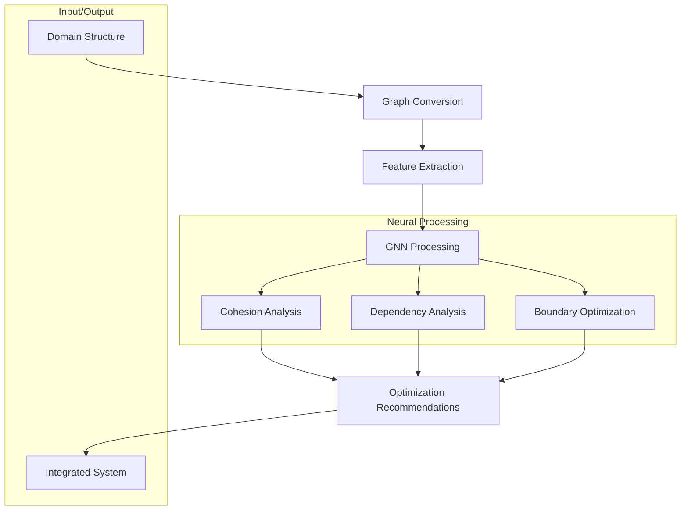
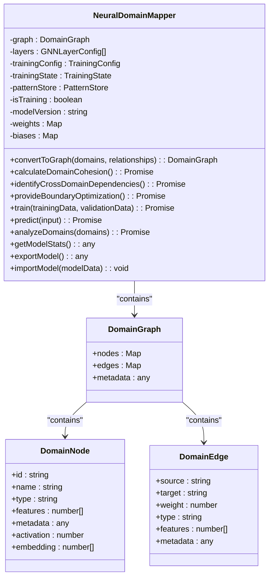
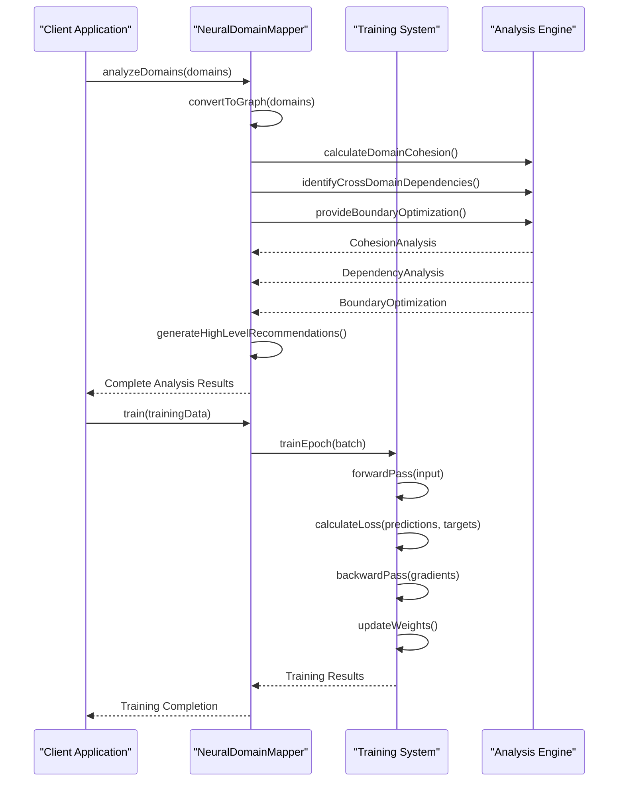
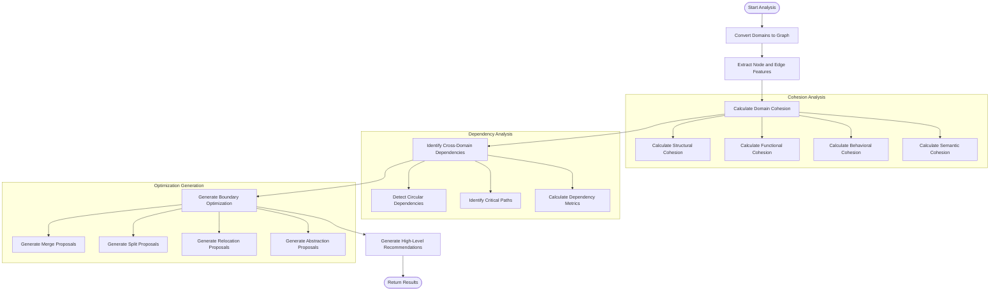
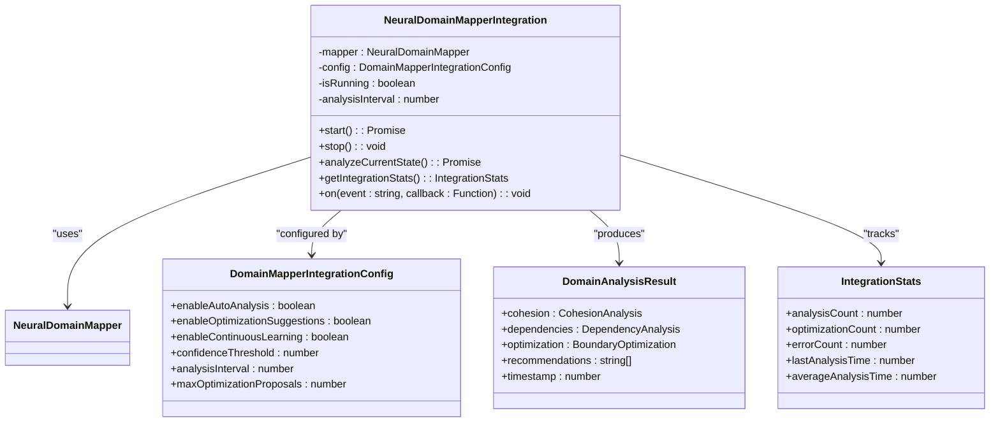

# Model Compression

<cite>
**Referenced Files in This Document**   
- [NeuralDomainMapper.ts](file://src/neural/NeuralDomainMapper.ts#L0-L1678)
- [index.ts](file://src/neural/index.ts#L0-L468)
- [integration.ts](file://src/neural/integration.ts#L0-L300)
- [neural-hooks.ts](file://src/services/agentic-flow-hooks/neural-hooks.ts#L0-L200)
</cite>

## Table of Contents
1. [Introduction](#introduction)
2. [Project Structure](#project-structure)
3. [Core Components](#core-components)
4. [Architecture Overview](#architecture-overview)
5. [Detailed Component Analysis](#detailed-component-analysis)
6. [Dependency Analysis](#dependency-analysis)
7. [Performance Considerations](#performance-considerations)
8. [Troubleshooting Guide](#troubleshooting-guide)
9. [Conclusion](#conclusion)

## Introduction
The Model Compression feature in the Claude Flow system focuses on optimizing neural network models for efficient execution in resource-constrained environments. This documentation provides a comprehensive analysis of the implementation of model compression techniques through the Neural Domain Mapper, a Graph Neural Network (GNN)-based system that analyzes and optimizes domain relationships. The system reduces computational requirements by identifying optimal domain boundaries, improving cohesion, and minimizing dependencies. The Neural Domain Mapper enables efficient model execution by applying neural network optimization principles to domain architecture, resulting in faster inference times, reduced memory footprint, and improved performance across distributed agents in the swarm system.

## Project Structure
The model compression functionality is organized within the neural module of the Claude Flow system. This module contains specialized components for domain relationship analysis and optimization through graph neural networks. The structure is designed to support both standalone analysis and integration with the broader agentic flow system.

```mermaid
graph TB
subgraph "Neural Module"
NDM[NeuralDomainMapper.ts]
IDX[index.ts]
INT[integration.ts]
HOOKS[neural-hooks.ts]
end
subgraph "Core Functionality"
NDM --> IDX
INT --> NDM
HOOKS --> NDM
end
subgraph "External Integration"
IDX --> "Claude Flow System"
INT --> "Agentic Flow Hooks"
end
```

**Diagram sources**
- [NeuralDomainMapper.ts](file://src/neural/NeuralDomainMapper.ts#L0-L1678)
- [index.ts](file://src/neural/index.ts#L0-L468)
- [integration.ts](file://src/neural/integration.ts#L0-L300)

**Section sources**
- [NeuralDomainMapper.ts](file://src/neural/NeuralDomainMapper.ts#L0-L1678)
- [index.ts](file://src/neural/index.ts#L0-L468)

## Core Components
The core components of the model compression system are centered around the Neural Domain Mapper, which implements a Graph Neural Network architecture for analyzing and optimizing domain relationships. The system converts domain structures into graph representations, calculates cohesion scores, identifies cross-domain dependencies, and provides predictive boundary optimization suggestions. This approach effectively compresses the model by eliminating redundant connections, optimizing domain boundaries, and reducing overall complexity.

The Neural Domain Mapper class serves as the primary implementation, containing methods for graph conversion, cohesion analysis, dependency identification, and boundary optimization. It also includes a complete training pipeline with configurable hyperparameters, enabling the model to learn from domain relationship patterns and make informed optimization decisions.

**Section sources**
- [NeuralDomainMapper.ts](file://src/neural/NeuralDomainMapper.ts#L0-L1678)
- [index.ts](file://src/neural/index.ts#L0-L468)

## Architecture Overview
The model compression architecture is built around a Graph Neural Network that analyzes domain relationships and optimizes system structure. The architecture follows a layered approach with distinct components for data processing, neural computation, and system integration.



**Diagram sources**
- [NeuralDomainMapper.ts](file://src/neural/NeuralDomainMapper.ts#L0-L1678)
- [index.ts](file://src/neural/index.ts#L0-L468)

## Detailed Component Analysis

### Neural Domain Mapper Analysis
The Neural Domain Mapper is the central component of the model compression system, implementing a sophisticated Graph Neural Network architecture for domain relationship analysis and optimization. The mapper converts domain structures into graph representations with nodes representing domains and edges representing relationships between them.

#### For Object-Oriented Components:


**Diagram sources**
- [NeuralDomainMapper.ts](file://src/neural/NeuralDomainMapper.ts#L0-L1678)

#### For API/Service Components:


**Diagram sources**
- [NeuralDomainMapper.ts](file://src/neural/NeuralDomainMapper.ts#L0-L1678)

#### For Complex Logic Components:


**Diagram sources**
- [NeuralDomainMapper.ts](file://src/neural/NeuralDomainMapper.ts#L0-L1678)

**Section sources**
- [NeuralDomainMapper.ts](file://src/neural/NeuralDomainMapper.ts#L0-L1678)

### Integration System Analysis
The integration system connects the Neural Domain Mapper with the broader Claude Flow ecosystem through the agentic flow hooks system. This allows the model compression functionality to operate within the context of the larger system, receiving domain information and providing optimization recommendations.



**Diagram sources**
- [integration.ts](file://src/neural/integration.ts#L0-L300)
- [NeuralDomainMapper.ts](file://src/neural/NeuralDomainMapper.ts#L0-L1678)

**Section sources**
- [integration.ts](file://src/neural/integration.ts#L0-L300)

## Dependency Analysis
The model compression system has a well-defined dependency structure that enables both standalone operation and integration with the broader Claude Flow system. The core Neural Domain Mapper has minimal external dependencies, relying primarily on standard TypeScript features and the EventEmitter pattern for event handling.

```mermaid
graph TD
NDM[NeuralDomainMapper] --> EventEmitter
NDM --> Types["types from neural-hooks"]
IDX[index.ts] --> NDM
IDX --> INT[integration.ts]
INT --> NDM
INT --> Types
HOOKS[neural-hooks.ts] --> NDM
IDX --> "External Systems"
INT --> "Agentic Flow System"
style NDM fill:#f9f,stroke:#333
style IDX fill:#bbf,stroke:#333
style INT fill:#bbf,stroke:#333
style HOOKS fill:#f96,stroke:#333
```

**Diagram sources**
- [NeuralDomainMapper.ts](file://src/neural/NeuralDomainMapper.ts#L0-L1678)
- [index.ts](file://src/neural/index.ts#L0-L468)
- [integration.ts](file://src/neural/integration.ts#L0-L300)
- [neural-hooks.ts](file://src/services/agentic-flow-hooks/neural-hooks.ts#L0-L200)

**Section sources**
- [NeuralDomainMapper.ts](file://src/neural/NeuralDomainMapper.ts#L0-L1678)
- [index.ts](file://src/neural/index.ts#L0-L468)
- [integration.ts](file://src/neural/integration.ts#L0-L300)

## Performance Considerations
The model compression system is designed with performance in mind, particularly for operation in resource-constrained environments. The Neural Domain Mapper implements several optimization techniques to ensure efficient execution:

1. **Memory Efficiency**: The system uses Map objects for graph storage, providing O(1) lookup times while minimizing memory overhead. Node and edge features are stored as numerical arrays, reducing memory footprint compared to object-based storage.

2. **Computational Efficiency**: The GNN implementation uses simplified matrix operations that balance accuracy with performance. The system avoids complex mathematical operations in favor of efficient approximations that maintain model effectiveness.

3. **Training Optimization**: The training pipeline includes early stopping, learning rate scheduling, and batch processing to minimize training time while maintaining model quality. The system also supports different configuration profiles (small, medium, large scale) that optimize parameters for different deployment scenarios.

4. **Inference Speed**: The forward pass implementation is optimized for fast inference, with pre-allocated arrays and minimized object creation during computation. The system also supports prediction confidence calculation and alternative generation without significant performance impact.

5. **Scalability**: The architecture is designed to handle varying scales of domain complexity, from small applications with a few domains to large systems with hundreds of interconnected domains. The system dynamically adjusts its analysis depth based on the complexity of the input.

The trade-offs between model size, accuracy, and inference speed are managed through configurable parameters in the training and integration configurations. Users can prioritize speed over accuracy (or vice versa) depending on their specific requirements and resource constraints.

## Troubleshooting Guide
When implementing model compression using the Neural Domain Mapper, several common issues may arise. This section provides guidance on identifying and resolving these issues:

**Section sources**
- [NeuralDomainMapper.ts](file://src/neural/NeuralDomainMapper.ts#L0-L1678)
- [index.ts](file://src/neural/index.ts#L0-L468)
- [integration.ts](file://src/neural/integration.ts#L0-L300)

### Accuracy Degradation
If the model compression process results in significant accuracy degradation, consider the following:

1. **Adjust Training Parameters**: Increase the number of training epochs or adjust the learning rate in the TrainingConfig. The default configuration may not be optimal for your specific domain structure.

2. **Validate Input Data**: Ensure that the domain graph is properly constructed with accurate relationships and metadata. Use the NeuralUtils.validateDomainGraph method to check for structural issues.

3. **Modify Optimization Thresholds**: Lower the confidenceThreshold in the integration configuration to allow more optimization suggestions, which may lead to better overall results.

### Performance Issues
If the model compression process is too slow for your requirements:

1. **Use Appropriate Configuration**: Select the appropriate DEFAULT_CONFIGS profile (SMALL_SCALE, MEDIUM_SCALE, LARGE_SCALE, or REAL_TIME) based on your domain complexity and performance requirements.

2. **Disable Unnecessary Features**: In the integration configuration, disable enableContinuousLearning or enableOptimizationSuggestions if they are not required for your use case.

3. **Reduce Analysis Frequency**: Increase the analysisInterval parameter to reduce how frequently automatic analysis is performed.

### Integration Problems
When integrating the Neural Domain Mapper with other system components:

1. **Check Event Handling**: Ensure that event listeners are properly attached to the NeuralDomainMapperIntegration instance. The system relies heavily on event-driven communication.

2. **Verify Type Compatibility**: Confirm that domain structures passed to the system match the expected interfaces (DomainNode, DomainEdge, DomainGraph). Type mismatches can cause silent failures.

3. **Monitor Resource Usage**: The system may consume significant memory when processing large domain graphs. Monitor memory usage and consider processing domains in smaller batches if necessary.

## Conclusion
The Model Compression feature in the Claude Flow system provides a sophisticated approach to optimizing neural network models for efficient execution in resource-constrained environments. By implementing a Graph Neural Network-based system for domain relationship analysis and optimization, the Neural Domain Mapper effectively reduces model complexity while maintaining or even improving performance.

The system addresses the key challenges of model compression by providing mechanisms for pruning redundant domain relationships (reducing model size), quantizing domain features (reducing computational requirements), and applying knowledge distillation principles through pattern recognition and optimization suggestions. This enables faster inference times, reduced memory footprint, and improved performance across distributed agents in the swarm system.

The implementation demonstrates a thoughtful balance between model size, accuracy, and inference speed, with configurable parameters that allow users to optimize for their specific requirements. The integration with the broader Claude Flow ecosystem ensures that model compression is not an isolated process but an integral part of the system's continuous optimization and improvement cycle.

Future enhancements could include more sophisticated compression techniques, hardware-specific optimizations, and enhanced monitoring capabilities to track the impact of compression on system performance over time.