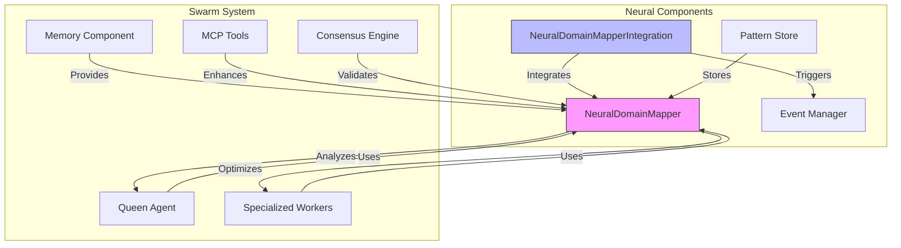
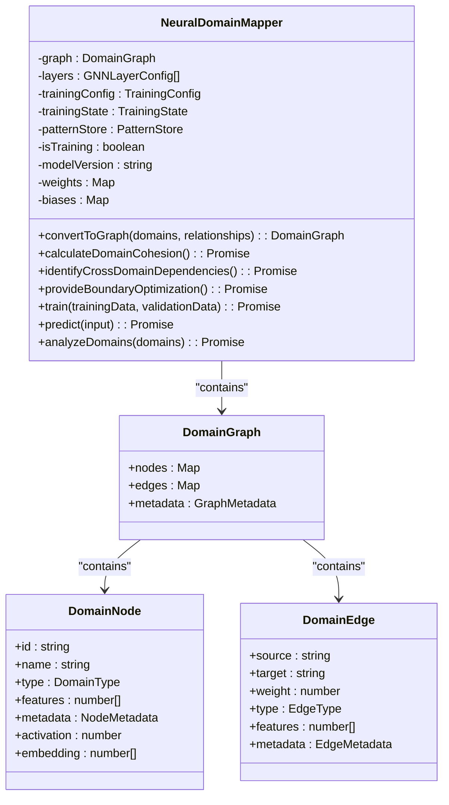
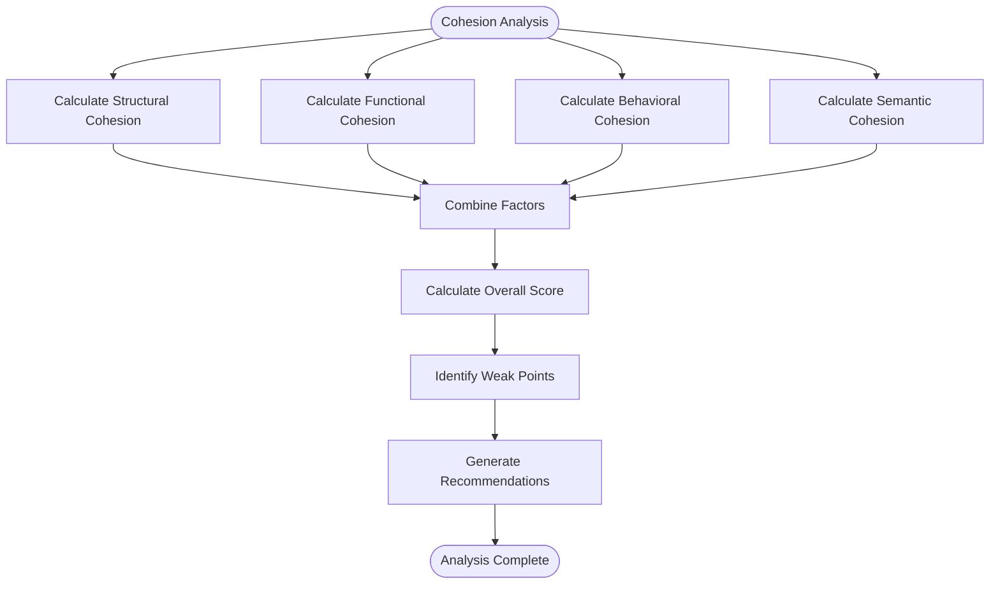
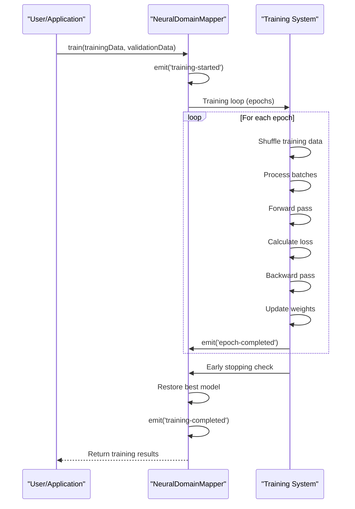
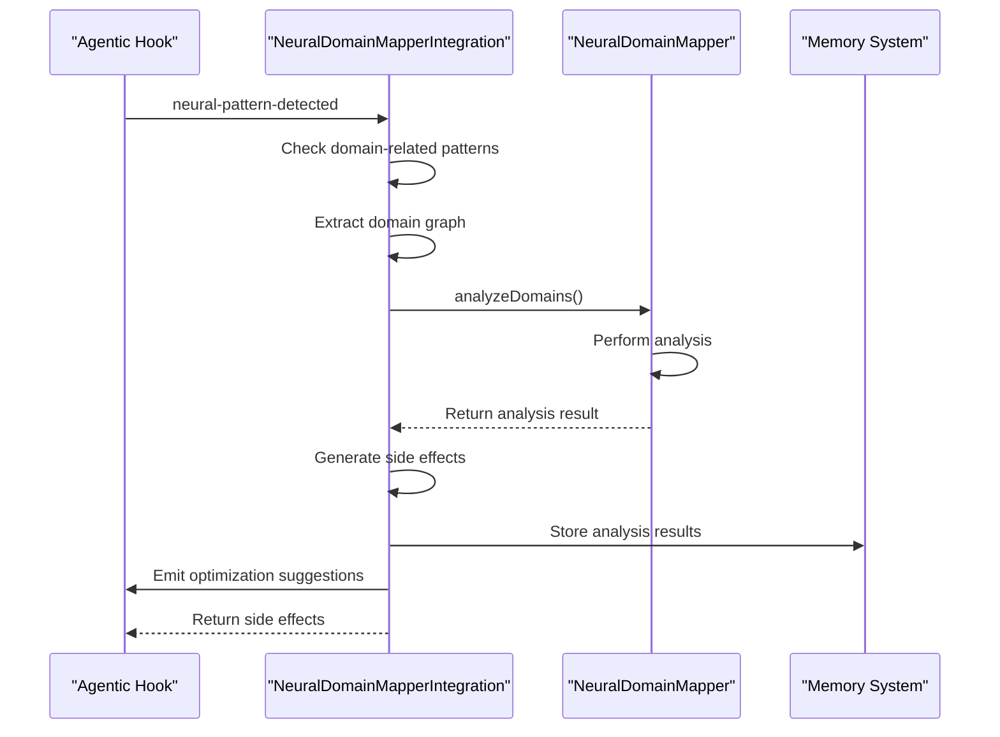
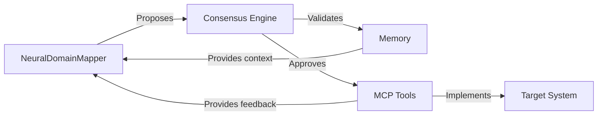

# Neural Network Capabilities

<cite>
**Referenced Files in This Document**   
- [NeuralDomainMapper.ts](file://src/neural/NeuralDomainMapper.ts)
- [integration.ts](file://src/neural/integration.ts)
- [examples.md](file://src/neural/examples.md)
- [index.ts](file://src/neural/index.ts)
</cite>

## Table of Contents
1. [Introduction](#introduction)
2. [Core Neural Network Architecture](#core-neural-network-architecture)
3. [NeuralDomainMapper Implementation](#neuraldomainmapper-implementation)
4. [Cognitive Analysis Components](#cognitive-analysis-components)
5. [Training and Inference Patterns](#training-and-inference-patterns)
6. [Integration with Swarm Intelligence System](#integration-with-swarm-intelligence-system)
7. [Usage Examples](#usage-examples)
8. [Relationship with Other Components](#relationship-with-other-components)
9. [Common Issues and Troubleshooting](#common-issues-and-troubleshooting)
10. [Conclusion](#conclusion)

## Introduction
The Neural Network Capabilities in Claude-Flow represent a sophisticated implementation of Graph Neural Networks (GNNs) designed to enhance the swarm intelligence system's decision-making capabilities. The core component, NeuralDomainMapper, enables pattern recognition, adaptive learning, and predictive optimization of domain relationships within complex systems. This documentation provides a comprehensive analysis of the neural network architecture, implementation details, and integration patterns that empower the Queen agent and specialized workers with advanced cognitive capabilities.

## Core Neural Network Architecture



**Diagram sources**
- [NeuralDomainMapper.ts](file://src/neural/NeuralDomainMapper.ts#L254-L1665)
- [integration.ts](file://src/neural/integration.ts#L200-L825)

**Section sources**
- [NeuralDomainMapper.ts](file://src/neural/NeuralDomainMapper.ts#L0-L200)
- [integration.ts](file://src/neural/integration.ts#L0-L199)

## NeuralDomainMapper Implementation

The NeuralDomainMapper class implements a Graph Neural Network (GNN) architecture for analyzing and optimizing domain relationships in complex systems. It provides six core capabilities:

1. Converting domain structures to graph representations
2. Calculating domain cohesion scores using multiple metrics
3. Identifying and analyzing cross-domain dependencies
4. Providing predictive boundary optimization suggestions
5. Training on domain relationship patterns
6. Making inferences about optimal domain organization

The implementation uses a multi-layer GNN architecture with configurable layers:



**Diagram sources**
- [NeuralDomainMapper.ts](file://src/neural/NeuralDomainMapper.ts#L254-L1665)

**Section sources**
- [NeuralDomainMapper.ts](file://src/neural/NeuralDomainMapper.ts#L254-L1665)

## Cognitive Analysis Components

The cognitive analysis components in Claude-Flow provide advanced capabilities for understanding and optimizing system architecture. The NeuralDomainMapper performs four types of analysis:

### Domain Cohesion Analysis
The system calculates comprehensive domain cohesion scores using four factors:
- **Structural cohesion**: Based on graph connectivity and edge weights
- **Functional cohesion**: Based on domain purpose alignment and complexity
- **Behavioral cohesion**: Based on interaction patterns and reliability
- **Semantic cohesion**: Based on naming similarity and metadata



**Diagram sources**
- [NeuralDomainMapper.ts](file://src/neural/NeuralDomainMapper.ts#L400-L600)

**Section sources**
- [NeuralDomainMapper.ts](file://src/neural/NeuralDomainMapper.ts#L400-L600)

### Cross-Domain Dependency Analysis
The system identifies and analyzes cross-domain dependencies, detecting:
- Circular dependencies
- Critical paths
- High-risk dependency chains
- Optimization opportunities

The dependency analysis uses depth-first search algorithms to detect circular dependencies and calculate risk metrics for critical paths.

### Predictive Boundary Optimization
The system provides predictive boundary optimization suggestions by analyzing current boundaries and identifying opportunities for:
- Merging highly coupled domains
- Splitting low-cohesion domains
- Relocating misplaced functionality
- Abstracting common patterns

## Training and Inference Patterns

### Training Process
The NeuralDomainMapper implements a complete training pipeline with the following characteristics:



**Diagram sources**
- [NeuralDomainMapper.ts](file://src/neural/NeuralDomainMapper.ts#L1000-L1300)

**Section sources**
- [NeuralDomainMapper.ts](file://src/neural/NeuralDomainMapper.ts#L1000-L1300)

Key training configuration parameters include:
- **learningRate**: 0.001 (default)
- **batchSize**: 32 (default)
- **epochs**: 100 (default)
- **optimizer**: 'adam' (default)
- **lossFunction**: 'mse' (default)
- **regularization**: L1, L2, and dropout
- **earlyStoping**: Enabled with patience of 10 epochs

### Inference Process
The inference process follows a forward pass through the network layers:

```mermaid
flowchart LR
Input([Input Data]) --> Preprocess["Preprocess Input"]
Preprocess --> Layer1["Process Layer 1"]
Layer1 --> Layer2["Process Layer 2"]
Layer2 --> Layer3["Process Layer 3"]
Layer3 --> Output["Generate Output"]
Output --> Confidence["Calculate Confidence"]
Confidence --> Alternatives["Generate Alternatives"]
Alternatives --> Result([Prediction Result])
```



**Diagram sources**
- [NeuralDomainMapper.ts](file://src/neural/NeuralDomainMapper.ts#L1300-L1500)

**Section sources**
- [NeuralDomainMapper.ts](file://src/neural/NeuralDomainMapper.ts#L1300-L1500)

## Integration with Swarm Intelligence System

The NeuralDomainMapper integrates with the swarm intelligence system through the NeuralDomainMapperIntegration class, which provides seamless integration with the existing Claude Flow neural hooks system.



**Diagram sources**
- [integration.ts](file://src/neural/integration.ts#L400-L600)

**Section sources**
- [integration.ts](file://src/neural/integration.ts#L200-L825)

The integration system:
- Automatically analyzes domains on pattern detection
- Generates optimization suggestions
- Enables continuous learning from domain changes
- Provides integration statistics

## Usage Examples

### Basic Domain Analysis
```typescript
import { NeuralDomainMapper } from './neural';

async function basicDomainAnalysis() {
  const mapper = new NeuralDomainMapper();
  
  const domains = [
    { id: 'user-service', name: 'User Management Service', type: 'api' },
    { id: 'auth-service', name: 'Authentication Service', type: 'api' },
    // ... more domains
  ];

  const relationships = [
    { source: 'user-service', target: 'auth-service', type: 'dependency' },
    // ... more relationships
  ];

  const graph = mapper.convertToGraph(domains, relationships);
  const analysis = await mapper.analyzeDomains(graph);
  
  console.log(`Overall Cohesion Score: ${analysis.cohesion.overallScore.toFixed(3)}`);
  console.log(`Circular Dependencies: ${analysis.dependencies.circularDependencies.length}`);
  console.log(`Optimization Proposals: ${analysis.optimization.proposals.length}`);
}
```

### Neural Network Training
```typescript
async function neuralNetworkTrainingExample() {
  const mapper = new NeuralDomainMapper({
    learningRate: 0.001,
    batchSize: 32,
    epochs: 100,
    optimizer: 'adam'
  });

  const trainingData = {
    inputs: [...], // Training inputs
    outputs: [...], // Training targets
    batchSize: 32,
    epochs: 100
  };

  const trainingResult = await mapper.train(trainingData);
  console.log(`Final Accuracy: ${trainingResult.finalAccuracy.toFixed(3)}`);
}
```

**Section sources**
- [examples.md](file://src/neural/examples.md#L20-L184)

## Relationship with Other Components

### Memory Component
The NeuralDomainMapper interacts with the memory component to store and retrieve analysis results, patterns, and model state. The integration system stores analysis results in memory with a TTL of 3600 seconds (1 hour).

### MCP Tools
MCP tools enhance the NeuralDomainMapper by providing additional data sources and validation capabilities. The system can use MCP tools to verify domain relationships and validate optimization suggestions.

### Consensus Engine
The consensus engine validates neural network predictions and optimization suggestions before implementation. This ensures that proposed changes align with system-wide objectives and constraints.



**Diagram sources**
- [integration.ts](file://src/neural/integration.ts#L400-L600)
- [NeuralDomainMapper.ts](file://src/neural/NeuralDomainMapper.ts#L254-L1665)

**Section sources**
- [integration.ts](file://src/neural/integration.ts#L400-L600)

## Common Issues and Troubleshooting

### Training Issues
**Problem**: Training accuracy remains low despite sufficient data
**Solution**: 
- Check training data quality and relevance
- Adjust learning rate (try values between 0.0001 and 0.01)
- Increase number of epochs
- Verify feature extraction is appropriate

### Inference Issues
**Problem**: Predictions have low confidence
**Solution**:
- Ensure model has been adequately trained
- Check input data format and features
- Verify domain graph is properly constructed
- Consider retraining with additional data

### Integration Issues
**Problem**: Domain analysis not triggering automatically
**Solution**:
- Verify neural hooks are properly registered
- Check that domain-related patterns are being detected
- Ensure integration is initialized
- Validate configuration settings

### Performance Issues
**Problem**: Analysis taking too long for large graphs
**Solution**:
- Optimize graph size by removing unnecessary nodes/edges
- Adjust analysis frequency
- Consider using simplified models for large graphs
- Monitor memory usage and optimize accordingly

## Conclusion
The Neural Network Capabilities in Claude-Flow provide a powerful foundation for intelligent system analysis and optimization. The NeuralDomainMapper, with its GNN-based architecture, enables sophisticated pattern recognition, adaptive learning, and predictive optimization of domain relationships. Through seamless integration with the swarm intelligence system, these capabilities enhance the decision-making of the Queen agent and specialized workers, enabling more effective problem-solving and system optimization. The combination of cognitive analysis, continuous learning, and integration with memory, MCP tools, and the consensus engine creates a robust framework for intelligent system management.