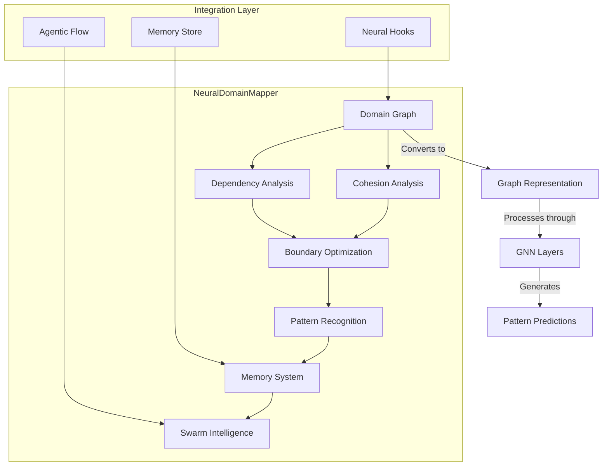
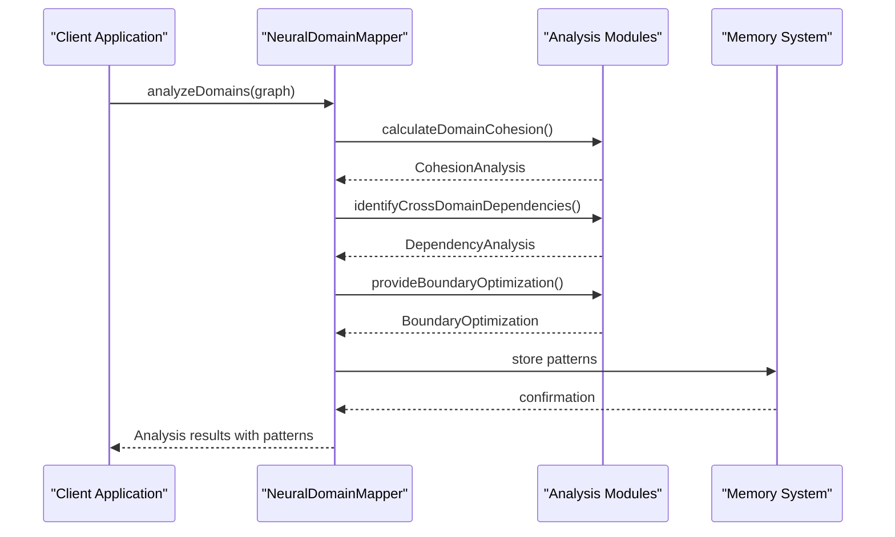
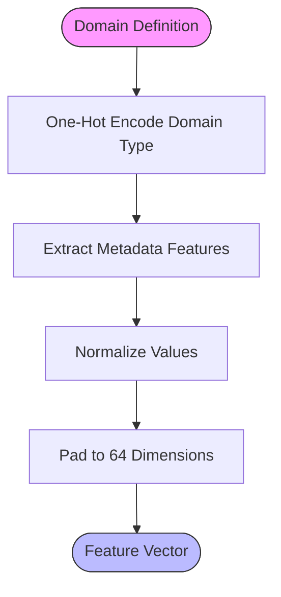
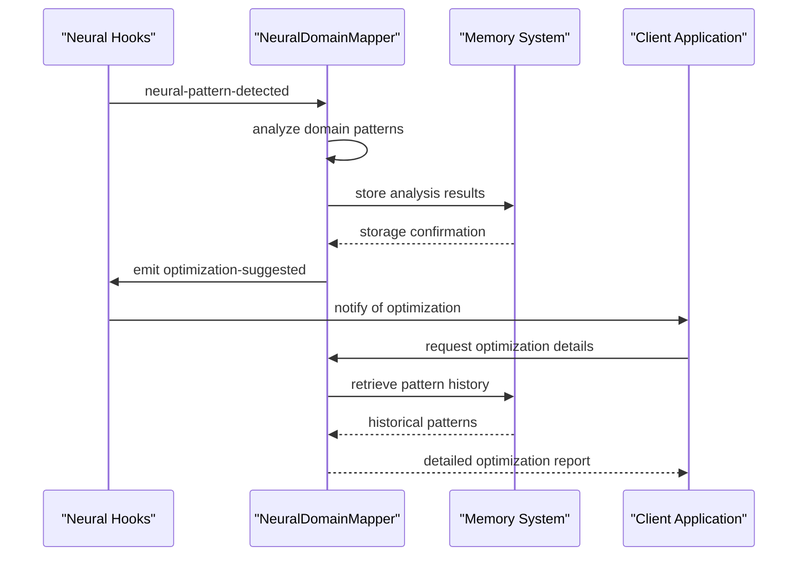

# Pattern Recognition

<cite>
**Referenced Files in This Document**   
- [NeuralDomainMapper.ts](file://src/neural/NeuralDomainMapper.ts)
- [integration.ts](file://src/neural/integration.ts)
- [examples.md](file://src/neural/examples.md)
</cite>

## Table of Contents
1. [Introduction](#introduction)
2. [Architecture Overview](#architecture-overview)
3. [Pattern Recognition Implementation](#pattern-recognition-implementation)
4. [Feature Extraction Techniques](#feature-extraction-techniques)
5. [Classification Methods](#classification-methods)
6. [Integration with Memory Systems](#integration-with-memory-systems)
7. [Common Issues and Troubleshooting](#common-issues-and-troubleshooting)
8. [Optimization Strategies](#optimization-strategies)

## Introduction
The NeuralDomainMapper is a core component of the Claude Flow orchestration system that implements Graph Neural Network (GNN) architecture for mapping and analyzing domain relationships. It provides advanced pattern recognition capabilities for identifying and classifying patterns in data streams, code structures, and workflow behaviors within the swarm intelligence system. The system enables dynamic domain boundary analysis and intelligent task routing based on learned patterns, enhancing decision-making efficiency and agent specialization.

**Section sources**
- [NeuralDomainMapper.ts](file://src/neural/NeuralDomainMapper.ts#L1-L50)

## Architecture Overview
The NeuralDomainMapper follows a modular architecture that integrates with the broader Claude Flow ecosystem through neural hooks and memory systems. At its core, it uses a GNN-based approach to represent domain structures as graphs, where domains are nodes and their relationships are edges. The system processes these graph representations through multiple neural network layers to identify patterns and make predictions about optimal domain organization.



**Diagram sources**
- [NeuralDomainMapper.ts](file://src/neural/NeuralDomainMapper.ts#L254-L285)
- [integration.ts](file://src/neural/integration.ts#L12-L76)

## Pattern Recognition Implementation
The NeuralDomainMapper implements pattern recognition through a combination of graph-based analysis and neural network processing. The system identifies patterns by analyzing domain structures, their relationships, and behavioral characteristics. It uses a multi-step approach that includes domain-to-graph conversion, feature extraction, and neural processing to classify patterns and make predictions.

The pattern recognition process begins with the `analyzeDomains` method, which takes a domain graph as input and performs comprehensive analysis to identify patterns. This method orchestrates the execution of cohesion analysis, dependency analysis, and boundary optimization to generate a complete picture of the domain relationships.



**Section sources**
- [NeuralDomainMapper.ts](file://src/neural/NeuralDomainMapper.ts#L1479-L1678)
- [integration.ts](file://src/neural/integration.ts#L129-L168)

## Feature Extraction Techniques
The NeuralDomainMapper employs sophisticated feature extraction techniques to convert domain information into numerical representations suitable for neural processing. The system extracts features from both domain nodes and edges, creating comprehensive feature vectors that capture the essential characteristics of the domain structure.

For domain nodes, the system uses the `extractDomainFeatures` method to create a 64-dimensional feature vector. This vector includes one-hot encoded domain types, metadata features such as size and complexity, and normalized dependency counts. The feature extraction process ensures consistent input dimensions for the neural network.



For edge relationships, the `extractEdgeFeatures` method creates a 32-dimensional feature vector that includes relationship type encoding and metadata such as frequency, latency, reliability, and bandwidth. These features enable the system to distinguish between different types of domain relationships and assess their quality.

The system also implements dynamic feature preprocessing through the `preprocessInput` method, which ensures that input data is properly formatted for neural processing. This method handles various input formats and converts them to standardized numerical features.

**Section sources**
- [NeuralDomainMapper.ts](file://src/neural/NeuralDomainMapper.ts#L500-L550)

## Classification Methods
The NeuralDomainMapper uses a multi-layered classification approach that combines graph neural network processing with specialized analysis modules. The system implements a three-layer GNN architecture with different layer types (GCN, GAT, GCN) to process domain graphs and identify patterns.

The classification process begins with forward propagation through the neural network layers, where each layer applies matrix multiplication, bias addition, and activation functions to transform the input features. The system uses different activation functions (ReLU, ReLU, Tanh) across layers to introduce non-linearity and enhance pattern recognition capabilities.

```mermaid
classDiagram
class NeuralDomainMapper {
+analyzeDomains(domains) Promise~AnalysisResult~
+train(trainingData) Promise~TrainingResult~
+predict(input) Promise~Prediction~
-forwardPass(input) number[]
-backwardPass(inputs, predictions, targets) void
-processLayer(input, weights, biases, config) number[]
}
class GNNLayerConfig {
+type : string
+inputDim : number
+outputDim : number
+dropout : number
+activation : string
}
class TrainingData {
+inputs : any[]
+outputs : any[]
+batchSize : number
+epochs : number
}
class Prediction {
+input : any
+output : number[]
+confidence : number
+alternatives : {output : any; confidence : number}[]
}
NeuralDomainMapper --> GNNLayerConfig : "uses"
NeuralDomainMapper --> TrainingData : "processes"
NeuralDomainMapper --> Prediction : "generates"
```

**Diagram sources**
- [NeuralDomainMapper.ts](file://src/neural/NeuralDomainMapper.ts#L254-L1678)

The system employs several specialized classification methods for different aspects of domain analysis:

1. **Cohesion Analysis**: Calculates structural, functional, behavioral, and semantic cohesion scores to assess domain quality
2. **Dependency Analysis**: Identifies circular dependencies and critical paths in the domain graph
3. **Boundary Optimization**: Generates proposals for merging, splitting, or relocating domains

The classification results are combined to generate comprehensive analysis reports that include optimization suggestions and implementation priorities. The system uses confidence scoring to rank predictions and ensure reliable pattern recognition.

**Section sources**
- [NeuralDomainMapper.ts](file://src/neural/NeuralDomainMapper.ts#L700-L1200)

## Integration with Memory Systems
The NeuralDomainMapper integrates with memory systems to store learned patterns and maintain state across analysis sessions. The system uses a pattern store to persistently store identified patterns, enabling continuous learning and pattern recognition improvement over time.

The integration is facilitated through the NeuralDomainMapperIntegration class, which connects the domain mapper with the agentic flow hooks system. This integration enables automatic pattern detection, continuous learning from domain changes, and optimization suggestion generation.



The system implements pattern persistence through the `exportModel` and `importModel` methods, which allow the complete model state to be saved and restored. This includes the domain graph, neural network weights, biases, and training state, ensuring that learned patterns are preserved across system restarts.

The integration also supports continuous learning through the `learnFromAnalysis` method, which converts analysis results into training data and retrains the model. This creates a feedback loop where the system improves its pattern recognition capabilities over time based on real-world domain changes.

**Section sources**
- [integration.ts](file://src/neural/integration.ts#L76-L825)

## Common Issues and Troubleshooting
The NeuralDomainMapper may encounter several common issues related to pattern recognition accuracy, performance, and integration. Understanding these issues and their solutions is essential for maintaining optimal system operation.

**False Positives**: The system may occasionally identify non-existent patterns due to noise in the input data. This can be mitigated by:
- Adjusting the confidence threshold for pattern recognition
- Implementing input noise reduction techniques
- Increasing the training dataset size and diversity

**Overfitting**: When the model becomes too specialized to training data, it may perform poorly on new patterns. Solutions include:
- Implementing dropout layers during training
- Using regularization techniques (L1 and L2)
- Applying early stopping based on validation performance
- Increasing the validation split ratio

**Pattern Drift**: As domain structures evolve, previously learned patterns may become obsolete. This can be addressed by:
- Implementing continuous learning from recent patterns
- Regularly retraining the model with updated data
- Monitoring pattern relevance and pruning outdated patterns
- Using adaptive learning rates to respond to changing patterns

The system provides several diagnostic tools to help troubleshoot these issues:
- `getModelStats()` returns current model statistics including training state and cohesion scores
- `getIntegrationStats()` provides integration metrics such as analysis frequency and accuracy trends
- Event emissions (training-completed, prediction-made) enable monitoring of system behavior

**Section sources**
- [NeuralDomainMapper.ts](file://src/neural/NeuralDomainMapper.ts#L1479-L1678)
- [integration.ts](file://src/neural/integration.ts#L300-L400)

## Optimization Strategies
To improve pattern recognition accuracy and system performance, several optimization strategies can be implemented:

**Training Optimization**:
- Use larger and more diverse training datasets
- Implement learning rate scheduling to improve convergence
- Apply batch normalization to stabilize training
- Use synthetic data generation to augment training samples

**Performance Optimization**:
- Cache frequently accessed analysis results
- Implement parallel processing for independent analysis tasks
- Optimize memory usage by pruning unused patterns
- Use efficient data structures for graph operations

**Accuracy Optimization**:
- Implement ensemble methods by combining multiple model predictions
- Use noise injection during inference to generate alternative predictions
- Apply feature engineering to extract more meaningful domain characteristics
- Implement adaptive thresholding based on context and domain type

The system supports configuration of these optimization strategies through the training configuration and integration configuration parameters. These settings allow fine-tuning of the pattern recognition process to match specific use cases and performance requirements.

**Section sources**
- [NeuralDomainMapper.ts](file://src/neural/NeuralDomainMapper.ts#L254-L1678)
- [examples.md](file://src/neural/examples.md#L186-L272)