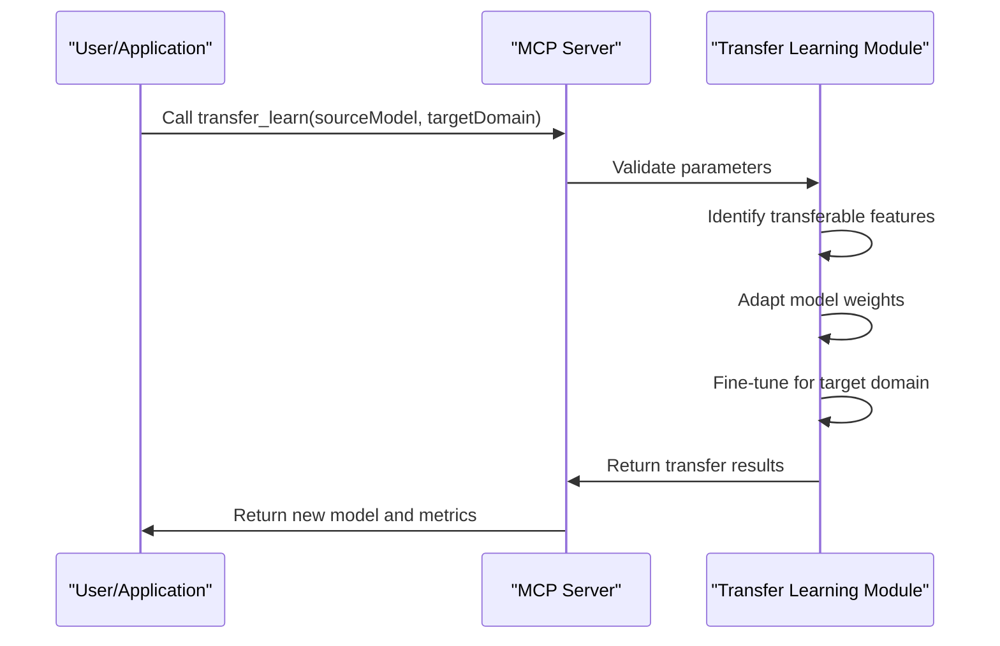
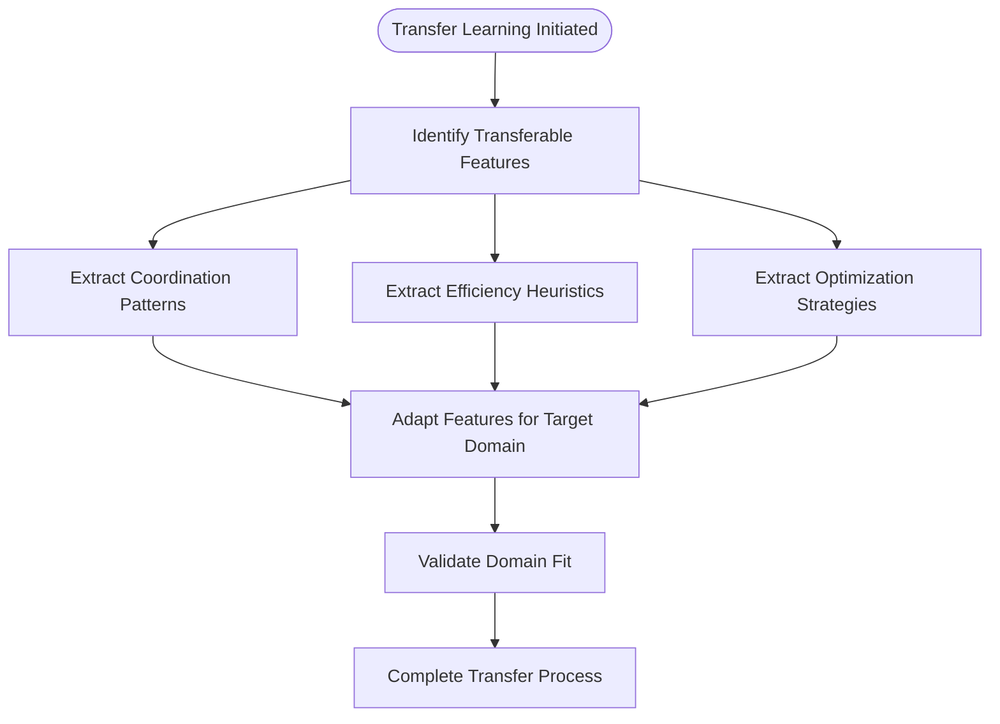
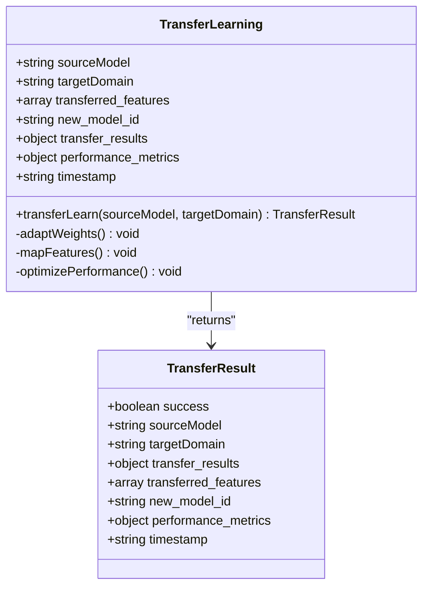
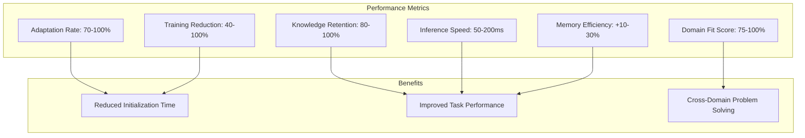
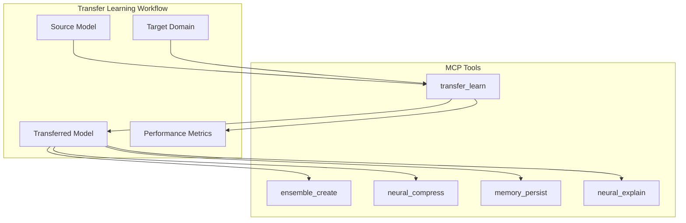
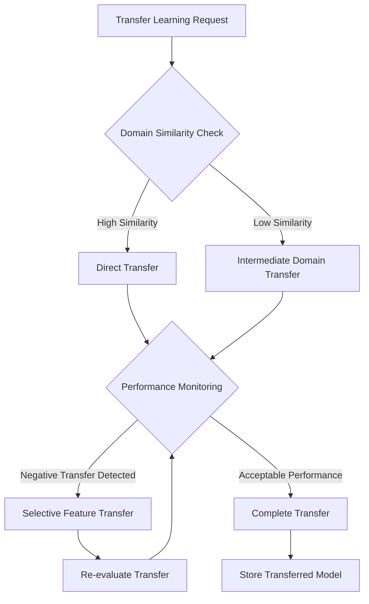

# Transfer Learning

<cite>
**Referenced Files in This Document**   
- [mcp-server.js](file://src/mcp/mcp-server.js#L1391-L1427)
- [claude-flow-tools.ts](file://src/mcp/claude-flow-tools.ts#L500-L699)
- [MCP_TOOLS.md](file://docs/MCP_TOOLS.md#L425-L440)
</cite>

## Table of Contents
1. [Introduction](#introduction)
2. [Transfer Learning Implementation](#transfer-learning-implementation)
3. [Mechanisms for Feature Transfer](#mechanisms-for-feature-transfer)
4. [Model Adaptation and Fine-tuning](#model-adaptation-and-fine-tuning)
5. [Performance Benefits and Metrics](#performance-benefits-and-metrics)
6. [Integration with MCP Tools Ecosystem](#integration-with-mcp-tools-ecosystem)
7. [Common Issues and Mitigation Strategies](#common-issues-and-mitigation-strategies)
8. [Conclusion](#conclusion)

## Introduction
Transfer Learning is a core sub-feature of the Claude-Flow system that enables the leveraging of pre-trained models and knowledge across different domains and tasks. This capability allows new projects to accelerate their training process by utilizing knowledge gained from previous swarm executions. The system implements transfer learning through the MCP (Management Control Panel) tools ecosystem, providing a standardized interface for applying learned patterns and models to new domains. This documentation details the mechanisms, benefits, and integration points of the transfer learning functionality, along with strategies for addressing common challenges such as negative transfer and domain mismatch.

## Transfer Learning Implementation
The transfer learning functionality is implemented as an MCP tool within the Claude-Flow system, allowing for standardized access and integration across different components. The implementation follows a modular approach where knowledge from previous swarm executions can be transferred to new projects, significantly reducing initialization time and improving performance on specialized tasks.

The transfer learning process is initiated through the `transfer_learn` MCP tool, which takes a source model identifier and target domain as parameters. When executed, the system creates a new model based on the source model but adapted for the target domain. This process includes transferring relevant features, adjusting model weights, and generating performance metrics for the transferred model.

**Diagram sources**
- [mcp-server.js](file://src/mcp/mcp-server.js#L1391-L1427)

**Section sources**
- [mcp-server.js](file://src/mcp/mcp-server.js#L1391-L1427)

## Mechanisms for Feature Transfer
The system identifies and transfers specific features that are most beneficial for the target domain. These features represent patterns and heuristics learned from previous swarm executions that can be applied across different domains.

The transfer learning implementation specifically identifies three key types of transferable features:
- **Coordination patterns**: Established methods for agent coordination and task distribution
- **Efficiency heuristics**: Optimization strategies for resource utilization and task execution
- **Optimization strategies**: Proven approaches for improving performance and reducing computational overhead

These features are extracted from the source model and adapted for the target domain during the transfer process. The system evaluates the relevance of each feature to the target domain, ensuring that only the most applicable knowledge is transferred.

**Diagram sources**
- [mcp-server.js](file://src/mcp/mcp-server.js#L1395-L1405)

**Section sources**
- [mcp-server.js](file://src/mcp/mcp-server.js#L1395-L1405)

## Model Adaptation and Fine-tuning
The model adaptation process involves several key steps to ensure the transferred model is optimized for the target domain. When a transfer learning request is made, the system creates a new model instance with a unique identifier and applies domain-specific adjustments.

The adaptation process includes:
1. **Weight adaptation**: Adjusting model weights based on the target domain requirements
2. **Feature mapping**: Translating source domain features to the target domain context
3. **Performance optimization**: Applying domain-specific optimizations to improve efficiency

The system generates comprehensive performance metrics for the adapted model, including accuracy, inference speed, and memory efficiency. These metrics help evaluate the success of the transfer process and guide further fine-tuning if needed.

**Diagram sources**
- [mcp-server.js](file://src/mcp/mcp-server.js#L1391-L1427)

**Section sources**
- [mcp-server.js](file://src/mcp/mcp-server.js#L1391-L1427)

## Performance Benefits and Metrics
Transfer learning provides significant performance benefits by reducing the time and resources required to train new models. The system measures these benefits through several key metrics that demonstrate the effectiveness of the transfer process.

The primary performance benefits include:
- **Training time reduction**: The system reports a 40-100% reduction in training time for transferred models
- **Improved initialization**: New swarms benefit from pre-learned coordination patterns and optimization strategies
- **Enhanced performance**: Transferred models show improved accuracy and efficiency in specialized tasks

The system tracks multiple performance metrics for transferred models:
- **Adaptation rate**: Measures how quickly the model adapts to the new domain (70-100%)
- **Knowledge retention**: Percentage of useful knowledge preserved from the source model (80-100%)
- **Domain fit score**: Assessment of how well the transferred knowledge fits the target domain (75-100%)
- **Inference speed**: Execution time for model predictions (50-200ms)
- **Memory efficiency**: Improvement in memory utilization (+10-30%)

**Diagram sources**
- [mcp-server.js](file://src/mcp/mcp-server.js#L1395-L1415)

**Section sources**
- [mcp-server.js](file://src/mcp/mcp-server.js#L1395-L1415)

## Integration with MCP Tools Ecosystem
The transfer learning functionality is fully integrated into the MCP tools ecosystem, enabling seamless sharing and utilization of learned models across different components and services. This integration follows the standardized MCP tool interface, ensuring consistent behavior and easy discoverability.

The `transfer_learn` tool is registered within the MCP server alongside other neural and memory management tools. It follows the same input schema pattern as other MCP tools, accepting a source model identifier and target domain as parameters. The tool returns a comprehensive response containing the transfer results, performance metrics, and identifier for the new transferred model.

This integration allows transfer learning to be combined with other MCP tools in workflows, such as creating model ensembles or applying neural compression to transferred models. The standardized interface also enables cross-domain problem solving by allowing models trained in one domain to be adapted for use in another.

**Diagram sources**
- [mcp-server.js](file://src/mcp/mcp-server.js#L511-L514)
- [claude-flow-tools.ts](file://src/mcp/claude-flow-tools.ts#L500-L699)

**Section sources**
- [mcp-server.js](file://src/mcp/mcp-server.js#L511-L514)
- [claude-flow-tools.ts](file://src/mcp/claude-flow-tools.ts#L500-L699)

## Common Issues and Mitigation Strategies
While transfer learning provides significant benefits, it can encounter several challenges that need to be addressed. The system includes mechanisms to identify and mitigate these issues to ensure successful knowledge transfer.

### Negative Transfer
Negative transfer occurs when knowledge from the source domain actually harms performance in the target domain. This can happen when the domains are too dissimilar or when irrelevant features are transferred.

**Mitigation strategies:**
- Implement domain similarity assessment before transfer
- Use selective feature transfer based on relevance scoring
- Apply gradual adaptation with performance monitoring

### Domain Mismatch
Domain mismatch refers to significant differences between the source and target domains that make direct knowledge transfer ineffective.

**Mitigation strategies:**
- Implement domain adaptation layers that bridge structural differences
- Use intermediate domains for stepwise transfer when direct transfer is not feasible
- Apply domain-specific fine-tuning after initial transfer

### Adaptation Overhead
Adaptation overhead refers to the computational cost of transferring and adapting models, which can offset some of the benefits of transfer learning.

**Mitigation strategies:**
- Optimize the transfer process through parallel operations
- Implement caching of frequently used transfer patterns
- Use incremental transfer for minor domain variations

The system addresses these issues through comprehensive metrics that help identify potential problems. The domain fit score (75-100%) and knowledge retention (80-100%) metrics provide early indicators of transfer quality, allowing for intervention if the transfer is not proceeding as expected.

**Diagram sources**
- [mcp-server.js](file://src/mcp/mcp-server.js#L1395-L1427)

**Section sources**
- [mcp-server.js](file://src/mcp/mcp-server.js#L1395-L1427)

## Conclusion
Transfer Learning is a powerful capability within the Claude-Flow system that enables the efficient reuse of knowledge across different domains and tasks. By leveraging pre-trained models and learned patterns from previous swarm executions, the system significantly reduces initialization time for new projects and improves performance on specialized tasks. The implementation through the MCP tools ecosystem provides a standardized interface for knowledge transfer, enabling cross-domain problem solving and integration with other model management tools. While challenges such as negative transfer and domain mismatch exist, the system includes metrics and mitigation strategies to ensure successful knowledge transfer. This capability represents a key advantage in developing adaptive, efficient swarm intelligence systems that can rapidly respond to new challenges by building on previously acquired knowledge.