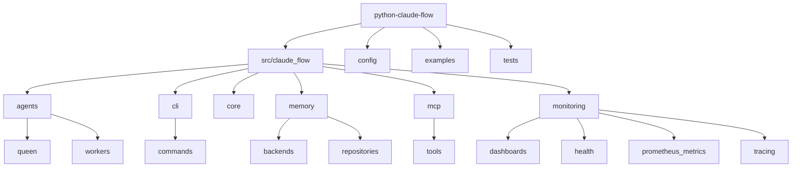
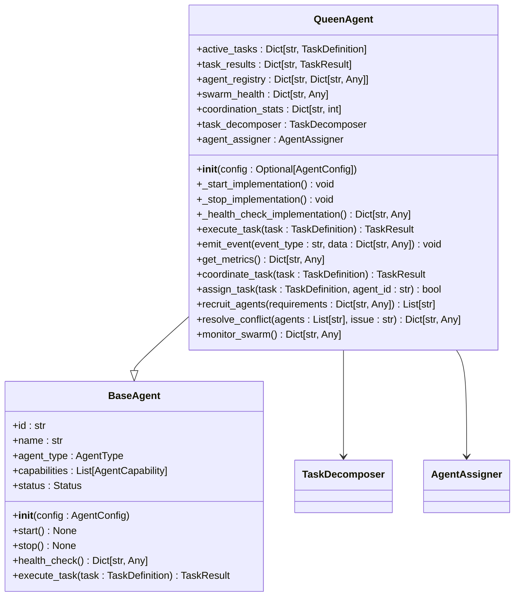
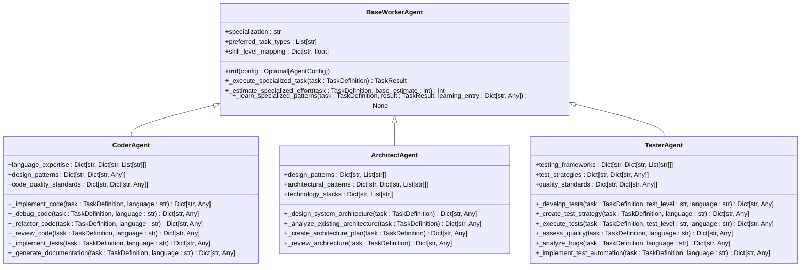

<docs>
# Python Implementation Guide

<cite>
**Referenced Files in This Document**   
- [README.md](file://python-claude-flow/README.md)
- [pyproject.toml](file://python-claude-flow/pyproject.toml)
- [src/claude_flow/agents/queen/queen_agent.py](file://python-claude-flow/src/claude_flow/agents/queen/queen_agent.py)
- [src/claude_flow/agents/workers/coder_agent.py](file://python-claude-flow/src/claude_flow/agents/workers/coder_agent.py)
- [src/claude_flow/agents/workers/architect_agent.py](file://python-claude-flow/src/claude_flow/agents/workers/architect_agent.py)
- [src/claude_flow/agents/workers/tester_agent.py](file://python-claude-flow/src/claude_flow/agents/workers/tester_agent.py)
- [src/claude_flow/core/config.py](file://python-claude-flow/src/claude_flow/core/config.py)
- [src/claude_flow/cli/main.py](file://python-claude-flow/src/claude_flow/cli/main.py)
- [src/claude_flow/memory/backends/sqlite_backend.py](file://python-claude-flow/src/claude_flow/memory/backends/sqlite_backend.py)
- [src/claude_flow/mcp/server.py](file://python-claude-flow/src/claude_flow/mcp/server.py)
</cite>

## Table of Contents
1. [Introduction](#introduction)
2. [Project Structure](#project-structure)
3. [Core Components](#core-components)
4. [Architecture Overview](#architecture-overview)
5. [Detailed Component Analysis](#detailed-component-analysis)
6. [Integration with TypeScript Codebase](#integration-with-typescript-codebase)
7. [Python-Specific Features](#python-specific-features)
8. [Setup and Configuration](#setup-and-configuration)
9. [Best Practices for Python Developers](#best-practices-for-python-developers)
10. [Conclusion](#conclusion)

## Introduction

The Python implementation of Claude-Flow provides a comprehensive AI agent orchestration platform with enterprise-grade features. This guide documents the architecture, component design, integration patterns with the existing TypeScript codebase, and Python-specific features to help developers effectively utilize the platform.

**Section sources**
- [README.md](file://python-claude-flow/README.md#L0-L789)

## Project Structure

The Python implementation follows a modular structure with clear separation of concerns. The main components are organized into distinct directories:

- **src/claude_flow**: Core application code
  - **agents**: Agent implementations including Queen and Worker agents
  - **cli**: Command-line interface components
  - **core**: Core interfaces and base classes
  - **memory**: Memory management and persistence
  - **mcp**: MCP protocol implementation
  - **monitoring**: Observability components

- **config**: Configuration files for different environments
- **examples**: Usage examples and demonstrations
- **tests**: Test suite with unit and integration tests



**Diagram sources**
- [README.md](file://python-claude-flow/README.md#L0-L789)

**Section sources**
- [README.md](file://python-claude-flow/README.md#L0-L789)

## Core Components

The Python implementation of Claude-Flow consists of several core components that work together to provide AI agent orchestration capabilities. These include specialized agents for different roles, a robust configuration system, and comprehensive monitoring tools.

**Section sources**
- [README.md](file://python-claude-flow/README.md#L0-L789)
- [pyproject.toml](file://python-claude-flow/pyproject.toml#L0-L97)

## Architecture Overview

The architecture of the Python implementation follows a queen-worker pattern with specialized agents handling different aspects of AI orchestration. The system is designed to be extensible, scalable, and maintainable.

```mermaid
graph TD
A[Queen Agent] --> B[Architect Agent]
A --> C[Coder Agent]
A --> D[Tester Agent]
A --> E[Analyzer Agent]
A --> F[Writer Agent]
B --> G[System Design]
B --> H[Code Analysis]
B --> I[Technology Selection]
C --> J[Code Generation]
C --> K[Debugging]
C --> L[Refactoring]
D --> M[Unit Testing]
D --> N[Integration Testing]
D --> O[Performance Testing]
E --> P[Data Analysis]
E --> Q[Insight Generation]
F --> R[Documentation]
F --> S[Content Creation]
A --> T[Task Coordination]
A --> U[Resource Allocation]
A --> V[Conflict Resolution]
style A fill:#f9f,stroke:#333,stroke-width:2px
style B fill:#bbf,stroke:#333,stroke-width:2px
style C fill:#bbf,stroke:#333,stroke-width:2px
style D fill:#bbf,stroke:#333,stroke-width:2px
style E fill:#bbf,stroke:#333,stroke-width:2px
style F fill:#bbf,stroke:#333,stroke-width:2px
```



**Diagram sources**
- [src/claude_flow/agents/queen/queen_agent.py](file://python-claude-flow/src/claude_flow/agents/queen/queen_agent.py#L527-L1271)
- [src/claude_flow/agents/workers/coder_agent.py](file://python-claude-flow/src/claude_flow/agents/workers/coder_agent.py#L18-L697)
- [src/claude_flow/agents/workers/architect_agent.py](file://python-claude-flow/src/claude_flow/agents/workers/architect_agent.py#L17-L531)
- [src/claude_flow/agents/workers/tester_agent.py](file://python-claude-flow/src/claude_flow/agents/workers/tester_agent.py#L17-L634)

## Detailed Component Analysis

### Queen Agent Analysis
The Queen Agent serves as the central coordinator for all agent activities, responsible for task decomposition, agent assignment, conflict resolution, and swarm monitoring.

#### Queen Agent Class Diagram


**Diagram sources**
- [src/claude_flow/agents/queen/queen_agent.py](file://python-claude-flow/src/claude_flow/agents/queen/queen_agent.py#L527-L1271)

### Worker Agents Analysis
Worker agents are specialized for specific tasks and are coordinated by the Queen Agent. Each worker agent has expertise in a particular domain.

#### Worker Agents Class Diagram


**Diagram sources**
- [src/claude_flow/agents/workers/coder_agent.py](file://python-claude-flow/src/claude_flow/agents/workers/coder_agent.py#L18-L697)
- [src/claude_flow/agents/workers/architect_agent.py](file://python-claude-flow/src/claude_flow/agents/workers/architect_agent.py#L17-L531)
- [src/claude_flow/agents/workers/tester_agent.py](file://python-claude-flow/src/claude_flow/agents/workers/tester_agent.py#L17-L634)

### Configuration System Analysis
The configuration system provides hierarchical configuration loading with support for environment variables and multiple configuration files.

#### Configuration System Flowchart
```mermaid
flowchart TD
A[Start] --> B{Configuration Source}
B --> C[config/config.yaml]
B --> D[config/config.{environment}.yaml]
B --> E[Environment Variables]
C --> F[Load Base Configuration]
D --> G[Apply Environment Overrides]
E --> H[Apply Runtime Overrides]
F --> I[Merge Configurations]
G --> I
H --> I
I --> J[Validate Configuration]
J --> K{Valid?}
K --> |Yes| L[Return Configuration]
K --> |No| M[Throw ConfigurationError]
M --> N[Log Error]
N --> O[Exit]
```

**Diagram sources**
- [src/claude_flow/core/config.py](file://python-claude-flow/src/claude_flow/core/config.py)
- [README.md](file://python-claude-flow/README.md#L0-L789)

**Section sources**
- [src/claude_flow/agents/queen/queen_agent.py](file://python-claude-flow/src/claude_flow/agents/queen/queen_agent.py#L527-L1271)
- [src/claude_flow/agents/workers/coder_agent.py](file://python-claude-flow/src/claude_flow/agents/workers/coder_agent.py#L18-L697)
- [src/claude_flow/agents/workers/architect_agent.py](file://python-claude-flow/src/claude_flow/agents/workers/architect_agent.py#L17-L5