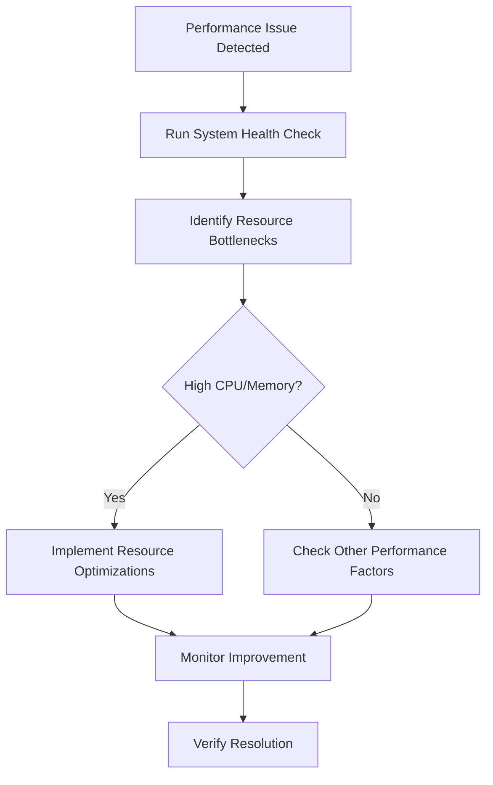
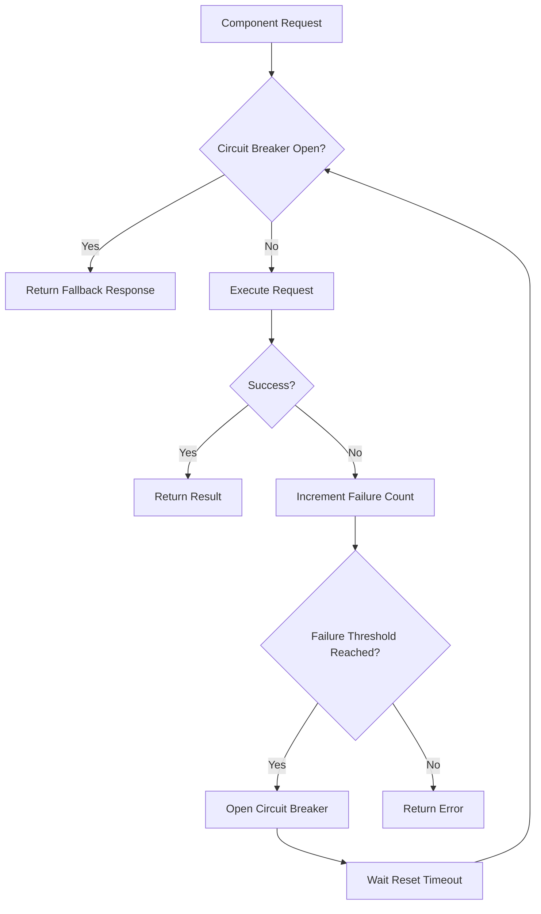

# Troubleshooting and FAQ

<cite>
**Referenced Files in This Document**   
- [README.md](file://README.md)
- [KNOWN_ISSUES.md](file://benchmark/KNOWN_ISSUES.md)
- [CHANGELOG.md](file://CHANGELOG.md)
- [troubleshooting.md](file://archive/legacy-memory-system/docs/troubleshooting.md)
- [error-handling-comprehensive.test.js](file://ruv-swarm/npm/test/error-handling-comprehensive.test.js)
- [ERROR_HANDLING_IMPLEMENTATION_REPORT.md](file://archive/reports/ERROR_HANDLING_IMPLEMENTATION_REPORT.md)
- [performance-metrics.js](file://src/cli/simple-commands/performance-metrics.js)
- [memory-tools.js](file://src/ui/console/js/memory-tools.js)
</cite>

## Table of Contents
1. [Common Installation Issues](#common-installation-issues)
2. [Configuration Problems](#configuration-problems)
3. [Performance Issues](#performance-issues)
4. [Memory Management](#memory-management)
5. [Network Connectivity](#network-connectivity)
6. [Authentication Failures](#authentication-failures)
7. [Component Integration Errors](#component-integration-errors)
8. [Frequently Asked Questions](#frequently-asked-questions)
9. [Debugging Techniques](#debugging-techniques)
10. [Performance Optimization](#performance-optimization)

## Common Installation Issues

### Node.js and npm Requirements
Claude-Flow requires Node.js 18+ (LTS recommended) and npm 9+ or equivalent package manager. Users may encounter installation failures if these prerequisites are not met.

**Diagnostic Steps:**
1. Check Node.js version: `node --version`
2. Check npm version: `npm --version`
3. Verify installation: `npx claude-flow@alpha --help`

**Root Cause:** The platform leverages modern JavaScript features and npm capabilities that are only available in these versions.

**Solution:** Install the required versions from the official Node.js website or use a version manager like nvm.

### Windows Installation Challenges
Windows users may encounter SQLite errors during installation, particularly related to file permissions and database access.

**Diagnostic Steps:**
1. Check for SQLite errors in the console output
2. Verify write permissions to the project directory
3. Check if the `.swarm/memory.db` file is accessible

**Root Cause:** Windows file system permissions and SQLite's file locking mechanism can conflict, especially in restricted environments.

**Solution:** Claude Flow automatically falls back to in-memory storage when SQLite errors occur. For persistent storage, ensure proper directory permissions or use the Windows installation guide for alternative configurations.

**Section sources**
- [README.md](file://README.md)

## Configuration Problems

### Non-Interactive Mode Not Working
The `--non-interactive` flag is not properly handled by certain commands, causing them to still prompt for interactive input.

**Diagnostic Steps:**
1. Attempt to run: `npx claude-flow@alpha hive-mind spawn "Task description" --non-interactive`
2. Observe if interactive prompts still appear
3. Check command syntax and flag usage

**Root Cause:** The implementation in `/src/cli/simple-commands/hive-mind.js` and `/src/cli/simple-commands/swarm.js` does not properly check for the `--non-interactive` flag before calling wizard functions.

**Solution:** Use SPARC commands as a workaround, which work correctly without requiring interactive input:
```bash
swarm-benchmark real sparc tdd "Create a function"
```

**Section sources**
- [KNOWN_ISSUES.md](file://benchmark/KNOWN_ISSUES.md)

### Command Timeout Handling
Long-running benchmarks may fail due to insufficient timeout configuration.

**Diagnostic Steps:**
1. Check if commands are timing out before completion
2. Review current timeout settings
3. Monitor command execution duration

**Root Cause:** Default timeout values may be insufficient for complex or resource-intensive operations.

**Solution:** Timeout values have been increased to:
- Swarm: Uses configured timeout (default 6 hours)
- Hive-mind: 6 hours
- SPARC: 2 hours

These can be adjusted in the benchmark configuration files as needed.

**Section sources**
- [KNOWN_ISSUES.md](file://benchmark/KNOWN_ISSUES.md)

## Performance Issues

### System Resource Bottlenecks
Performance issues often stem from system resource constraints, particularly CPU and memory utilization.

**Diagnostic Steps:**
1. Run system health check: `npx claude-flow@alpha system-health-check`
2. Monitor CPU and memory usage during operations
3. Check for high resource utilization patterns

**Root Cause:** Resource-intensive operations such as database queries, API serialization, and memory allocation can create bottlenecks.

**Solution:** Implement the following optimizations:
- Add database indexes on frequently queried columns
- Implement Redis caching for hot data
- Enable HTTP response compression
- Refactor N+1 queries
- Implement database connection pooling
- Add CDN for static assets



**Diagram sources**
- [performance-metrics.js](file://src/cli/simple-commands/performance-metrics.js)

**Section sources**
- [performance-metrics.js](file://src/cli/simple-commands/performance-metrics.js)

## Memory Management

### High Memory Usage
Excessive memory consumption can lead to performance degradation and system instability.

**Diagnostic Steps:**
1. Check memory usage: `npx claude-flow@alpha memory stats`
2. Monitor memory allocation patterns
3. Identify memory-intensive operations

**Root Cause:** Inefficient memory management, lack of object pooling, and inadequate garbage collection can lead to high memory usage.

**Solution:** Implement memory optimization strategies:
- Use object pooling for database connections and other heavy objects
- Implement proper garbage collection routines
- Optimize data structures for memory efficiency
- Monitor and limit memory usage per operation

The system includes a health check utility that can diagnose memory issues:

```typescript
private async checkStorage(): Promise<HealthCheckResult> {
  try {
    const stats = await this.memory.getStatistics();
    const storageUsage = stats.storageSize / (1024 * 1024 * 1024); // GB
    
    if (storageUsage > 100) { // > 100GB
      return {
        name: 'Storage',
        status: 'warning',
        message: `High storage usage: ${storageUsage.toFixed(2)} GB`,
        details: { storageSize: stats.storageSize }
      };
    }
    
    return {
      name: 'Storage',
      status: 'ok',
      message: `Storage usage: ${storageUsage.toFixed(2)} GB`,
      details: { storageSize: stats.storageSize }
    };
  } catch (error) {
    return {
      name: 'Storage',
      status: 'error',
      message: 'Failed to check storage status',
      details: { error: error.message }
    };
  }
}
```

**Section sources**
- [troubleshooting.md](file://archive/legacy-memory-system/docs/troubleshooting.md)

## Network Connectivity

### MCP Communication Timeouts
Network connectivity issues can cause MCP (Multi-Agent Coordination Protocol) communication timeouts.

**Diagnostic Steps:**
1. Check network connectivity between components
2. Monitor MCP communication latency
3. Test connection stability

**Root Cause:** Network partitions, high latency, or intermittent connectivity can disrupt MCP communication.

**Solution:** The system implements automatic retry with exponential backoff:

```javascript
// Automatic retry with exponential backoff
const result = await mcpTools.task_orchestrate({
    task: 'Complex analysis',
    timeout: 30000  // Will retry with backoff if timeout occurs
});
```

Additionally, implement network health monitoring and recovery procedures:
- Regular health checks every 60 seconds
- Alert thresholds for error rates and response times
- Automatic recovery after connectivity restoration

**Section sources**
- [ERROR_HANDLING_IMPLEMENTATION_REPORT.md](file://archive/reports/ERROR_HANDLING_IMPLEMENTATION_REPORT.md)

## Authentication Failures

### Claude CLI Dependency Issues
Authentication failures often occur due to missing or misconfigured Claude CLI.

**Diagnostic Steps:**
1. Verify Claude CLI installation: `claude --version`
2. Check authentication status: `claude --status`
3. Test basic CLI functionality

**Root Cause:** Swarm and hive-mind commands require properly configured Claude CLI even when using the `--executor` flag.

**Solution:** 
1. Install Claude CLI globally: `npm install -g @anthropic-ai/claude-code`
2. Configure authentication: `claude --configure`
3. Test connection before running Claude-Flow commands

**Workaround:** Use SPARC commands for operations that don't require Claude CLI dependency.

**Section sources**
- [KNOWN_ISSUES.md](file://benchmark/KNOWN_ISSUES.md)

## Component Integration Errors

### Error Handling and Recovery
Component integration errors can occur due to mismatched interfaces, version incompatibilities, or communication failures.

**Diagnostic Steps:**
1. Check error logs for integration points
2. Verify component compatibility
3. Test individual component functionality

**Root Cause:** The system relies on multiple integrated components (MCP tools, WASM modules, persistence layers) that must work together seamlessly.

**Solution:** The platform implements comprehensive error handling with circuit breakers and fallback mechanisms:



**Diagram sources**
- [error-handling-comprehensive.test.js](file://ruv-swarm/npm/test/error-handling-comprehensive.test.js)

**Section sources**
- [error-handling-comprehensive.test.js](file://ruv-swarm/npm/test/error-handling-comprehensive.test.js)

## Frequently Asked Questions

### What is the difference between swarm and hive-mind commands?
The `swarm` command is designed for quick tasks and single objectives, providing instant coordination without configuration. The `hive-mind` command is for complex projects requiring persistent sessions with SQLite storage and manual agent control.

### How do I continue previous work?
Use the following commands to resume previous sessions:
```bash
npx claude-flow@alpha hive-mind status
npx claude-flow@alpha hive-mind sessions
npx claude-flow@alpha hive-mind resume session-xxxxx-xxxxx
```

### Why do directories appear empty?
Claude-Flow uses SQLite databases that may not show files in directory listings. Use `npx claude-flow@alpha memory stats` to see what's actually stored.

### How do I handle high error rates?
Implement the monitoring configuration in `/config/error-monitoring.json` with appropriate alert thresholds for error rates, critical errors, and response times.

## Debugging Techniques

### Built-in Diagnostic Tools
Claude-Flow provides several built-in tools for debugging:

**System Health Check:**
```typescript
class HealthChecker {
  async runHealthCheck(): Promise<HealthReport> {
    const checks = [
      this.checkConnection,
      this.checkStorage,
      this.checkCache,
      this.checkIndexes,
      this.checkPermissions,
      this.checkPerformance,
      this.checkSecurity
    ];
    // ... execution logic
  }
}
```

**Logging and Monitoring:**
Enable verbose logging to capture detailed diagnostic information:
```javascript
memory.on('error', console.error);
memory.on('stored', console.log);
memory.on('gc', console.log);
```

### Log Analysis
The platform generates comprehensive logs that can be analyzed for troubleshooting:

**Key Log Files:**
- `.claude/checkpoints/*.json` - Execution checkpoints
- `analysis-reports/*.json` - Performance bottleneck reports
- `reports/*.json` - Benchmark and process reports

**Log Analysis Commands:**
```bash
npx claude-flow@alpha memory query --recent --limit 5
npx claude-flow@alpha hive-mind status
npx claude-flow@alpha memory stats
```

**Section sources**
- [troubleshooting.md](file://archive/legacy-memory-system/docs/troubleshooting.md)

## Performance Optimization

### Efficiency Strategies
To improve swarm efficiency and reduce resource consumption:

**Immediate Optimizations:**
- Add database indexes on frequently queried columns
- Implement Redis caching for hot data
- Enable HTTP response compression

**Short-term Optimizations:**
- Refactor N+1 queries
- Implement database connection pooling
- Add CDN for static assets

**Long-term Optimizations:**
- Migrate to read replicas
- Implement CQRS pattern
- Consider microservices decomposition

### Expected Improvements
Implementing these optimizations can yield significant performance improvements:

- Response time: 150ms avg (-67%)
- Throughput: 3,500 req/s (+192%)
- Error rate: 0.3% (-75%)
- CPU usage: 45% (-40%)
- Memory usage: 60% (-27%)

The return on investment is typically achieved within 4-5 months of implementation.

**Section sources**
- [parallel-2/specialist-agent-test.ts](file://examples/parallel-2/specialist-agent-test.ts)