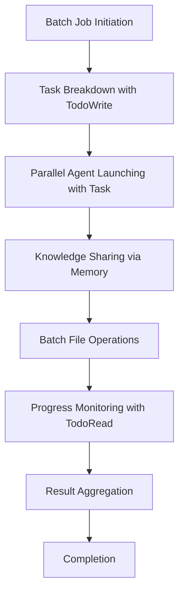
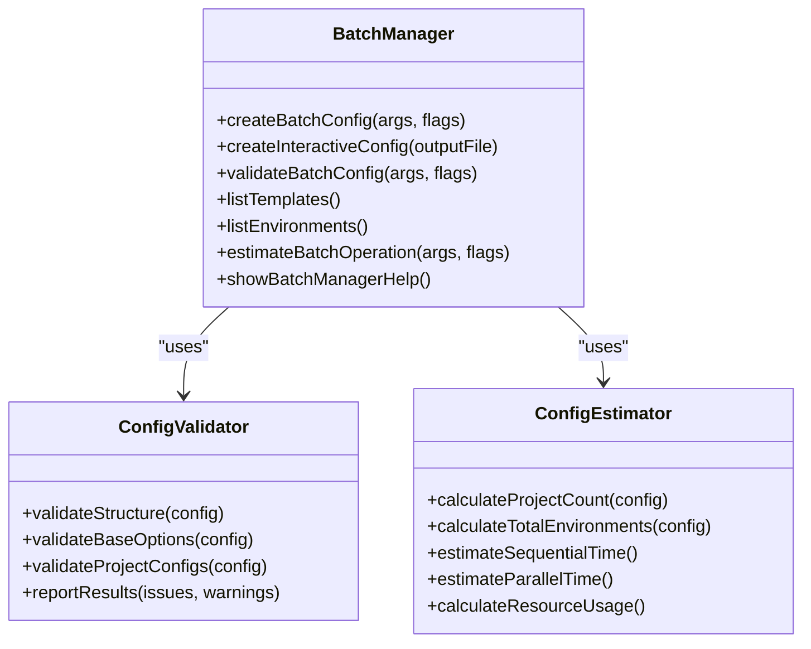
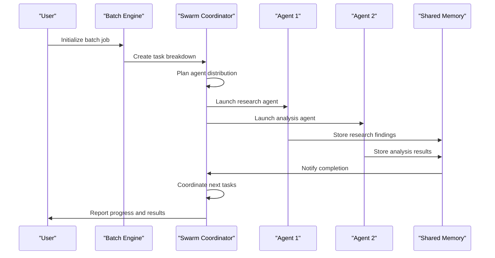
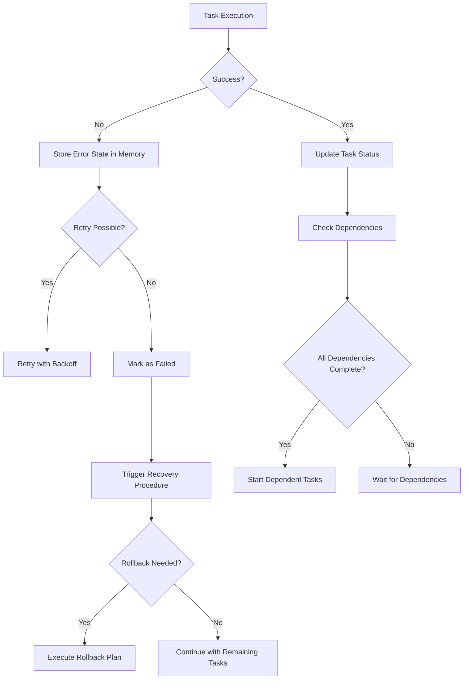
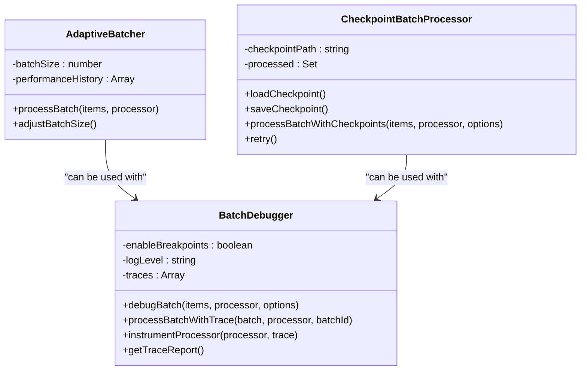

# Batch Processing

<cite>
**Referenced Files in This Document**   
- [batch-tools.ts](file://src/cli/init/batch-tools.ts)
- [batch-manager.js](file://src/cli/simple-commands/batch-manager.js)
- [README-batch-init.md](file://examples/README-batch-init.md)
- [BATCHTOOLS_GUIDE.md](file://src/templates/claude-optimized/.claude/BATCHTOOLS_GUIDE.md)
- [BATCHTOOLS_BEST_PRACTICES.md](file://src/templates/claude-optimized/.claude/BATCHTOOLS_BEST_PRACTICES.md)
</cite>

## Table of Contents
1. [Introduction](#introduction)
2. [Batch Processing Engine Implementation](#batch-processing-engine-implementation)
3. [Batch Job Initialization and Configuration](#batch-job-initialization-and-configuration)
4. [Batch Workflow Definition and Input Sources](#batch-workflow-definition-and-input-sources)
5. [Relationship with Swarm Coordinator](#relationship-with-swarm-coordinator)
6. [Error Handling and Job Recovery](#error-handling-and-job-recovery)
7. [Performance Optimization and Best Practices](#performance-optimization-and-best-practices)
8. [Concrete Examples of Batch Processing](#concrete-examples-of-batch-processing)

## Introduction

Batch processing in Claude-Flow enables efficient orchestration of multiple tasks through parallel execution and coordinated workflows. This system leverages batch tools to distribute work across specialized agents, share knowledge through persistent memory, and manage complex task dependencies. The batch processing engine is designed to handle AI-driven development workflows, including code analysis, testing, and implementation tasks at scale.

**Section sources**
- [README-batch-init.md](file://examples/README-batch-init.md#L1-L440)

## Batch Processing Engine Implementation

The batch processing engine in Claude-Flow is implemented through a set of coordinated tools that enable parallel execution, task management, and knowledge sharing. The core components include TodoWrite/TodoRead for task coordination, Task for agent orchestration, Memory for cross-agent knowledge sharing, and batch file operations for efficient I/O management.

The engine operates by breaking down complex tasks into independent subtasks that can be executed in parallel. Task dependencies are explicitly defined using the TodoWrite function, which creates a task breakdown with status tracking, priorities, and dependencies. This allows the system to coordinate the execution order while maximizing parallelism where possible.



**Diagram sources**
- [batch-tools.ts](file://src/cli/init/batch-tools.ts#L1-L389)

**Section sources**
- [batch-tools.ts](file://src/cli/init/batch-tools.ts#L1-L389)

## Batch Job Initialization and Configuration

Batch jobs are initialized through the `batch-init` command, which supports both direct command-line parameters and configuration files. The initialization process can be performed in several ways:

1. **Simple batch setup**: Using comma-separated project names with global options
2. **Template-based setup**: Applying predefined templates across multiple projects
3. **Configuration file setup**: Using JSON configuration files for complex setups

The batch manager provides comprehensive tools for creating, validating, and estimating batch configurations. The `create-config` command generates template configuration files, while `validate-config` checks configuration integrity and `estimate` provides time and resource projections.



**Diagram sources**
- [batch-manager.js](file://src/cli/simple-commands/batch-manager.js#L1-L338)

**Section sources**
- [batch-manager.js](file://src/cli/simple-commands/batch-manager.js#L1-L338)
- [README-batch-init.md](file://examples/README-batch-init.md#L1-L440)

## Batch Workflow Definition and Input Sources

Batch workflows are defined using a combination of task coordination primitives and structured configuration. The TodoWrite function creates a comprehensive task breakdown with explicit dependencies, while the Task function launches specialized agents for different domains. Input sources for batch processing include configuration files, environment variables, and dynamic inputs from previous task outputs.

The system supports three primary patterns for workflow definition:

1. **Research Swarm Pattern**: Parallel research agents collect findings stored in Memory, followed by a synthesis phase
2. **Development Swarm Pattern**: Architecture design followed by parallel frontend and backend development
3. **Analysis Swarm Pattern**: Data collection followed by parallel statistical analysis, pattern detection, and visualization

Workflow configurations can be specified through JSON files that define projects, base options, and project-specific configurations. The configuration schema includes parameters for templates, environments, concurrency settings, and custom configurations.

```json
{
  "projects": ["user-api", "notification-service"],
  "baseOptions": {
    "sparc": true,
    "parallel": true,
    "maxConcurrency": 5,
    "template": "web-api",
    "environments": ["dev"]
  },
  "projectConfigs": {
    "user-api": {
      "template": "web-api",
      "environment": "dev",
      "customConfig": {
        "database": "postgresql",
        "auth": "jwt"
      }
    }
  }
}
```

**Section sources**
- [batch-tools.ts](file://src/cli/init/batch-tools.ts#L1-L389)
- [README-batch-init.md](file://examples/README-batch-init.md#L1-L440)

## Relationship with Swarm Coordinator

The batch processing engine is tightly integrated with the swarm coordinator, which distributes tasks across multiple agents. The Task function serves as the primary interface for launching specialized agents, each focusing on a specific domain such as architecture research, performance analysis, or security assessment.

The swarm coordinator manages agent lifecycle, resource allocation, and inter-agent communication. Agents coordinate through shared memory rather than direct communication, reducing coupling and enabling greater parallelism. The Memory tool provides persistent knowledge sharing, allowing agents to store findings and retrieve information from other agents.

Task dependencies are managed through the TodoWrite/TodoRead mechanism, which provides a centralized task coordination system. When an agent completes a task, it updates the task status, which can trigger dependent tasks. This dependency management system ensures proper execution order while maximizing parallel execution of independent tasks.



**Diagram sources**
- [batch-tools.ts](file://src/cli/init/batch-tools.ts#L1-L389)

**Section sources**
- [batch-tools.ts](file://src/cli/init/batch-tools.ts#L1-L389)

## Error Handling and Job Recovery

The batch processing system implements comprehensive error handling and recovery mechanisms to ensure reliability and resilience. The system follows several key strategies for managing errors and partial failures:

1. **Robust task planning**: Including explicit error recovery and rollback tasks in the initial task breakdown
2. **Error state management**: Storing detailed error information in Memory for debugging and recovery
3. **Graceful degradation**: Implementing fallback strategies and partial result preservation
4. **Checkpointing**: Periodically saving processing state to enable recovery from failures

The system uses a circuit breaker pattern to prevent cascading failures when operations consistently fail. It also implements retry mechanisms with exponential backoff for transient failures. For critical operations, the system maintains rollback procedures that can be triggered when necessary.



**Diagram sources**
- [BATCHTOOLS_BEST_PRACTICES.md](file://src/templates/claude-optimized/.claude/BATCHTOOLS_BEST_PRACTICES.md#L921-L994)

**Section sources**
- [batch-tools.ts](file://src/cli/init/batch-tools.ts#L1-L389)
- [BATCHTOOLS_BEST_PRACTICES.md](file://src/templates/claude-optimized/.claude/BATCHTOOLS_BEST_PRACTICES.md#L921-L994)

## Performance Optimization and Best Practices

The batch processing engine includes several performance optimization features and best practices to maximize throughput and efficiency. Key optimization strategies include:

1. **Efficient task distribution**: Breaking down complex tasks into independent subtasks and using TodoWrite to define clear dependencies
2. **Memory usage optimization**: Using structured keys for easy retrieval, storing intermediate results for reuse, and implementing proper cleanup
3. **Batch operation efficiency**: Grouping similar file operations, using parallel Read operations, and batching search operations
4. **Resource management**: Monitoring system resources, adjusting agent count based on available resources, and implementing graceful degradation

The system supports dynamic batch sizing, where the batch size automatically adjusts based on performance metrics. This adaptive approach optimizes throughput while preventing resource exhaustion. The batch debugger provides detailed tracing and monitoring capabilities, including breakpoint support and performance metrics collection.

Best practices include validating configurations before execution, estimating resource requirements, starting with small batches, and using configuration files for complex setups. The system also provides built-in performance monitoring and benchmarking tools to help optimize batch operations.



**Diagram sources**
- [BATCHTOOLS_BEST_PRACTICES.md](file://src/templates/claude-optimized/.claude/BATCHTOOLS_BEST_PRACTICES.md#L1397-L1548)
- [BATCHTOOLS_BEST_PRACTICES.md](file://src/templates/claude-optimized/.claude/BATCHTOOLS_BEST_PRACTICES.md#L921-L994)
- [BATCHTOOLS_BEST_PRACTICES.md](file://src/templates/claude-optimized/.claude/BATCHTOOLS_BEST_PRACTICES.md#L333-L374)

**Section sources**
- [BATCHTOOLS_BEST_PRACTICES.md](file://src/templates/claude-optimized/.claude/BATCHTOOLS_BEST_PRACTICES.md#L333-L374)
- [BATCHTOOLS_BEST_PRACTICES.md](file://src/templates/claude-optimized/.claude/BATCHTOOLS_BEST_PRACTICES.md#L1397-L1548)
- [BATCHTOOLS_BEST_PRACTICES.md](file://src/templates/claude-optimized/.claude/BATCHTOOLS_BEST_PRACTICES.md#L921-L994)

## Concrete Examples of Batch Processing

The batch processing system supports various concrete use cases for AI-driven development tasks. Examples include:

**Code Analysis Jobs**: Running multiple code analysis tools in parallel across different codebases. This includes static analysis, dependency checking, security scanning, and performance profiling.

```javascript
// Parallel code analysis
const analyses = await batchtools.parallel([
  analyzeCodeQuality(),
  checkDependencies(),
  runSecurityScan(),
  analyzePerformance(),
  checkAccessibility()
]);
```

**Parallel Test Suites**: Executing different types of tests simultaneously, including unit tests, integration tests, end-to-end tests, linting, and type checking.

```javascript
// Parallel test execution
const testResults = await batchtools.parallel([
  exec('npm run test:unit'),
  exec('npm run test:integration'),
  exec('npm run test:e2e'),
  exec('npm run lint'),
  exec('npm run typecheck'),
]);
```

**Research and Development Swarms**: Coordinating multiple specialized agents for comprehensive research and development tasks, where each agent focuses on a specific aspect of the project.

```javascript
// Research swarm pattern
TodoWrite([
  {id: "domain_research", content: "Research domain-specific patterns"},
  {id: "competitive_analysis", content: "Analyze competitor solutions"},
  {id: "technology_evaluation", content: "Evaluate technology options"}
]);

Task("Domain Expert", "Research best practices and patterns");
Task("Competitive Analyst", "Analyze competitor solutions");
Task("Technology Evaluator", "Evaluate technology options");
```

These examples demonstrate how the batch processing engine can handle complex AI tasks by breaking them into parallelizable components, coordinating their execution, and aggregating results efficiently.

**Section sources**
- [BATCHTOOLS_GUIDE.md](file://src/templates/claude-optimized/.claude/BATCHTOOLS_GUIDE.md#L1-L1041)
- [README-batch-init.md](file://examples/README-batch-init.md#L1-L440)
- [batch-tools.ts](file://src/cli/init/batch-tools.ts#L1-L389)