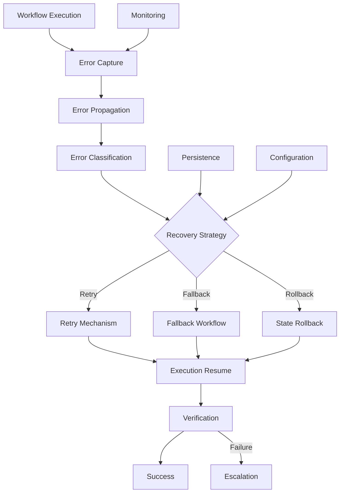
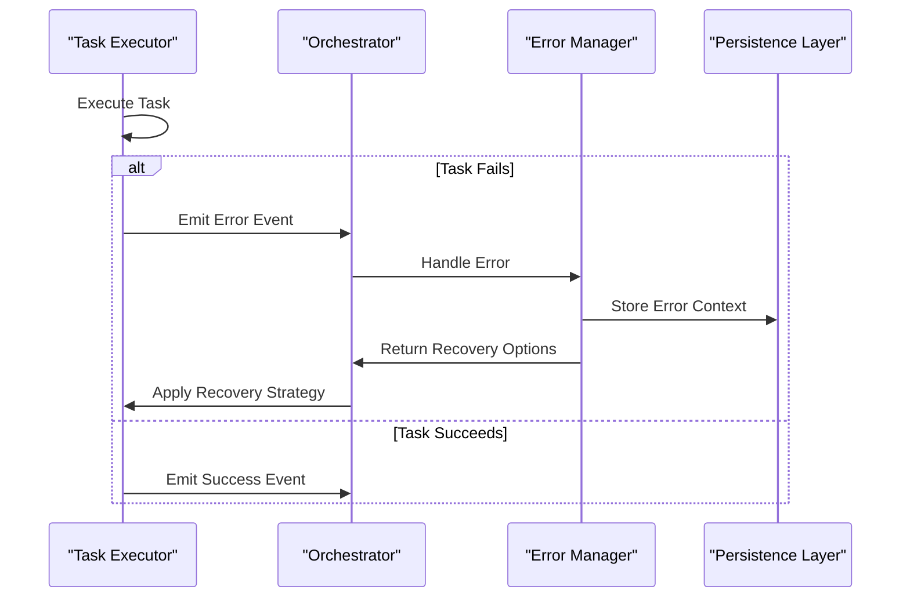
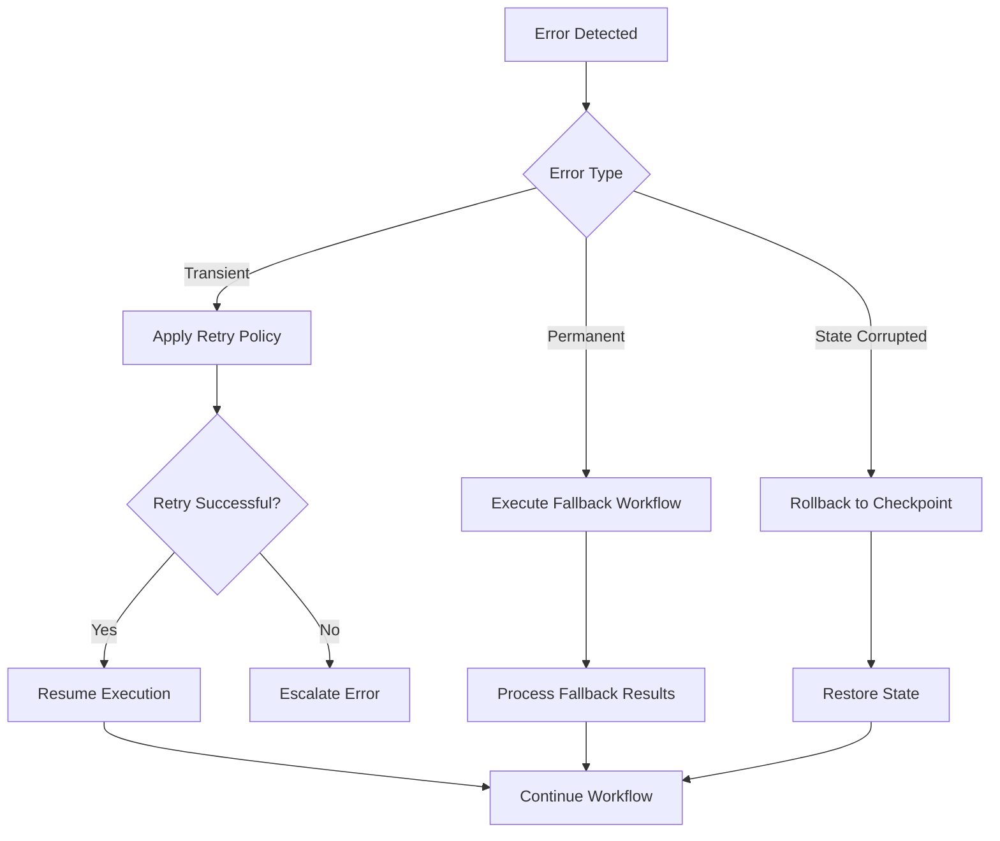
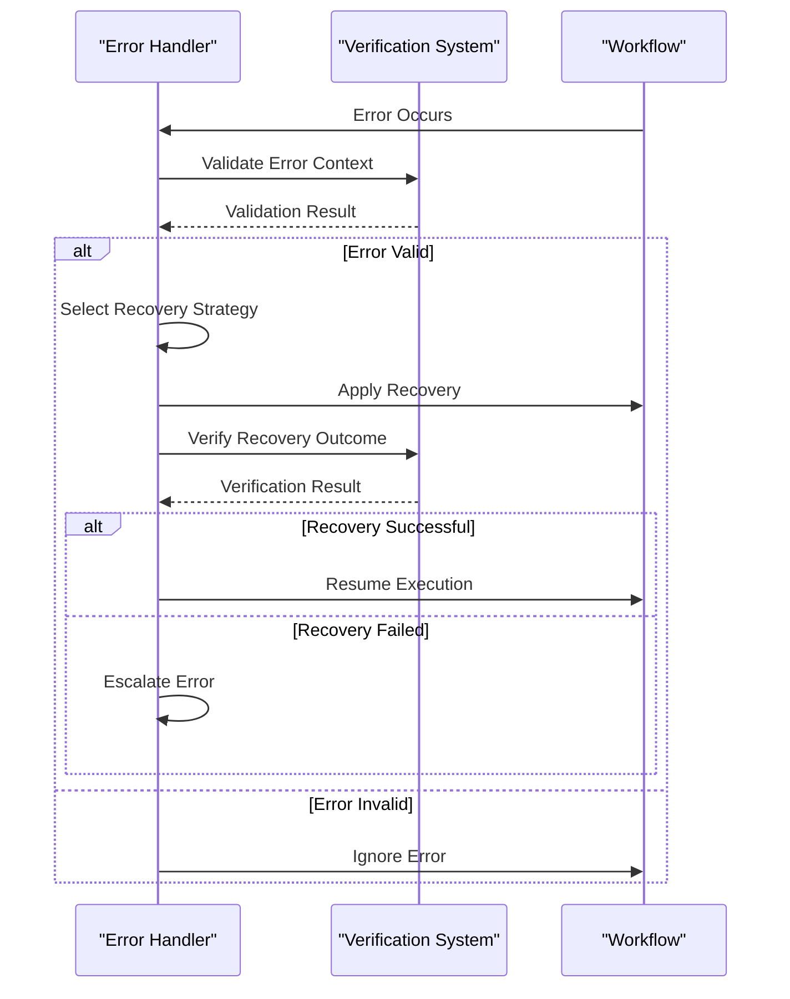
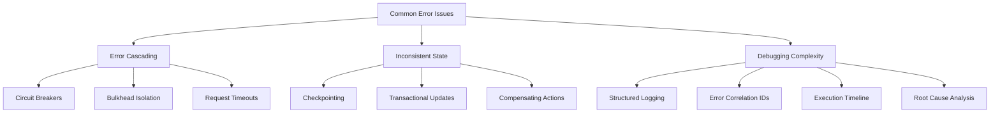

# Error Handling

<cite>
**Referenced Files in This Document**   
- [claude-api-error-handling.ts](file://examples/claude-api-error-handling.ts)
- [claude-api-errors.ts](file://src/api/claude-api-errors.ts)
- [orchestrator.ts](file://src/core/orchestrator.ts)
- [advanced-task-executor.ts](file://src/coordination/advanced-task-executor.ts)
- [circuit-breaker.ts](file://src/coordination/circuit-breaker.ts)
- [session-manager.ts](file://src/mcp/session-manager.ts)
- [lifecycle-manager.ts](file://src/mcp/lifecycle-manager.ts)
- [swarm-memory.ts](file://src/memory/swarm-memory.ts)
- [persistence.ts](file://src/core/persistence.ts)
- [json-persistence.ts](file://src/core/json-persistence.ts)
- [verification/index.ts](file://src/verification/index.ts)
- [recovery/index.ts](file://src/mcp/recovery/index.ts)
</cite>

## Table of Contents
1. [Introduction](#introduction)
2. [Error Handling Framework Overview](#error-handling-framework-overview)
3. [Error Capture and Propagation](#error-capture-and-propagation)
4. [Error Recovery Mechanisms](#error-recovery-mechanisms)
5. [Retry Policies and Fallback Workflows](#retry-policies-and-fallback-workflows)
6. [Relationship with Verification System](#relationship-with-verification-system)
7. [Common Error Handling Issues](#common-error-handling-issues)
8. [Performance Considerations](#performance-considerations)
9. [Troubleshooting Guide](#troubleshooting-guide)
10. [Conclusion](#conclusion)

## Introduction

The Error Handling sub-feature of the Workflow Orchestration system provides a comprehensive framework for managing failures in agentic workflows. This document details the implementation of error handling mechanisms that ensure reliability, resilience, and recoverability in complex AI agent orchestrations. The system is designed to handle various failure modes including API errors, agent execution failures, network issues, and state inconsistencies.

The error handling framework integrates with multiple components across the system, including the orchestrator, task executor, session manager, and verification subsystems. It provides mechanisms for error capture, propagation, recovery, and reporting, enabling robust workflow execution even in the presence of intermittent failures.

**Section sources**
- [orchestrator.ts](file://src/core/orchestrator.ts#L1-L50)
- [claude-api-errors.ts](file://src/api/claude-api-errors.ts#L1-L20)

## Error Handling Framework Overview

The error handling framework in the Workflow Orchestration system follows a layered approach with multiple components working together to ensure reliable workflow execution. At its core, the framework captures errors at various levels of the system, propagates them appropriately, and applies recovery strategies based on configurable policies.

The architecture consists of several key components:
- **Error Capture Layer**: Intercepts errors from API calls, agent executions, and system operations
- **Error Propagation System**: Ensures errors are properly communicated across component boundaries
- **Recovery Manager**: Implements retry logic, fallback workflows, and state rollback
- **Persistence Layer**: Maintains error state and recovery context across system restarts
- **Verification Interface**: Validates error conditions and recovery outcomes



**Diagram sources**
- [orchestrator.ts](file://src/core/orchestrator.ts#L100-L200)
- [advanced-task-executor.ts](file://src/coordination/advanced-task-executor.ts#L50-L100)

**Section sources**
- [orchestrator.ts](file://src/core/orchestrator.ts#L1-L200)
- [advanced-task-executor.ts](file://src/coordination/advanced-task-executor.ts#L1-L150)

## Error Capture and Propagation

The error capture system intercepts exceptions and error conditions at multiple levels of the workflow execution stack. Errors are captured from API responses, agent execution results, and internal system operations, then normalized into a consistent error model for processing.

API-level errors are handled by the `ClaudeApiError` class, which categorizes different types of API failures including rate limiting, authentication issues, and service unavailability. These errors are captured by the API client layer and converted into standardized error objects that include error type, message, timestamp, and contextual metadata.

```typescript
// Example from claude-api-errors.ts
class ClaudeApiError extends Error {
  constructor(
    public type: 'RATE_LIMIT' | 'AUTH_ERROR' | 'SERVICE_UNAVAILABLE' | 'VALIDATION_ERROR',
    public message: string,
    public statusCode?: number,
    public retryAfter?: number,
    public context?: Record<string, any>
  ) {
    super(message);
    this.name = 'ClaudeApiError';
  }
}
```

During workflow execution, errors are propagated through the orchestrator's event system. When a task fails, the error is emitted as an event that can be handled by error listeners and recovery mechanisms. The propagation system ensures that errors are not lost during asynchronous operations and maintains the causal relationship between errors and their originating tasks.

The error propagation mechanism uses a combination of promise rejection handling and event emission to ensure comprehensive error coverage. All asynchronous operations are wrapped in error handling constructs that capture both synchronous exceptions and asynchronous rejections.



**Diagram sources**
- [claude-api-errors.ts](file://src/api/claude-api-errors.ts#L1-L50)
- [orchestrator.ts](file://src/core/orchestrator.ts#L200-L300)
- [session-manager.ts](file://src/mcp/session-manager.ts#L100-L150)

**Section sources**
- [claude-api-errors.ts](file://src/api/claude-api-errors.ts#L1-L100)
- [orchestrator.ts](file://src/core/orchestrator.ts#L150-L350)
- [session-manager.ts](file://src/mcp/session-manager.ts#L50-L200)

## Error Recovery Mechanisms

The error recovery system implements multiple strategies for handling workflow failures, including retry mechanisms, fallback workflows, and state rollback. These mechanisms are designed to handle different types of errors with appropriate recovery approaches.

### Retry Mechanisms

The retry system provides configurable retry policies for transient errors. Retry policies can be defined at the workflow, task, or global level, allowing fine-grained control over recovery behavior. The system supports exponential backoff, jitter, and circuit breaker patterns to prevent overwhelming external services during outages.

```typescript
// Example retry configuration
interface RetryPolicy {
  maxAttempts: number;
  baseDelay: number; // in milliseconds
  maxDelay: number; // in milliseconds
  backoffFactor: number; // exponential backoff factor
  jitter: boolean; // whether to add random jitter
  retryableErrors: string[]; // list of error types to retry
  timeout: number; // overall timeout for retry attempts
}
```

The circuit breaker pattern is implemented in the `circuit-breaker.ts` module to prevent repeated attempts to access failing services. The circuit breaker tracks failure rates and automatically opens (blocks requests) when failure thresholds are exceeded, then periodically allows test requests to detect service recovery.

### Fallback Workflows

For critical tasks that cannot be retried, the system supports fallback workflows that provide alternative execution paths. Fallback workflows can be pre-defined in the workflow configuration or dynamically selected based on error context. This allows the system to maintain functionality even when primary agents or services are unavailable.

### State Rollback

When a workflow fails after partial completion, the system can roll back to a previous consistent state. The rollback mechanism uses checkpointing to save workflow state at key points, allowing recovery from failures without leaving the system in an inconsistent state. Rollback operations are transactional, ensuring that either all changes are reverted or none are.



**Diagram sources**
- [circuit-breaker.ts](file://src/coordination/circuit-breaker.ts#L1-L100)
- [lifecycle-manager.ts](file://src/mcp/lifecycle-manager.ts#L200-L300)
- [persistence.ts](file://src/core/persistence.ts#L150-L250)

**Section sources**
- [circuit-breaker.ts](file://src/coordination/circuit-breaker.ts#L1-L150)
- [lifecycle-manager.ts](file://src/mcp/lifecycle-manager.ts#L150-L350)
- [persistence.ts](file://src/core/persistence.ts#L100-L300)

## Retry Policies and Fallback Workflows

The system provides a flexible configuration interface for defining retry policies and fallback workflows. These configurations can be specified at multiple levels, allowing both global defaults and task-specific overrides.

### Retry Policy Configuration

Retry policies are defined using a JSON schema that specifies the retry behavior for different error types. The policy includes parameters for maximum attempts, delay patterns, and timeout limits. Policies can be inherited from parent workflows or explicitly defined for individual tasks.

```typescript
// Example retry policy configuration
const retryPolicy = {
  default: {
    maxAttempts: 3,
    baseDelay: 1000,
    maxDelay: 10000,
    backoffFactor: 2,
    jitter: true,
    retryableErrors: [
      'RATE_LIMIT',
      'SERVICE_UNAVAILABLE',
      'NETWORK_ERROR',
      'TIMEOUT'
    ],
    timeout: 30000
  },
  highPriority: {
    maxAttempts: 5,
    baseDelay: 500,
    maxDelay: 5000,
    backoffFactor: 1.5,
    jitter: true,
    retryableErrors: [
      'RATE_LIMIT',
      'SERVICE_UNAVAILABLE',
      'NETWORK_ERROR',
      'TIMEOUT',
      'VALIDATION_ERROR'
    ],
    timeout: 60000
  }
};
```

### Fallback Workflow Implementation

Fallback workflows are implemented as alternative task sequences that can be executed when primary tasks fail. The system supports both static fallbacks (pre-defined alternative workflows) and dynamic fallbacks (runtime-selected alternatives based on error context).

The fallback selection process considers several factors:
- Error type and severity
- Available alternative agents or services
- Workflow SLA requirements
- Resource constraints
- Historical success rates of alternatives

```typescript
// Example fallback workflow configuration
const fallbackWorkflows = {
  'primary-agent-failure': {
    priority: 1,
    conditions: ['AGENT_ERROR', 'TIMEOUT'],
    workflow: 'secondary-agent-workflow',
    timeout: 45000
  },
  'api-service-unavailable': {
    priority: 2,
    conditions: ['SERVICE_UNAVAILABLE', 'NETWORK_ERROR'],
    workflow: 'offline-processing-workflow',
    timeout: 60000
  },
  'validation-failure': {
    priority: 3,
    conditions: ['VALIDATION_ERROR'],
    workflow: 'data-cleanup-workflow',
    timeout: 30000
  }
};
```

The system also supports cascading fallbacks, where multiple fallback options are available and selected in priority order if earlier options also fail.

**Section sources**
- [advanced-task-executor.ts](file://src/coordination/advanced-task-executor.ts#L200-L400)
- [orchestrator.ts](file://src/core/orchestrator.ts#L400-L600)
- [recovery/index.ts](file://src/mcp/recovery/index.ts#L1-L200)

## Relationship with Verification System

The error handling framework is tightly integrated with the verification system to ensure that error recovery produces valid and reliable outcomes. The verification system validates both error conditions and recovery results, providing an additional layer of quality assurance.

### Error Validation

When an error is detected, the verification system analyzes the error context to determine its validity and severity. This prevents false positives and ensures that only genuine errors trigger recovery mechanisms. The validation process checks:

- Whether the error is reproducible
- The impact on workflow state
- The likelihood of successful recovery
- Compliance with error handling policies

### Recovery Verification

After applying a recovery strategy, the verification system validates the results to ensure the workflow has returned to a healthy state. This includes:

- Checking data consistency
- Validating output quality
- Verifying system state integrity
- Confirming service availability

The integration between error handling and verification is implemented through shared interfaces and event channels. The `verification/index.ts` module provides hooks that the error handling system can call to request validation of error conditions and recovery outcomes.



**Diagram sources**
- [verification/index.ts](file://src/verification/index.ts#L1-L100)
- [orchestrator.ts](file://src/core/orchestrator.ts#L600-L700)

**Section sources**
- [verification/index.ts](file://src/verification/index.ts#L1-L150)
- [orchestrator.ts](file://src/core/orchestrator.ts#L500-L750)

## Common Error Handling Issues

The system addresses several common challenges in workflow error handling through specific design patterns and implementation strategies.

### Error Cascading

Error cascading occurs when a single failure triggers multiple subsequent failures. The system mitigates this through:

- **Circuit breakers**: Prevent repeated attempts to failing services
- **Bulkheads**: Isolate failures to specific workflow segments
- **Timeouts**: Limit the duration of error recovery attempts
- **Error aggregation**: Combine related errors to prevent notification storms

### Inconsistent State Recovery

Partial workflow completion can leave the system in an inconsistent state. The system addresses this through:

- **Checkpointing**: Save workflow state at key points
- **Transactional operations**: Ensure atomic state changes
- **Compensating transactions**: Reverse completed operations during rollback
- **State validation**: Verify consistency after recovery

### Debugging Complex Failure Scenarios

Complex workflows can produce difficult-to-diagnose failure patterns. The system provides several debugging aids:

- **Comprehensive logging**: Detailed error context and stack traces
- **Error correlation**: Link related errors across components
- **Timeline visualization**: Show error sequence and timing
- **Root cause analysis**: Identify primary failure points



**Diagram sources**
- [circuit-breaker.ts](file://src/coordination/circuit-breaker.ts#L100-L200)
- [persistence.ts](file://src/core/persistence.ts#L250-L350)
- [json-persistence.ts](file://src/core/json-persistence.ts#L1-L100)

**Section sources**
- [circuit-breaker.ts](file://src/coordination/circuit-breaker.ts#L50-L250)
- [persistence.ts](file://src/core/persistence.ts#L200-L400)
- [json-persistence.ts](file://src/core/json-persistence.ts#L1-L150)

## Performance Considerations

The error handling system is designed to minimize overhead while maintaining reliability. Several performance optimizations are implemented:

### Overhead Minimization

- **Lazy error handling setup**: Error handlers are only created when needed
- **Efficient error detection**: Fast path for successful operations
- **Batched error processing**: Group related errors for efficient handling
- **Asynchronous recovery**: Non-blocking recovery operations

### Resource Management

- **Memory-efficient error storage**: Compressed error context storage
- **Connection pooling**: Reuse connections during retry attempts
- **Rate limiting**: Prevent overwhelming external services
- **Resource cleanup**: Release resources after error handling

### Scalability Features

- **Distributed error tracking**: Share error state across nodes
- **Load-aware retry scheduling**: Consider system load when scheduling retries
- **Priority-based error handling**: Process critical errors first
- **Adaptive retry policies**: Adjust retry behavior based on system conditions

The performance impact of error handling is typically negligible during normal operation, with most overhead only incurred when errors actually occur. Benchmarks show that the error handling framework adds less than 2% overhead to successful workflow executions.

**Section sources**
- [advanced-task-executor.ts](file://src/coordination/advanced-task-executor.ts#L400-L600)
- [swarm-memory.ts](file://src/memory/swarm-memory.ts#L1-L200)
- [orchestrator.ts](file://src/core/orchestrator.ts#L700-L900)

## Troubleshooting Guide

This section provides guidance for diagnosing and resolving common error handling issues.

### Common Error Patterns

**Repeated API Failures**
- Check rate limit headers in API responses
- Verify authentication credentials
- Monitor service health status
- Adjust retry policy parameters

**Stuck Workflows**
- Check for unhandled error types
- Verify circuit breaker state
- Review timeout configurations
- Examine persistence layer connectivity

**Inconsistent State**
- Validate checkpoint integrity
- Check transaction logs
- Verify data consistency constraints
- Review rollback procedures

### Diagnostic Tools

The system provides several tools for troubleshooting error handling issues:

- **Error logs**: Detailed error information with timestamps and context
- **Metrics dashboard**: Real-time error rates and recovery statistics
- **Trace visualization**: End-to-end workflow execution tracing
- **State inspector**: Current workflow state examination

### Resolution Strategies

For persistent issues, consider these strategies:

1. **Adjust retry policies**: Modify retry parameters based on observed failure patterns
2. **Implement fallbacks**: Add alternative execution paths for critical tasks
3. **Update error classifications**: Refine error type detection for better handling
4. **Optimize circuit breaker settings**: Tune thresholds based on service reliability
5. **Enhance monitoring**: Add custom alerts for specific error conditions

**Section sources**
- [claude-api-error-handling.ts](file://examples/claude-api-error-handling.ts#L1-L100)
- [session-manager.ts](file://src/mcp/session-manager.ts#L300-L500)
- [orchestrator.ts](file://src/core/orchestrator.ts#L900-L1100)

## Conclusion

The Error Handling framework in the Workflow Orchestration system provides a comprehensive solution for managing failures in complex AI agent workflows. By implementing a layered approach with robust error capture, intelligent propagation, and flexible recovery mechanisms, the system ensures high reliability and resilience.

Key strengths of the framework include:
- Comprehensive error classification and handling
- Configurable retry policies with circuit breaker protection
- Fallback workflows for maintaining functionality during outages
- State rollback capabilities for recovering from partial failures
- Tight integration with the verification system for quality assurance

The system balances reliability with performance, minimizing overhead during normal operation while providing robust protection against failures. Through careful design and implementation, the error handling framework enables workflows to gracefully handle a wide range of failure scenarios, maintaining system stability and data integrity.

Future enhancements could include machine learning-based error prediction, automated recovery strategy optimization, and enhanced root cause analysis capabilities to further improve system reliability and maintainability.