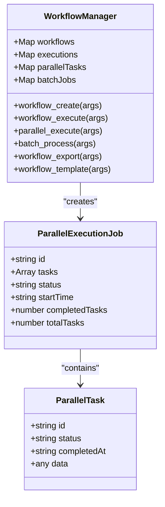
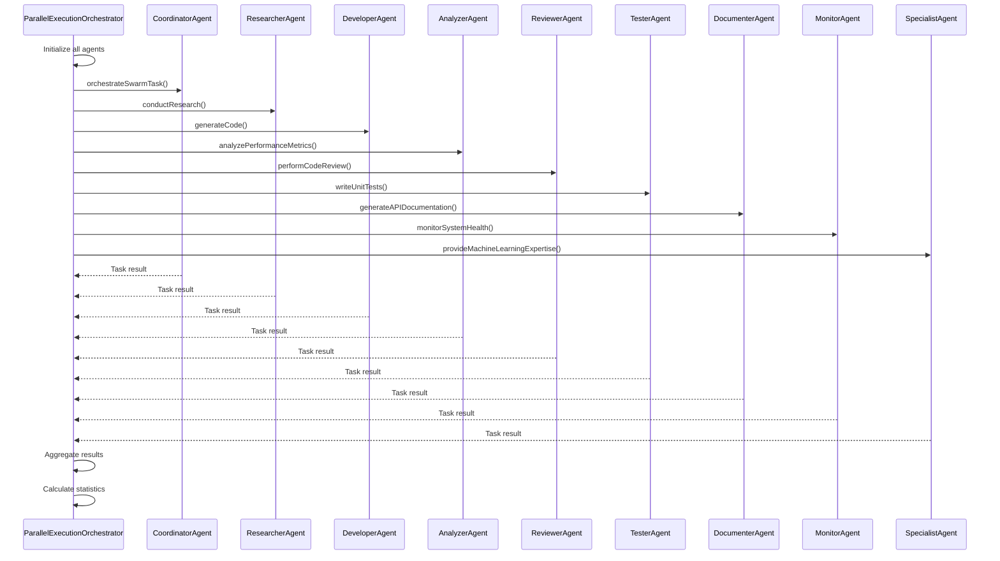

# Parallel Execution

<cite>
**Referenced Files in This Document**   
- [workflow-tools.js](file://src/mcp/implementations/workflow-tools.js#L80-L120)
- [types.ts](file://src/task/types.ts#L0-L62)
- [parallel-execution-test.ts](file://examples/parallel-2/parallel-execution-test.ts#L0-L234)
- [parallel-test.ts](file://examples/parallel-2/parallel-test.ts#L0-L65)
- [BATCHTOOLS_GUIDE.md](file://src/templates/claude-optimized/.claude/BATCHTOOLS_GUIDE.md#L792-L1027)
- [optimized-sparc-commands.js](file://src/cli/simple-commands/init/claude-commands/optimized-sparc-commands.js#L213-L240)
- [docs-writer.md](file://src/templates/claude-optimized/.claude/commands/sparc/docs-writer.md#L0-L110)
</cite>

## Table of Contents
1. [Introduction](#introduction)
2. [Core Implementation](#core-implementation)
3. [Parallel Execution Framework](#parallel-execution-framework)
4. [Task Definition and Interfaces](#task-definition-and-interfaces)
5. [Usage Patterns and Examples](#usage-patterns-and-examples)
6. [Performance Considerations](#performance-considerations)
7. [Best Practices and Limitations](#best-practices-and-limitations)
8. [Troubleshooting Guide](#troubleshooting-guide)

## Introduction

The Parallel Execution sub-feature of Workflow Orchestration enables concurrent task processing across multiple agents and workflows. This document details the implementation, interfaces, and usage patterns for parallel execution within the system. The framework allows multiple tasks to be executed simultaneously, significantly reducing overall execution time for independent operations. The system is designed to handle complex workflows where multiple AI agents can work on different aspects of a software project concurrently, such as research, development, testing, and documentation.

**Section sources**
- [workflow-tools.js](file://src/mcp/implementations/workflow-tools.js#L5-L244)

## Core Implementation

The parallel execution framework is implemented within the `WorkflowManager` class, which provides the `parallel_execute` tool for spawning and managing concurrent tasks. This implementation uses JavaScript's event loop and `setTimeout` to simulate parallel execution, allowing multiple tasks to progress concurrently without blocking the main thread.



**Diagram sources**
- [workflow-tools.js](file://src/mcp/implementations/workflow-tools.js#L5-L244)

**Section sources**
- [workflow-tools.js](file://src/mcp/implementations/workflow-tools.js#L80-L120)

## Parallel Execution Framework

The parallel execution framework is centered around the `parallel_execute` method, which accepts an array of tasks and executes them concurrently. Each parallel execution job is assigned a unique identifier and tracked in the `parallelTasks` Map, allowing for monitoring and synchronization.

### Task Spawning and Management

When `parallel_execute` is called, it creates a job object containing all tasks with initial 'pending' status. Each task is then processed with a small delay (50ms * task index) to simulate concurrent execution. As tasks complete, the system updates their status and tracks completion progress.

```javascript
parallel_execute(args) {
  const tasks = args.tasks || [];
  const jobId = `parallel_${Date.now()}_${Math.random().toString(36).substr(2, 6)}`;
  
  const job = {
    id: jobId,
    tasks: tasks.map((task, index) => ({
      id: `task_${index}`,
      ...task,
      status: 'pending',
    })),
    status: 'running',
    startTime: new Date().toISOString(),
    completedTasks: 0,
    totalTasks: tasks.length,
  };

  this.parallelTasks.set(jobId, job);

  // Simulate parallel execution
  job.tasks.forEach((task, index) => {
    setTimeout(() => {
      task.status = 'completed';
      task.completedAt = new Date().toISOString();
      job.completedTasks++;
      
      if (job.completedTasks === job.totalTasks) {
        job.status = 'completed';
        job.endTime = new Date().toISOString();
      }
    }, 50 * (index + 1));
  });

  return {
    success: true,
    jobId: jobId,
    taskCount: tasks.length,
    status: 'running',
    timestamp: new Date().toISOString(),
  };
}
```

### Synchronization and Monitoring

The framework provides built-in synchronization by tracking the completion of all tasks within a job. When the number of completed tasks equals the total tasks, the job status is updated to 'completed'. This allows the workflow engine to coordinate dependent operations that require all parallel tasks to finish before proceeding.

The system also maintains a registry of all parallel jobs in the `parallelTasks` Map, enabling external monitoring and status queries. Each job includes timestamps for start and end times, allowing performance analysis and execution time tracking.

**Section sources**
- [workflow-tools.js](file://src/mcp/implementations/workflow-tools.js#L80-L120)

## Task Definition and Interfaces

The system defines specific interfaces for tasks and their metadata, enabling rich task definitions with execution parameters and coordination context.

### Task Metadata Interface

The `TaskMetadata` interface extends the base record type with properties that support parallel execution:

```typescript
export interface TaskMetadata extends Record<string, unknown> {
  retryCount?: number;
  todoId?: string;
  batchOptimized?: boolean;
  parallelExecution?: boolean;
  memoryKey?: string;
  cancellationReason?: string;
  cancelledAt?: Date;
  lastRetryAt?: Date;
  originalPriority?: number;
  escalated?: boolean;
  checkpointData?: Record<string, unknown>;
}
```

Key properties for parallel execution include:
- **parallelExecution**: Flag indicating the task is optimized for parallel processing
- **batchOptimized**: Indicates the task is designed for batch processing
- **retryCount**: Tracks retry attempts for fault tolerance in distributed execution

### Coordination Context

The `CoordinationContext` interface provides the execution context for tasks, including workflow and batch identifiers that enable coordination between parallel operations:

```typescript
export interface CoordinationContext {
  sessionId: string;
  agentId?: string;
  workflowId?: string;
  batchId?: string;
  parentTaskId?: string;
  coordinationMode: 'centralized' | 'distributed' | 'hierarchical' | 'mesh' | 'hybrid';
  agents?: any[];
  metadata?: Record<string, any>;
}
```

This context allows tasks to understand their position within the larger workflow and coordinate with other parallel tasks.

**Section sources**
- [types.ts](file://src/task/types.ts#L0-L62)

## Usage Patterns and Examples

The system supports multiple patterns for parallel execution, demonstrated through concrete examples in the codebase.

### Multi-Agent Parallel Execution

The `parallel-execution-test.ts` example demonstrates how multiple agent types can work concurrently on different aspects of a software project:



**Diagram sources**
- [parallel-execution-test.ts](file://examples/parallel-2/parallel-execution-test.ts#L0-L234)

This pattern shows nine different agent types working simultaneously on tasks such as:
- Coordinator: Orchestrate authentication system and monitor swarm progress
- Researcher: Research REST API best practices and analyze performance data
- Developer: Generate authentication code and refactor payment modules
- Tester: Write unit tests and run performance tests

The orchestrator uses `Promise.allSettled()` to execute all tasks in parallel and process results regardless of individual success or failure.

### Task Parallelization with Priority Management

The `parallel-test.ts` example demonstrates a different pattern where tasks are assigned priorities and executed in parallel:

```typescript
const agentTasks: AgentTask[] = [
  {
    name: "Specification",
    mode: "spec-pseudocode",
    task: "Create a simple calculator API specification with basic arithmetic operations",
    priority: 1
  },
  {
    name: "Architecture",
    mode: "architect",
    task: "Design the architecture for a REST API service with authentication",
    priority: 1
  },
  {
    name: "Code Implementation",
    mode: "code",
    task: "Implement a binary search algorithm in TypeScript",
    priority: 2
  }
  // Additional tasks...
];
```

This approach allows the system to categorize tasks by priority while still executing them concurrently, enabling efficient resource utilization.

**Section sources**
- [parallel-test.ts](file://examples/parallel-2/parallel-test.ts#L0-L65)

## Performance Considerations

The parallel execution framework provides significant performance benefits but requires careful resource management.

### Performance Benchmarking

The system includes benchmarking capabilities to compare sequential and parallel execution:

```javascript
const benchmarkBatchOperations = async () => {
  const operations = generateTestOperations(1000);

  // Sequential benchmark
  const sequentialStart = Date.now();
  for (const op of operations) {
    await op();
  }
  const sequentialTime = Date.now() - sequentialStart;

  // Parallel benchmark with different concurrency levels
  const concurrencyLevels = [5, 10, 20, 50, 100];
  const results = {};

  for (const concurrency of concurrencyLevels) {
    const parallelStart = Date.now();
    await batchtools.parallel(operations, { concurrency });
    const parallelTime = Date.now() - parallelStart;

    results[concurrency] = {
      time: parallelTime,
      speedup: sequentialTime / parallelTime,
      throughput: operations.length / (parallelTime / 1000),
    };
  }
};
```

This benchmarking approach allows users to determine optimal concurrency levels for their specific workloads.

### Resource Management Strategies

To prevent resource exhaustion, the system recommends:

```javascript
// Process large datasets in chunks
const processLargeDataset = async (files) => {
  const chunkSize = 100;
  const results = [];

  for (let i = 0; i < files.length; i += chunkSize) {
    const chunk = files.slice(i, i + chunkSize);
    const chunkResults = await batchtools.parallel(chunk.map((file) => processFile(file)));
    results.push(...chunkResults);

    // Allow garbage collection between chunks
    await new Promise((resolve) => setImmediate(resolve));
  }

  return results;
};
```

The optimal concurrency is typically set to the number of CPU cores:

```javascript
const optimalConcurrency = os.cpus().length;

await batchtools.parallel(tasks, {
  concurrency: optimalConcurrency,
  scheduler: 'round-robin',
});
```

**Section sources**
- [BATCHTOOLS_GUIDE.md](file://src/templates/claude-optimized/.claude/BATCHTOOLS_GUIDE.md#L987-L1027)

## Best Practices and Limitations

### When to Use Parallel Execution

**Use parallel execution when:**
- Creating multiple files with no interdependencies
- Running independent test suites
- Performing multiple searches or validations
- Generating documentation for multiple components
- Analyzing code across multiple modules
- Building multiple independent components

### When to Avoid Parallel Execution

**Avoid parallel execution when:**
- Operations depend on previous results
- Modifying shared state or resources
- Database transactions require strict ordering
- File operations have dependencies
- Memory constraints are tight
- Operations require sequential validation
- Error in one operation should stop others

### Security Considerations

For secure parallel execution, validate inputs before execution:

```javascript
const secureParallelExecution = async (operations, validators) => {
  // Validate all operations first
  const validations = await batchtools.parallel(operations.map((op, i) => validators[i](op)));

  if (validations.some((v) => !v.valid)) {
    throw new Error('Validation failed for one or more operations');
  }

  // Execute with security constraints
  return batchtools.parallel(operations, {
    timeout: 30000,
  });
};
```

**Section sources**
- [BATCHTOOLS_GUIDE.md](file://src/templates/claude-optimized/.claude/BATCHTOOLS_GUIDE.md#L792-L833)

## Troubleshooting Guide

### Common Issues and Solutions

**Resource Exhaustion:**
- **Symptom**: High memory usage or process crashes
- **Solution**: Implement chunking and limit concurrency
- **Example**: Use `batchProcess` with `batchSize` and `concurrency` parameters

**Dependency Conflicts:**
- **Symptom**: Race conditions or missing resources
- **Solution**: Use sequential operations for dependent tasks
- **Example**: Write a file before attempting to read it

**Inconsistent State:**
- **Symptom**: Data corruption or unexpected behavior
- **Solution**: Implement proper synchronization and locking mechanisms
- **Example**: Use atomic operations for shared state modifications

**Deadlocks:**
- **Symptom**: Tasks hanging indefinitely
- **Solution**: Implement timeouts and proper error handling
- **Example**: Set `timeout` parameter in parallel operations

### Performance Optimization

To optimize parallel execution efficiency:
1. **Monitor resource usage** during large operations
2. **Use smart batching** for related components
3. **Enable parallel analysis** for complex system designs
4. **Implement concurrent validation** for architectural decisions
5. **Use pipeline processing** for multi-stage operations

The system can achieve up to 10x faster execution for multi-module projects through parallel processing, as demonstrated in the documentation writer mode which supports concurrent writing of multiple documentation files.

**Section sources**
- [optimized-sparc-commands.js](file://src/cli/simple-commands/init/claude-commands/optimized-sparc-commands.js#L213-L240)
- [docs-writer.md](file://src/templates/claude-optimized/.claude/commands/sparc/docs-writer.md#L104-L110)