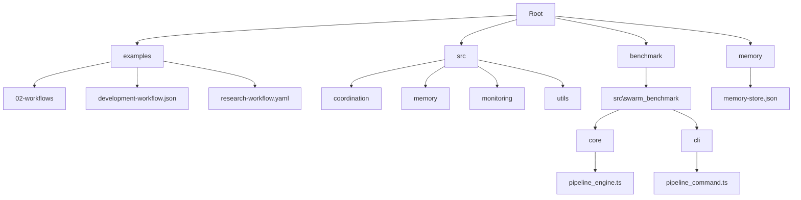
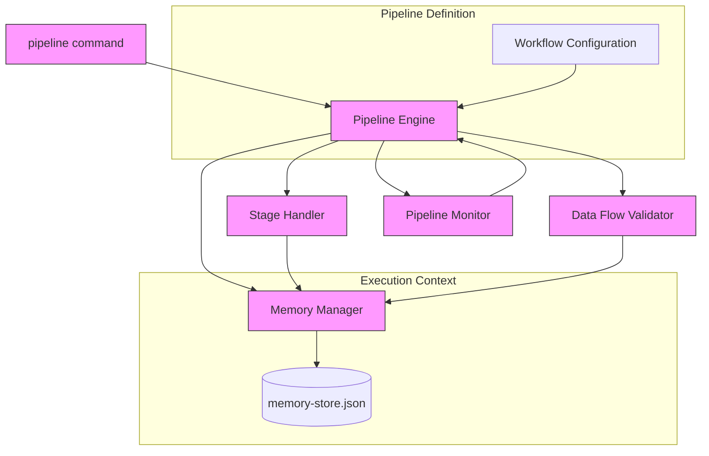
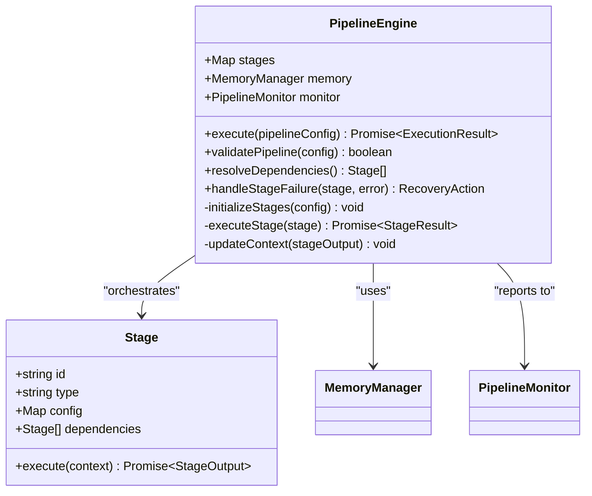
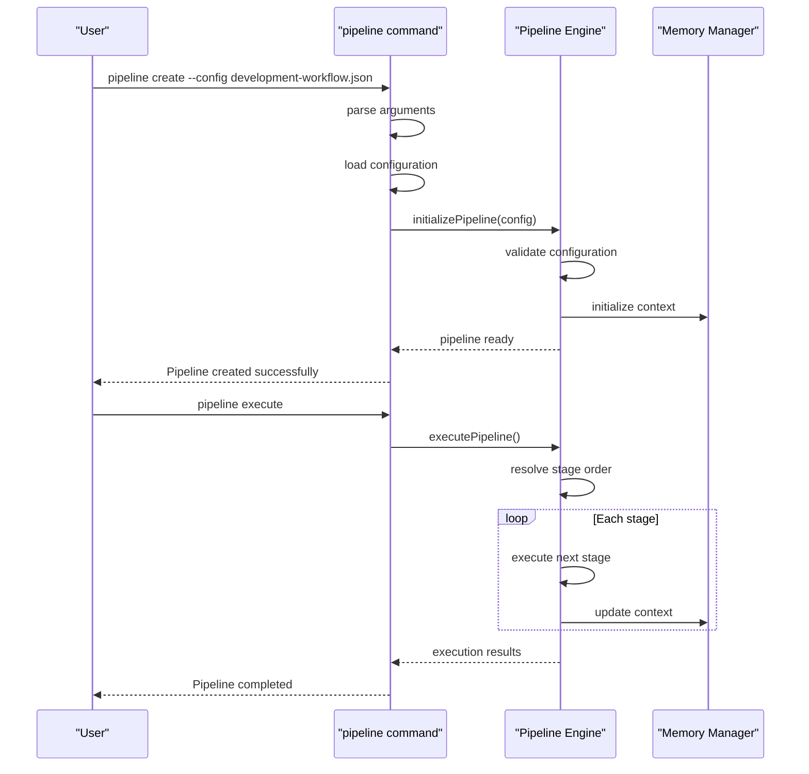
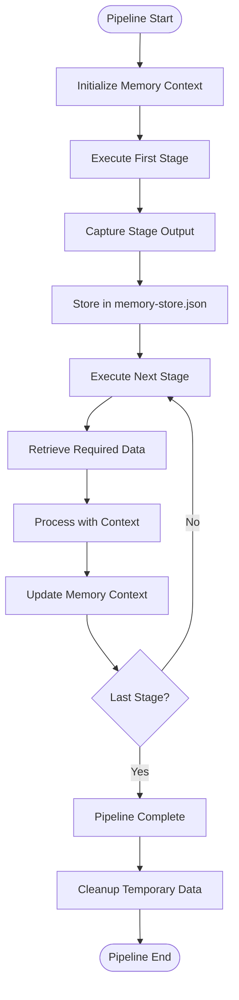
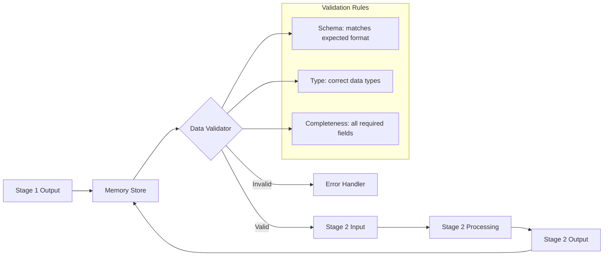
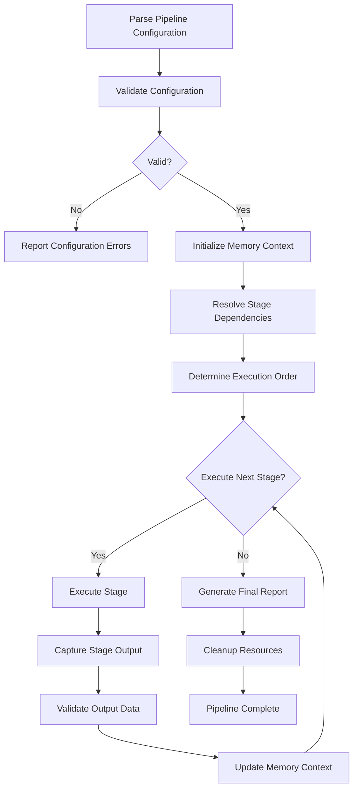
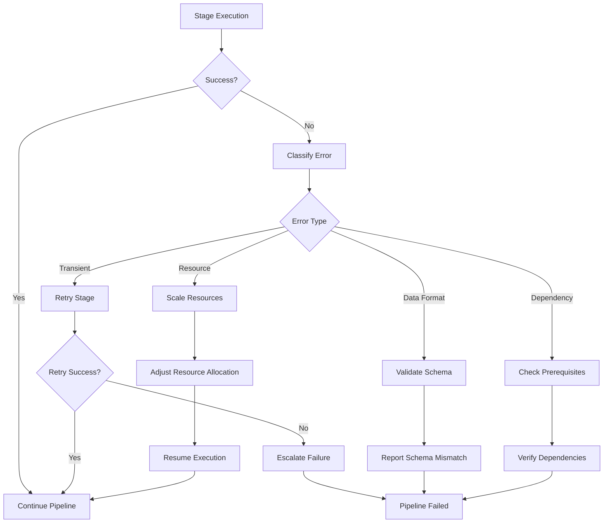
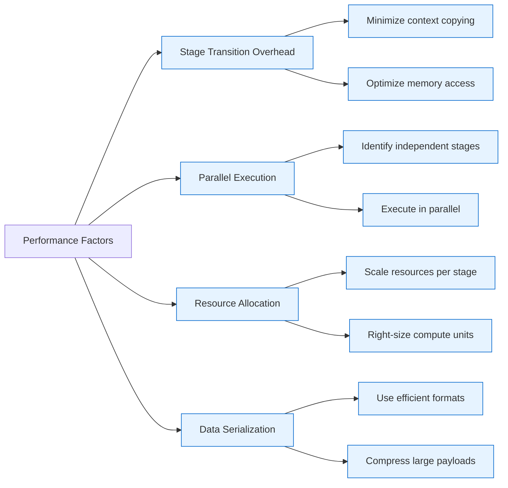
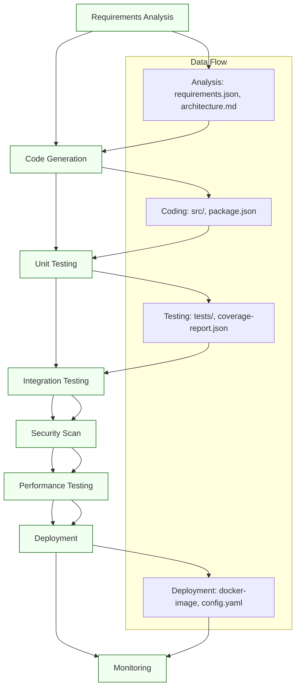

# Pipeline Creation

<cite>
**Referenced Files in This Document**  
- [development-workflow.json](file://examples/development-workflow.json)
- [research-workflow.yaml](file://examples/research-workflow.yaml)
- [memory-store.json](file://memory/memory-store.json)
- [src\swarm_benchmark\core\pipeline_engine.ts](file://benchmark/src/swarm_benchmark/core/pipeline_engine.ts)
- [src\swarm_benchmark\cli\pipeline_command.ts](file://benchmark/src/swarm_benchmark/cli/pipeline_command.ts)
- [src\memory\memory_manager.ts](file://src/memory/memory_manager.ts)
- [src\workflows\examples\software_lifecycle_pipeline.ts](file://src/workflows/examples/software_lifecycle_pipeline.ts)
- [src\coordination\stage_handler.ts](file://src/coordination/stage_handler.ts)
- [src\utils\data_flow_validator.ts](file://src/utils/data_flow_validator.ts)
- [src\monitoring\pipeline_monitor.ts](file://src/monitoring/pipeline_monitor.ts)
</cite>

## Table of Contents
1. [Introduction](#introduction)
2. [Project Structure](#project-structure)
3. [Core Components](#core-components)
4. [Architecture Overview](#architecture-overview)
5. [Detailed Component Analysis](#detailed-component-analysis)
6. [Pipeline Definition and Configuration](#pipeline-definition-and-configuration)
7. [Data Flow and Context Management](#data-flow-and-context-management)
8. [Pipeline Execution Flow](#pipeline-execution-flow)
9. [Error Handling and Troubleshooting](#error-handling-and-troubleshooting)
10. [Performance Considerations](#performance-considerations)
11. [Example: Software Development Lifecycle Pipeline](#example-software-development-lifecycle-pipeline)
12. [Conclusion](#conclusion)

## Introduction

The Pipeline Creation sub-feature of Workflow Orchestration enables the definition, execution, and monitoring of sequential workflows composed of discrete stages. This document provides a comprehensive analysis of the pipeline engine implementation, focusing on how complex AI workflows are structured, executed, and optimized. The system supports defining multi-stage pipelines where each stage performs a specific task, with data and context passed between stages through a shared memory system. Key capabilities include stage dependency management, data flow validation, execution monitoring, and error recovery mechanisms. The pipeline engine is designed to support complex AI workflows such as software development lifecycles, research processes, and data processing pipelines.

## Project Structure

The project structure reveals a modular organization with distinct directories for examples, source code, configuration, and testing. The pipeline functionality is primarily distributed across the `src` directory, with specific components in the `benchmark` module handling core pipeline orchestration. Example workflows are stored in the `examples` directory, providing templates for various pipeline configurations. The memory system, critical for context passing between pipeline stages, is implemented in both the top-level `memory` directory and within the `src/memory` module. Configuration files and workflow definitions are stored in JSON and YAML formats, enabling declarative pipeline specification.



**Diagram sources**
- [examples/development-workflow.json](file://examples/development-workflow.json)
- [src/swarm_benchmark/core/pipeline_engine.ts](file://benchmark/src/swarm_benchmark/core/pipeline_engine.ts)
- [src/memory/memory_manager.ts](file://src/memory/memory_manager.ts)

**Section sources**
- [examples/development-workflow.json](file://examples/development-workflow.json)
- [src/swarm_benchmark/core/pipeline_engine.ts](file://benchmark/src/swarm_benchmark/core/pipeline_engine.ts)

## Core Components

The pipeline creation system consists of several core components that work together to enable workflow orchestration. The pipeline engine serves as the central orchestrator, responsible for parsing pipeline definitions, managing stage execution, and coordinating data flow. The pipeline command interface provides the user-facing API for creating and managing pipelines. The memory manager handles context storage and retrieval between stages, ensuring data persistence throughout the pipeline lifecycle. The stage handler processes individual stage execution, while the data flow validator ensures compatibility between stages. Finally, the pipeline monitor provides real-time execution tracking and performance metrics.

**Section sources**
- [src\swarm_benchmark\core\pipeline_engine.ts](file://benchmark/src/swarm_benchmark/core/pipeline_engine.ts)
- [src\swarm_benchmark\cli\pipeline_command.ts](file://benchmark/src/swarm_benchmark/cli/pipeline_command.ts)
- [src\memory\memory_manager.ts](file://src/memory/memory_manager.ts)

## Architecture Overview

The pipeline creation architecture follows a modular, layered design with clear separation of concerns. At the core is the pipeline engine, which coordinates the execution of workflow stages according to defined dependencies and data flow requirements. The engine interacts with the memory system to maintain context across stages, ensuring that output from one stage can be used as input for subsequent stages. The CLI interface provides a command-based entry point for pipeline creation and management, translating user commands into engine operations. Validation components ensure data integrity and compatibility between stages, while monitoring components provide execution insights and performance metrics.



**Diagram sources**
- [src\swarm_benchmark\core\pipeline_engine.ts](file://benchmark/src/swarm_benchmark/core/pipeline_engine.ts)
- [src\swarm_benchmark\cli\pipeline_command.ts](file://benchmark/src/swarm_benchmark/cli/pipeline_command.ts)
- [src\memory\memory_manager.ts](file://src/memory/memory_manager.ts)

## Detailed Component Analysis

### Pipeline Engine Implementation

The pipeline engine is the central component responsible for orchestrating workflow execution. It parses pipeline definitions, resolves stage dependencies, manages execution order, and coordinates data flow between stages. The engine implements a directed acyclic graph (DAG) structure to represent stage dependencies, ensuring that stages are executed in the correct order based on their prerequisites.



**Diagram sources**
- [src\swarm_benchmark\core\pipeline_engine.ts](file://benchmark/src/swarm_benchmark/core/pipeline_engine.ts)
- [src\workflows\examples\software_lifecycle_pipeline.ts](file://src/workflows/examples/software_lifecycle_pipeline.ts)

**Section sources**
- [src\swarm_benchmark\core\pipeline_engine.ts](file://benchmark/src/swarm_benchmark/core/pipeline_engine.ts)

### Pipeline Command Interface

The pipeline command interface provides the user-facing API for creating and managing pipelines. It translates command-line inputs into pipeline engine operations, handling argument parsing, configuration loading, and result presentation. The command supports various sub-commands for pipeline creation, execution, monitoring, and debugging.



**Diagram sources**
- [src\swarm_benchmark\cli\pipeline_command.ts](file://benchmark/src/swarm_benchmark/cli/pipeline_command.ts)
- [src\swarm_benchmark\core\pipeline_engine.ts](file://benchmark/src/swarm_benchmark/core/pipeline_engine.ts)

**Section sources**
- [src\swarm_benchmark\cli\pipeline_command.ts](file://benchmark/src/swarm_benchmark/cli/pipeline_command.ts)

### Memory Management System

The memory management system enables context passing between pipeline stages by providing persistent storage for workflow data. Each stage can read from and write to the shared memory space, allowing for data flow between stages. The system supports both structured data (objects, arrays) and unstructured data (text, files), with type validation to prevent data format mismatches.



**Diagram sources**
- [src\memory\memory_manager.ts](file://src/memory/memory_manager.ts)
- [memory\memory-store.json](file://memory/memory-store.json)

**Section sources**
- [src\memory\memory_manager.ts](file://src/memory/memory_manager.ts)

## Pipeline Definition and Configuration

Pipeline definitions are specified in JSON or YAML format, allowing for declarative workflow configuration. The configuration includes stage definitions, dependency relationships, data flow specifications, and execution parameters. Each stage is defined with a unique identifier, type, configuration parameters, and dependency list. The pipeline engine validates the configuration before execution, ensuring that all dependencies are satisfied and data flow requirements are met.

```json
{
  "pipeline": "software-development-lifecycle",
  "description": "Complete software development workflow",
  "stages": [
    {
      "id": "analysis",
      "type": "code-analysis",
      "config": {
        "tools": ["static-analysis", "dependency-check"],
        "output_format": "json"
      },
      "dependencies": []
    },
    {
      "id": "coding",
      "type": "code-generation",
      "config": {
        "language": "typescript",
        "framework": "react"
      },
      "dependencies": ["analysis"]
    },
    {
      "id": "testing",
      "type": "test-execution",
      "config": {
        "test_types": ["unit", "integration"],
        "coverage_threshold": 80
      },
      "dependencies": ["coding"]
    },
    {
      "id": "deployment",
      "type": "deployment",
      "config": {
        "target_environment": "production",
        "rollback_strategy": "blue-green"
      },
      "dependencies": ["testing"]
    }
  ],
  "data_flow": {
    "analysis->coding": ["requirements", "architecture"],
    "coding->testing": ["source_code", "test_cases"],
    "testing->deployment": ["build_artifact", "test_results"]
  }
}
```

**Section sources**
- [examples/development-workflow.json](file://examples/development-workflow.json)
- [src\utils\data_flow_validator.ts](file://src/utils/data_flow_validator.ts)

## Data Flow and Context Management

The data flow system manages information transfer between pipeline stages through the shared memory system. Each stage can specify its input requirements and output data, with the pipeline engine ensuring that dependencies are satisfied before stage execution. The context manager handles data serialization, type validation, and versioning to prevent data format mismatches and ensure compatibility between stages.



**Diagram sources**
- [src\utils\data_flow_validator.ts](file://src/utils/data_flow_validator.ts)
- [src\memory\memory_manager.ts](file://src/memory/memory_manager.ts)

**Section sources**
- [src\utils\data_flow_validator.ts](file://src/utils/data_flow_validator.ts)

## Pipeline Execution Flow

The pipeline execution process follows a well-defined sequence of operations, from initialization to completion. The engine first validates the pipeline configuration, then resolves stage dependencies to determine execution order. Stages are executed sequentially (or in parallel when dependencies allow), with context updates after each stage. The monitor tracks execution progress and performance metrics throughout the process.



**Diagram sources**
- [src\swarm_benchmark\core\pipeline_engine.ts](file://benchmark/src/swarm_benchmark/core/pipeline_engine.ts)
- [src\monitoring\pipeline_monitor.ts](file://src/monitoring/pipeline_monitor.ts)

**Section sources**
- [src\swarm_benchmark\core\pipeline_engine.ts](file://benchmark/src/swarm_benchmark/core/pipeline_engine.ts)

## Error Handling and Troubleshooting

The pipeline system includes comprehensive error handling mechanisms to address common execution issues. Stage failures trigger recovery procedures based on failure type and stage criticality. Data format mismatches are detected by the data flow validator and reported with specific error details. Bottlenecks are identified through performance monitoring, allowing for optimization of slow stages.



**Diagram sources**
- [src\swarm_benchmark\core\pipeline_engine.ts](file://benchmark/src/swarm_benchmark/core/pipeline_engine.ts)
- [src\utils\data_flow_validator.ts](file://src/utils/data_flow_validator.ts)

**Section sources**
- [src\swarm_benchmark\core\pipeline_engine.ts](file://benchmark/src/swarm_benchmark/core/pipeline_engine.ts)

## Performance Considerations

Optimizing pipeline throughput requires attention to several performance factors. Stage transition overhead can be minimized by efficient context serialization and memory access patterns. Parallel execution of independent stages can significantly reduce overall pipeline duration. Caching frequently accessed data and optimizing resource allocation for compute-intensive stages further enhance performance.



**Diagram sources**
- [src\swarm_benchmark\core\pipeline_engine.ts](file://benchmark/src/swarm_benchmark/core/pipeline_engine.ts)
- [src\monitoring\pipeline_monitor.ts](file://src/monitoring/pipeline_monitor.ts)

**Section sources**
- [src\swarm_benchmark\core\pipeline_engine.ts](file://benchmark/src/swarm_benchmark/core/pipeline_engine.ts)

## Example: Software Development Lifecycle Pipeline

The software development lifecycle pipeline demonstrates a complex AI workflow with multiple stages: analysis, coding, testing, and deployment. Each stage builds upon the output of previous stages, with requirements and architecture decisions from analysis informing code generation, test cases derived from source code, and deployment artifacts created from successful test results.



**Diagram sources**
- [src\workflows\examples\software_lifecycle_pipeline.ts](file://src/workflows/examples/software_lifecycle_pipeline.ts)
- [examples/development-workflow.json](file://examples/development-workflow.json)

**Section sources**
- [src\workflows\examples\software_lifecycle_pipeline.ts](file://src/workflows/examples/software_lifecycle_pipeline.ts)

## Conclusion

The Pipeline Creation sub-feature provides a robust framework for defining and executing complex AI workflows through sequential stages with defined dependencies and data flow. The system's architecture, centered around the pipeline engine and memory management system, enables efficient orchestration of multi-stage processes while maintaining context across stages. Key strengths include declarative pipeline configuration, comprehensive error handling, and performance monitoring capabilities. The implementation supports complex workflows like the software development lifecycle pipeline, demonstrating its versatility for AI-driven automation tasks. Future enhancements could include dynamic pipeline reconfiguration, advanced parallelization strategies, and enhanced visualization of execution metrics.