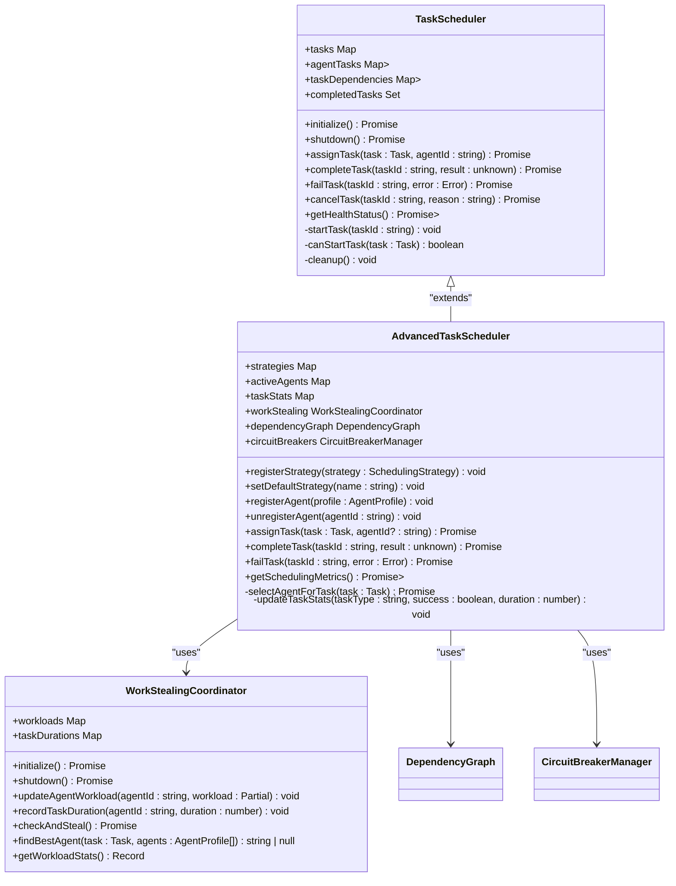
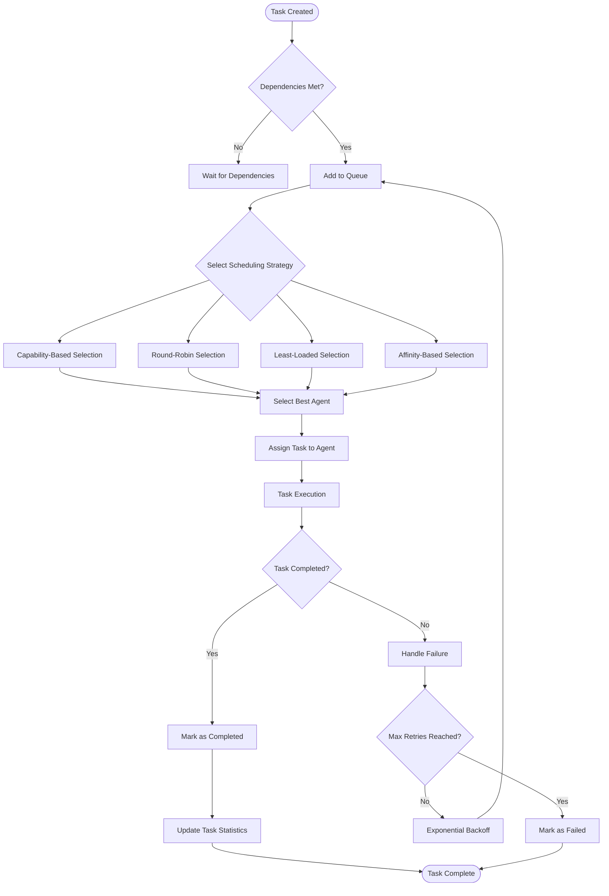
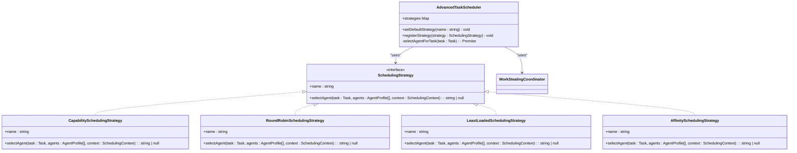
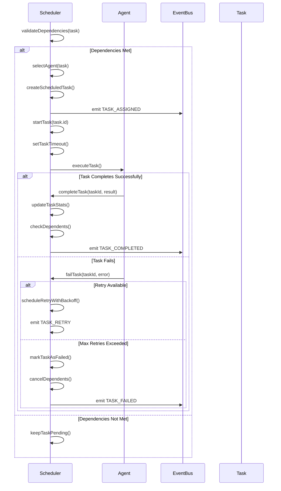
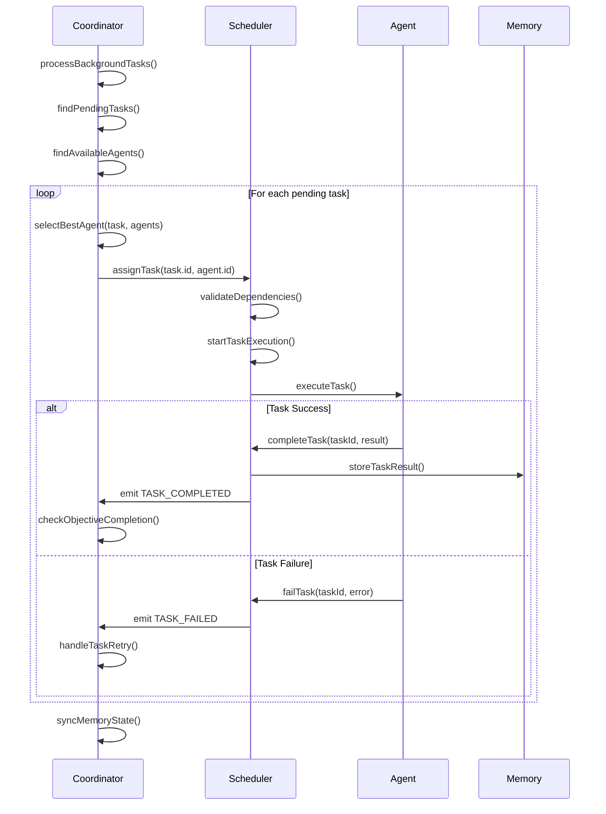
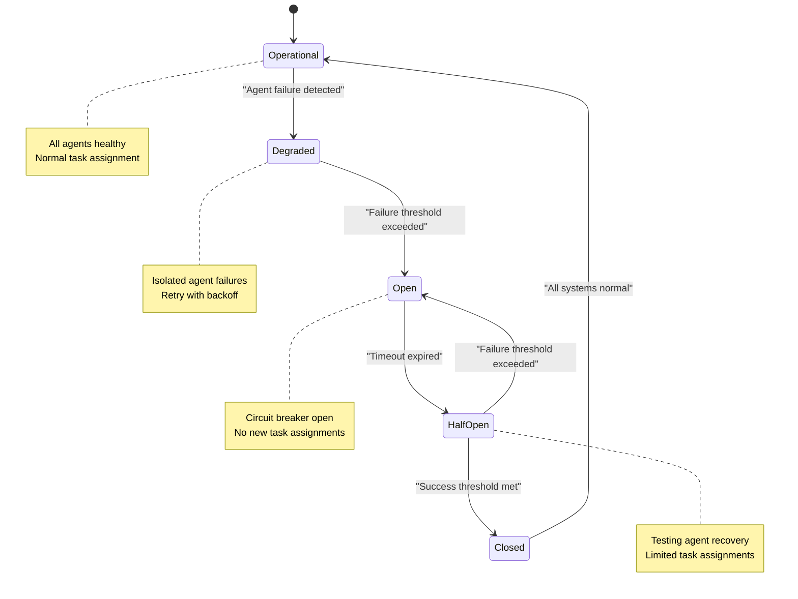

# Scheduling

<cite>
**Referenced Files in This Document**   
- [scheduler.ts](file://src/coordination/scheduler.ts)
- [advanced-scheduler.ts](file://src/coordination/advanced-scheduler.ts)
- [work-stealing.ts](file://src/coordination/work-stealing.ts)
- [dependency-graph.ts](file://src/coordination/dependency-graph.ts)
- [swarm-coordinator.ts](file://src/coordination/swarm-coordinator.ts)
- [circuit-breaker.ts](file://src/coordination/circuit-breaker.ts)
</cite>

## Table of Contents
1. [Introduction](#introduction)
2. [Core Scheduling Components](#core-scheduling-components)
3. [Task Queuing and Prioritization](#task-queuing-and-prioritization)
4. [Scheduler Architecture](#scheduler-architecture)
5. [Advanced Scheduling Strategies](#advanced-scheduling-strategies)
6. [Task Dispatch and Execution](#task-dispatch-and-execution)
7. [Dependency Management](#dependency-management)
8. [Integration with Swarm Coordinator](#integration-with-swarm-coordinator)
9. [Fault Tolerance and Resilience](#fault-tolerance-and-resilience)
10. [Performance Considerations](#performance-considerations)
11. [Troubleshooting Guide](#troubleshooting-guide)

## Introduction
The Scheduling sub-feature of the Workflow Orchestration system provides a comprehensive framework for managing task execution across distributed agents. This document details the implementation of the scheduling system, including task queuing, prioritization, dispatch mechanisms, and integration with the swarm coordination infrastructure. The system is designed to handle complex workflow dependencies, optimize resource utilization through intelligent agent selection, and ensure fault tolerance in distributed environments.

The scheduling architecture consists of multiple components working in concert: the base TaskScheduler handles fundamental task lifecycle management, while the AdvancedTaskScheduler extends this with sophisticated scheduling strategies and load balancing capabilities. The system integrates with the swarm coordinator to manage distributed agent workloads and ensure efficient task execution across the workflow orchestration ecosystem.

**Section sources**
- [scheduler.ts](file://src/coordination/scheduler.ts#L1-L391)
- [advanced-scheduler.ts](file://src/coordination/advanced-scheduler.ts#L1-L486)

## Core Scheduling Components

The scheduling system is built around several core components that work together to manage task execution. The foundation is the TaskScheduler class, which provides basic task lifecycle management including assignment, completion, failure handling, and cancellation. This base scheduler is extended by the AdvancedTaskScheduler, which adds intelligent agent selection, work stealing, and dependency graph management capabilities.

The system also includes specialized components for load balancing (WorkStealingCoordinator), dependency management (DependencyGraph), and fault tolerance (CircuitBreakerManager). These components work together to create a robust scheduling infrastructure that can handle complex workflow orchestration requirements.



**Diagram sources**
- [scheduler.ts](file://src/coordination/scheduler.ts#L1-L391)
- [advanced-scheduler.ts](file://src/coordination/advanced-scheduler.ts#L1-L486)
- [work-stealing.ts](file://src/coordination/work-stealing.ts#L1-L219)

**Section sources**
- [scheduler.ts](file://src/coordination/scheduler.ts#L1-L391)
- [advanced-scheduler.ts](file://src/coordination/advanced-scheduler.ts#L1-L486)
- [work-stealing.ts](file://src/coordination/work-stealing.ts#L1-L219)

## Task Queuing and Prioritization

The scheduling system implements a sophisticated task queuing and prioritization mechanism that ensures efficient resource utilization and optimal task execution order. Tasks are managed through multiple states: pending, queued, assigned, running, completed, failed, and cancelled. The system uses a combination of dependency checking, agent capability matching, and load balancing to determine the optimal execution order.

When a task is created, it enters the pending state until all its dependencies are satisfied. The scheduler then transitions it to the queued state, where it becomes eligible for assignment to an agent. The AdvancedTaskScheduler uses multiple strategies to prioritize task assignment, including capability-based selection, round-robin distribution, least-loaded agent selection, and affinity-based scheduling.

Priority is determined by several factors including task type, agent capabilities, current workload, and historical performance metrics. The system maintains task statistics for each task type, tracking success rates, average execution duration, and preferred agents to optimize future scheduling decisions.



**Diagram sources**
- [scheduler.ts](file://src/coordination/scheduler.ts#L1-L391)
- [advanced-scheduler.ts](file://src/coordination/advanced-scheduler.ts#L1-L486)

**Section sources**
- [scheduler.ts](file://src/coordination/scheduler.ts#L1-L391)
- [advanced-scheduler.ts](file://src/coordination/advanced-scheduler.ts#L1-L486)

## Scheduler Architecture

The scheduler architecture is designed as a layered system with clear separation of concerns. At the foundation is the TaskScheduler, which provides core task lifecycle management. This is extended by the AdvancedTaskScheduler, which adds intelligent scheduling capabilities through strategy patterns and integration with specialized components.

The architecture follows a modular design with the following key components:
- **TaskScheduler**: Manages basic task states and lifecycle
- **AdvancedTaskScheduler**: Implements intelligent agent selection and strategy patterns
- **WorkStealingCoordinator**: Handles load balancing between agents
- **DependencyGraph**: Manages task dependencies and execution order
- **CircuitBreakerManager**: Provides fault tolerance for agent failures

These components communicate through a centralized event bus, enabling loose coupling and asynchronous processing. The system uses a periodic maintenance cycle to clean up completed tasks, detect stuck tasks, and perform health checks.

```mermaid
graph TB
subgraph "Scheduling Core"
TS[TaskScheduler]
ATS[AdvancedTaskScheduler]
end
subgraph "Support Components"
WS[WorkStealingCoordinator]
DG[DependencyGraph]
CB[CircuitBreakerManager]
end
subgraph "Integration"
EB[EventBus]
LM[Logger]
end
ATS --> TS : "extends"
ATS --> WS : "uses"
ATS --> DG : "uses"
ATS --> CB : "uses"
ATS --> EB : "publishes events"
ATS --> LM : "logs events"
WS --> EB : "requests work stealing"
DG --> EB : "emits dependency events"
CB --> EB : "emits circuit breaker events"
style TS fill:#f9f,stroke:#333
style ATS fill:#bbf,stroke:#333
style WS fill:#f96,stroke:#333
style DG fill:#6f9,stroke:#333
style CB fill:#96f,stroke:#333
```

**Diagram sources**
- [scheduler.ts](file://src/coordination/scheduler.ts#L1-L391)
- [advanced-scheduler.ts](file://src/coordination/advanced-scheduler.ts#L1-L486)
- [work-stealing.ts](file://src/coordination/work-stealing.ts#L1-L219)
- [dependency-graph.ts](file://src/coordination/dependency-graph.ts#L1-L474)
- [circuit-breaker.ts](file://src/coordination/circuit-breaker.ts#L1-L150)

**Section sources**
- [scheduler.ts](file://src/coordination/scheduler.ts#L1-L391)
- [advanced-scheduler.ts](file://src/coordination/advanced-scheduler.ts#L1-L486)

## Advanced Scheduling Strategies

The AdvancedTaskScheduler implements multiple scheduling strategies to optimize task assignment based on different criteria. These strategies can be registered and selected dynamically, allowing the system to adapt to different workload patterns and performance requirements.

The available strategies include:
- **CapabilitySchedulingStrategy**: Selects agents based on their capabilities matching the task type, with secondary sorting by load and priority
- **RoundRobinSchedulingStrategy**: Distributes tasks evenly across available agents in a circular fashion
- **LeastLoadedSchedulingStrategy**: Selects the agent with the fewest active tasks to balance the workload
- **AffinitySchedulingStrategy**: Prefers agents that have previously executed similar tasks, falling back to capability-based selection

The system also incorporates work stealing, where overloaded agents can have tasks reassigned to underutilized agents. This is managed by the WorkStealingCoordinator, which periodically checks for workload imbalances and initiates task redistribution when necessary.



**Diagram sources**
- [advanced-scheduler.ts](file://src/coordination/advanced-scheduler.ts#L1-L486)
- [work-stealing.ts](file://src/coordination/work-stealing.ts#L1-L219)

**Section sources**
- [advanced-scheduler.ts](file://src/coordination/advanced-scheduler.ts#L1-L486)

## Task Dispatch and Execution

The task dispatch and execution process is managed through a coordinated sequence of events that ensure reliable task processing. When a task is assigned to an agent, the scheduler updates its state to "running" and sets a timeout to prevent indefinite execution. The system uses exponential backoff for retry attempts, with configurable maximum retry limits.

The dispatch process involves several key steps:
1. Dependency validation to ensure all prerequisite tasks are completed
2. Agent selection using the configured scheduling strategy
3. Task assignment with state updates and event emission
4. Execution monitoring with timeout protection
5. Result handling and dependency resolution

The system also includes maintenance routines to detect and handle stuck tasks that exceed their expected execution time. This proactive monitoring helps prevent resource leaks and ensures system responsiveness.



**Diagram sources**
- [scheduler.ts](file://src/coordination/scheduler.ts#L1-L391)
- [advanced-scheduler.ts](file://src/coordination/advanced-scheduler.ts#L1-L486)

**Section sources**
- [scheduler.ts](file://src/coordination/scheduler.ts#L1-L391)

## Dependency Management

The scheduling system implements comprehensive dependency management through the DependencyGraph component. This allows for complex workflow orchestration where tasks can have multiple dependencies that must be completed before execution can proceed. The system supports both direct and transitive dependencies, enabling sophisticated workflow patterns.

Key features of the dependency management system include:
- **Cycle Detection**: The system can detect circular dependencies that would prevent task completion
- **Topological Sorting**: Tasks are ordered based on their dependencies to ensure correct execution sequence
- **Critical Path Analysis**: Identifies the longest path through the dependency graph to optimize scheduling
- **Dynamic Dependency Resolution**: Dependencies are checked in real-time as tasks complete

The DependencyGraph maintains a directed acyclic graph (DAG) of task relationships, with nodes representing tasks and edges representing dependencies. When a task completes, the system automatically checks all dependent tasks to see if they can now be executed.

```mermaid
erDiagram
TASK ||--o{ DEPENDENCY : "has"
TASK ||--o{ DEPENDENT : "is dependency for"
TASK {
string id PK
string status
datetime createdAt
datetime startedAt
datetime completedAt
number priority
string type
string assignedAgent
number retryCount
number maxRetries
}
DEPENDENCY {
string taskId FK
string dependencyId FK
}
DEPENDENT {
string taskId FK
string dependentId FK
}
class DependencyGraph {
+nodes Map<string, DependencyNode>
+completedTasks Set<string>
+addTask(task: Task) void
+removeTask(taskId: string) void
+markCompleted(taskId: string) string[]
+markFailed(taskId: string) string[]
+isTaskReady(taskId: string) boolean
+getReadyTasks() string[]
+detectCycles() string[][]
+topologicalSort() string[] | null
+findCriticalPath() DependencyPath | null
}
```

**Diagram sources**
- [dependency-graph.ts](file://src/coordination/dependency-graph.ts#L1-L474)

**Section sources**
- [dependency-graph.ts](file://src/coordination/dependency-graph.ts#L1-L474)

## Integration with Swarm Coordinator

The scheduler integrates closely with the SwarmCoordinator to manage distributed task execution across multiple agents. The SwarmCoordinator acts as the central orchestration point, creating objectives, registering agents, and monitoring overall system health. It uses the AdvancedTaskScheduler to assign tasks to appropriate agents based on capabilities, workload, and other factors.

The integration works through a periodic background processing loop that:
1. Identifies pending tasks with satisfied dependencies
2. Finds available agents
3. Selects the best agent for each task using capability and performance metrics
4. Assigns tasks through the scheduler
5. Monitors task progress and handles completion or failure

The system also includes health checking mechanisms to detect stalled agents and work stealing capabilities to balance workloads across the swarm. This tight integration ensures efficient resource utilization and high system throughput.



**Diagram sources**
- [swarm-coordinator.ts](file://src/coordination/swarm-coordinator.ts#L1-L761)
- [scheduler.ts](file://src/coordination/scheduler.ts#L1-L391)

**Section sources**
- [swarm-coordinator.ts](file://src/coordination/swarm-coordinator.ts#L1-L761)

## Fault Tolerance and Resilience

The scheduling system incorporates multiple fault tolerance mechanisms to ensure reliability in distributed environments. The primary resilience features include circuit breakers, retry mechanisms with exponential backoff, and agent health monitoring.

The CircuitBreakerManager prevents cascading failures by temporarily blocking requests to agents that are experiencing repeated failures. When an agent fails multiple times consecutively, the circuit breaker opens, preventing further task assignments until the agent has recovered.

The system also implements comprehensive retry logic with exponential backoff, where failed tasks are retried with increasing delays between attempts. This helps overcome transient failures while preventing overwhelming agents with rapid retry requests.

Agent health monitoring detects stalled tasks and inactive agents, allowing the system to recover from failures by reassigning tasks to healthy agents.



**Diagram sources**
- [circuit-breaker.ts](file://src/coordination/circuit-breaker.ts#L1-L150)
- [scheduler.ts](file://src/coordination/scheduler.ts#L1-L391)

**Section sources**
- [circuit-breaker.ts](file://src/coordination/circuit-breaker.ts#L1-L150)

## Performance Considerations

The scheduling system includes several performance optimizations to minimize dispatch latency and maximize throughput. Key performance features include:

- **Efficient Data Structures**: Uses Maps and Sets for O(1) lookups and updates
- **Batch Processing**: Processes multiple tasks in each background cycle
- **Caching**: Maintains agent workload and task statistics for quick access
- **Asynchronous Operations**: Uses Promises and async/await for non-blocking execution
- **Memory Management**: Cleans up completed tasks to prevent memory leaks

The system is designed to handle high task volumes with minimal overhead. The AdvancedTaskScheduler maintains agent workload statistics and task performance metrics to make intelligent scheduling decisions that optimize overall system performance.

Performance monitoring is integrated through the SwarmMonitor, which tracks key metrics such as task completion rates, average execution times, and agent utilization. This data can be used to tune scheduling parameters and identify performance bottlenecks.

**Section sources**
- [scheduler.ts](file://src/coordination/scheduler.ts#L1-L391)
- [advanced-scheduler.ts](file://src/coordination/advanced-scheduler.ts#L1-L486)
- [swarm-coordinator.ts](file://src/coordination/swarm-coordinator.ts#L1-L761)

## Troubleshooting Guide

This section addresses common issues in task scheduling and provides guidance for diagnosis and resolution.

### Priority Inversion
**Symptom**: High-priority tasks are delayed by lower-priority tasks.
**Solution**: Ensure the scheduling strategy properly prioritizes tasks. The CapabilitySchedulingStrategy sorts by load (ascending) and priority (descending), so verify that task priorities are set correctly.

### Queue Starvation
**Symptom**: Some tasks remain in the queue indefinitely.
**Solution**: Check for unmet dependencies using the dependency graph visualization. Use `detectCycles()` to identify circular dependencies that prevent task execution.

### Timing Inaccuracies
**Symptom**: Tasks are timing out prematurely or not being monitored correctly.
**Solution**: Verify the `resourceTimeout` configuration in CoordinationConfig. Check that timeout handlers are properly cleared on task completion to prevent memory leaks.

### Agent Overload
**Symptom**: Agents become unresponsive due to excessive task loads.
**Solution**: Adjust the `stealThreshold` in WorkStealingConfig to trigger work stealing at lower imbalance levels. Monitor agent workloads through the WorkStealingCoordinator's metrics.

### Failed Task Retries
**Symptom**: Tasks are failing repeatedly without making progress.
**Solution**: Check the circuit breaker state for the affected agent. If the circuit breaker is open, the agent may need to be restarted. Review error logs to determine if the failures are transient or permanent.

**Section sources**
- [scheduler.ts](file://src/coordination/scheduler.ts#L1-L391)
- [advanced-scheduler.ts](file://src/coordination/advanced-scheduler.ts#L1-L486)
- [work-stealing.ts](file://src/coordination/work-stealing.ts#L1-L219)
- [circuit-breaker.ts](file://src/coordination/circuit-breaker.ts#L1-L150)