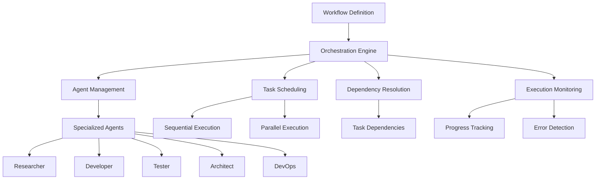
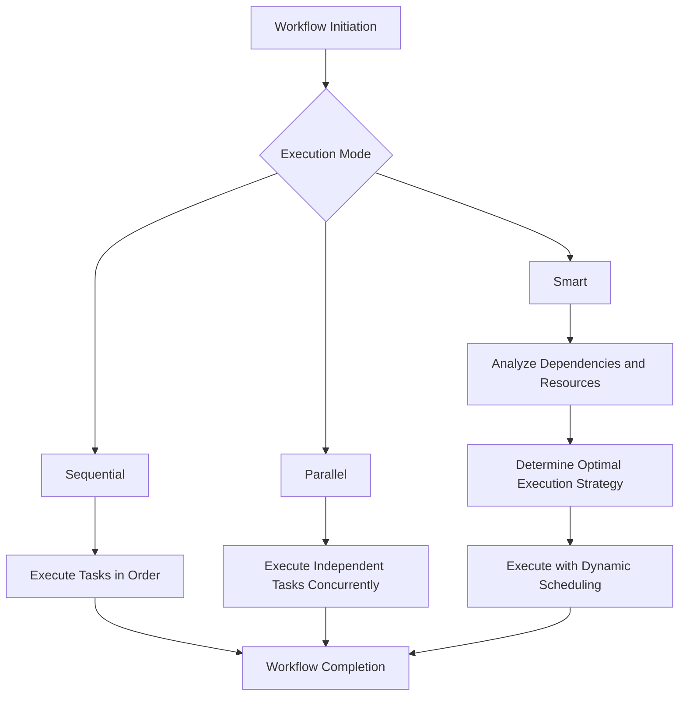
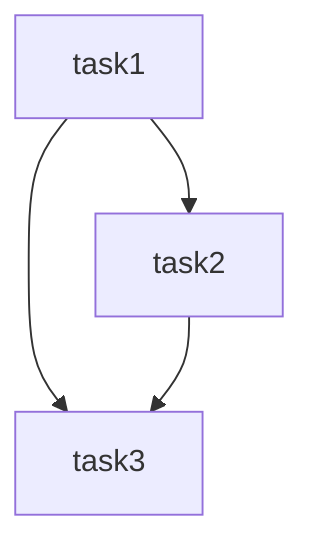
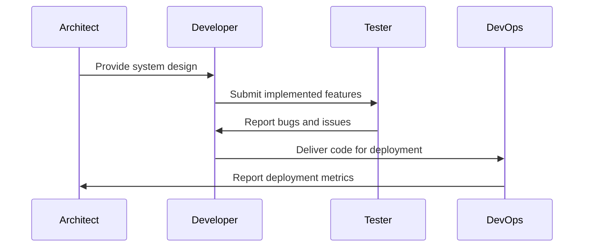
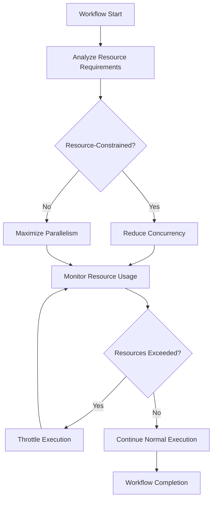
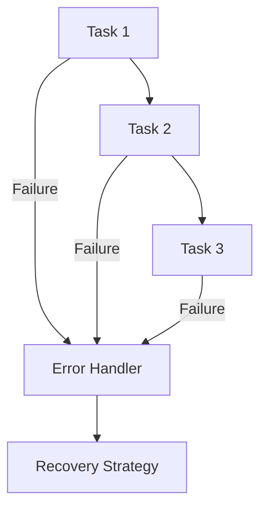
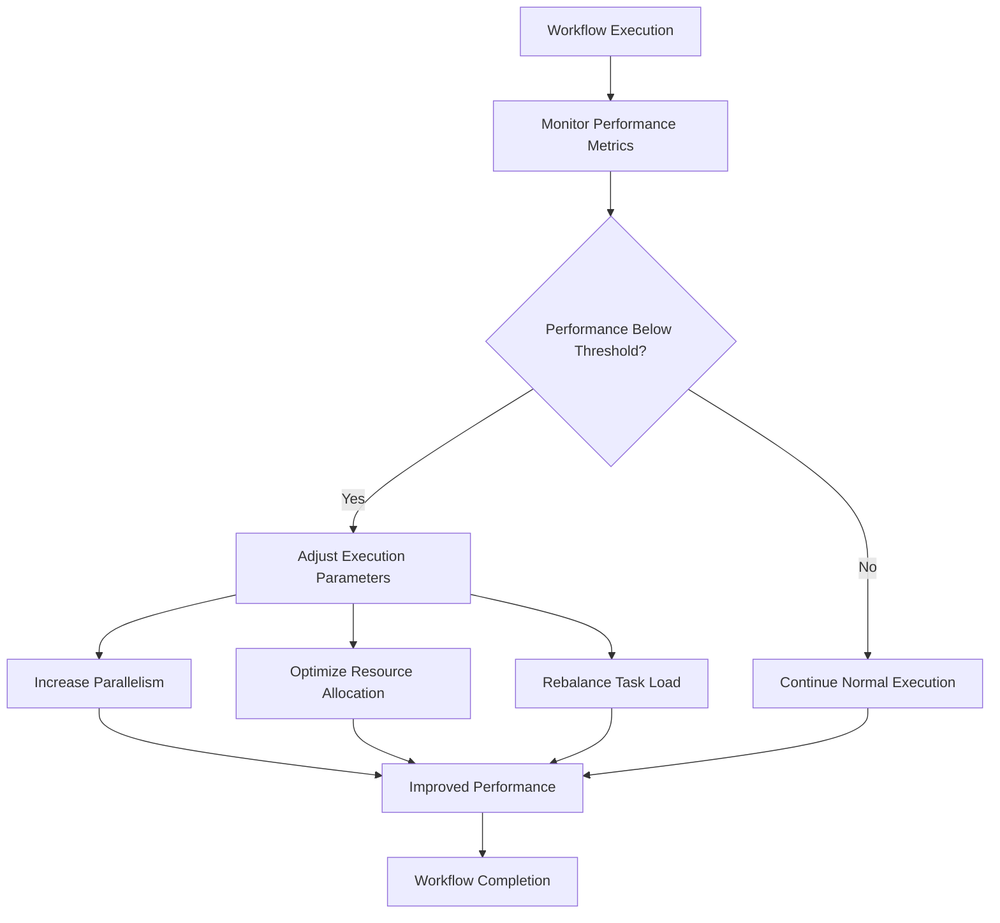
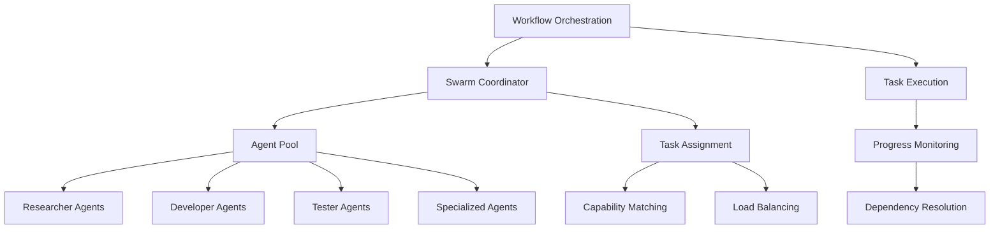
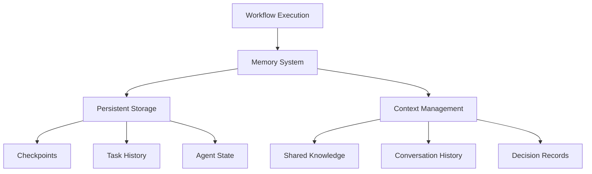
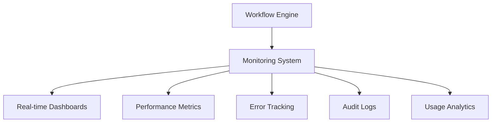

# Workflow Orchestration

<cite>
**Referenced Files in This Document**   
- [hello-world-workflow.json](file://examples/02-workflows/simple/hello-world-workflow.json)
- [data-processing-workflow.json](file://examples/02-workflows/parallel/data-processing-workflow.json)
- [blog-platform-workflow.json](file://examples/02-workflows/sequential/blog-platform-workflow.json)
- [microservices-workflow.json](file://examples/02-workflows/complex/microservices-workflow.json)
- [machine-learning-workflow.json](file://examples/02-workflows/specialized/machine-learning-workflow.json)
- [README.md](file://examples/02-workflows/README.md)
- [claude-workflow.json](file://examples/02-workflows/claude-workflow.json)
- [research-workflow.json](file://examples/02-workflows/research-workflow.json)
- [development-workflow.json](file://examples/development-workflow.json)
- [research-workflow.yaml](file://examples/research-workflow.yaml)
</cite>

## Table of Contents
1. [Introduction](#introduction)
2. [Workflow Orchestration Overview](#workflow-orchestration-overview)
3. [Core Workflow Patterns](#core-workflow-patterns)
4. [Workflow Definition Structure](#workflow-definition-structure)
5. [Execution Modes and Strategies](#execution-modes-and-strategies)
6. [Task Dependencies and Parallel Execution](#task-dependencies-and-parallel-execution)
7. [Agent Coordination and Specialization](#agent-coordination-and-specialization)
8. [Advanced Workflow Features](#advanced-workflow-features)
9. [Error Handling and Recovery](#error-handling-and-recovery)
10. [Performance Optimization](#performance-optimization)
11. [Integration with Other Components](#integration-with-other-components)
12. [Troubleshooting Common Issues](#troubleshooting-common-issues)
13. [Best Practices](#best-practices)

## Introduction

Workflow Orchestration in Claude-Flow enables the automation and coordination of complex AI tasks through structured, multi-agent workflows. This system allows users to define, execute, and monitor sophisticated processes that involve batch processing, parallel execution, pipeline creation, scheduling, and comprehensive error handling. By orchestrating multiple specialized agents, Claude-Flow can tackle complex development, research, and analysis tasks that would be challenging for a single agent to complete efficiently.

The workflow orchestration system is designed to handle various execution patterns, from simple sequential processes to complex parallel and hybrid workflows. It provides a flexible framework for defining task dependencies, managing agent specialization, and ensuring reliable execution with built-in monitoring and recovery mechanisms.

**Section sources**
- [README.md](file://examples/02-workflows/README.md#L1-L108)

## Workflow Orchestration Overview

Workflow Orchestration in Claude-Flow is a comprehensive system for managing complex AI-driven processes through coordinated multi-agent collaboration. The system enables users to define workflows that combine multiple specialized agents to accomplish sophisticated tasks that require diverse capabilities and sequential or parallel execution patterns.

The orchestration engine manages the lifecycle of workflows from initiation to completion, handling task scheduling, agent assignment, dependency resolution, and execution monitoring. Workflows can be designed for various use cases, including software development, data analysis, research projects, and machine learning pipelines.

Key capabilities of the workflow orchestration system include:
- **Batch Processing**: Execute multiple similar tasks in sequence or parallel
- **Parallel Execution**: Run independent tasks simultaneously to improve efficiency
- **Pipeline Creation**: Define sequential workflows with clear dependencies between stages
- **Scheduling**: Plan and execute workflows at specific times or intervals
- **Error Handling**: Implement robust error detection, reporting, and recovery mechanisms

The system supports various workflow patterns, from simple single-agent processes to complex multi-agent systems with sophisticated coordination requirements. Workflows are defined in JSON format, making them easy to create, modify, and share.



**Diagram sources**
- [README.md](file://examples/02-workflows/README.md#L1-L108)
- [hello-world-workflow.json](file://examples/02-workflows/simple/hello-world-workflow.json)

## Core Workflow Patterns

Claude-Flow supports several core workflow patterns that address different types of problems and execution requirements. These patterns are designed to handle various complexity levels and coordination needs.

### Simple Workflows
Simple workflows involve a single agent performing a straightforward task. These are ideal for basic operations and learning the workflow system.

```json
{
  "name": "Hello World Workflow",
  "agents": [
    {
      "id": "greeter",
      "type": "developer",
      "capabilities": ["code-generation"]
    }
  ],
  "tasks": [
    {
      "id": "create-hello-world",
      "agentId": "greeter",
      "type": "coding"
    }
  ],
  "execution": {
    "mode": "sequential"
  }
}
```

### Parallel Workflows
Parallel workflows execute multiple independent tasks simultaneously, significantly reducing overall execution time for tasks that can be processed concurrently.

```json
{
  "name": "Parallel Data Processing",
  "agents": [
    {"id": "csv-processor", "type": "analyzer"},
    {"id": "json-processor", "type": "analyzer"},
    {"id": "xml-processor", "type": "analyzer"},
    {"id": "aggregator", "type": "coordinator"}
  ],
  "tasks": [
    {"id": "process-csv", "parallel": true},
    {"id": "process-json", "parallel": true},
    {"id": "process-xml", "parallel": true},
    {
      "id": "aggregate-results",
      "dependencies": ["process-csv", "process-json", "process-xml"]
    }
  ],
  "execution": {
    "mode": "parallel",
    "maxConcurrency": 3
  }
}
```

### Sequential Workflows
Sequential workflows execute tasks in a specific order, with each task depending on the completion of previous tasks. This pattern is suitable for processes with clear dependencies.

```json
{
  "name": "Blog Platform Development",
  "agents": [
    {"id": "planner", "type": "coordinator"},
    {"id": "database-designer", "type": "architect"},
    {"id": "backend-dev", "type": "developer"},
    {"id": "frontend-dev", "type": "developer"},
    {"id": "content-dev", "type": "developer"},
    {"id": "deployer", "type": "devops"}
  ],
  "tasks": [
    {"id": "requirements-gathering"},
    {"id": "database-design", "dependencies": ["requirements-gathering"]},
    {"id": "backend-api", "dependencies": ["database-design"]},
    {"id": "frontend-ui", "dependencies": ["backend-api"]},
    {"id": "cms-integration", "dependencies": ["frontend-ui"]},
    {"id": "deployment", "dependencies": ["cms-integration"]}
  ],
  "execution": {
    "mode": "sequential"
  }
}
```

### Complex Workflows
Complex workflows combine multiple patterns and involve numerous agents with specialized roles. These workflows often include both parallel and sequential elements.

```json
{
  "name": "Microservices Architecture Workflow",
  "agents": [
    {"id": "architect", "type": "architect"},
    {"id": "auth-dev", "type": "developer"},
    {"id": "user-dev", "type": "developer"},
    {"id": "product-dev", "type": "developer"},
    {"id": "gateway-dev", "type": "developer"},
    {"id": "frontend-dev", "type": "developer"},
    {"id": "devops", "type": "devops"},
    {"id": "tester", "type": "tester"}
  ],
  "tasks": [
    {"id": "design-architecture"},
    {"id": "create-auth-service", "parallel": true},
    {"id": "create-user-service", "parallel": true},
    {"id": "create-product-service", "parallel": true},
    {"id": "create-api-gateway", "dependencies": ["create-auth-service", "create-user-service", "create-product-service"]},
    {"id": "create-frontend", "dependencies": ["create-api-gateway"]},
    {"id": "containerize-services", "parallel": true},
    {"id": "integration-tests", "dependencies": ["containerize-services"]}
  ],
  "execution": {
    "mode": "smart",
    "parallelism": {
      "max": 4,
      "strategy": "resource-based"
    }
  }
}
```

**Section sources**
- [README.md](file://examples/02-workflows/README.md#L1-L108)
- [hello-world-workflow.json](file://examples/02-workflows/simple/hello-world-workflow.json)
- [data-processing-workflow.json](file://examples/02-workflows/parallel/data-processing-workflow.json)
- [blog-platform-workflow.json](file://examples/02-workflows/sequential/blog-platform-workflow.json)
- [microservices-workflow.json](file://examples/02-workflows/complex/microservices-workflow.json)

## Workflow Definition Structure

Workflow definitions in Claude-Flow follow a structured JSON format that specifies all necessary components for orchestration. The structure consists of several key sections that define the workflow's characteristics, participants, tasks, and execution parameters.

### Root Level Properties
The top-level properties of a workflow definition include metadata and configuration:

- **name**: String identifier for the workflow
- **description**: Human-readable description of the workflow's purpose
- **agents**: Array of agent definitions
- **tasks**: Array of task definitions
- **execution**: Configuration for execution mode and parameters
- **quality**: Quality assurance and validation criteria

### Agents Section
The agents section defines the specialized participants in the workflow:

```json
"agents": [
  {
    "id": "agent-name",
    "name": "Display Name",
    "type": "researcher|developer|tester|architect|devops|coordinator",
    "capabilities": ["capability1", "capability2"],
    "configuration": {
      "temperature": 0.7,
      "maxTokens": 2000
    }
  }
]
```

Key agent properties:
- **id**: Unique identifier used for task assignment
- **name**: Human-readable name for display purposes
- **type**: Role classification that determines agent specialization
- **capabilities**: Array of capabilities that define what the agent can do
- **configuration**: Agent-specific configuration parameters

### Tasks Section
The tasks section defines the individual units of work within the workflow:

```json
"tasks": [
  {
    "id": "task-id",
    "name": "Task Name",
    "description": "Detailed description of the task",
    "agentId": "agent-name",
    "type": "research|coding|analysis|testing|deployment",
    "dependencies": ["prerequisite-task-id"],
    "parallel": true|false,
    "priority": "low|medium|high",
    "input": {
      "parameters": "specific to task type"
    },
    "output": {
      "artifacts": ["expected-output-files"]
    }
  }
]
```

Key task properties:
- **id**: Unique identifier for the task
- **name**: Human-readable name for the task
- **description**: Detailed explanation of what the task should accomplish
- **agentId**: Reference to the agent responsible for the task
- **type**: Category of work to be performed
- **dependencies**: Array of task IDs that must complete before this task starts
- **parallel**: Boolean indicating if the task can run in parallel with others
- **priority**: Execution priority level
- **input**: Parameters and requirements for the task
- **output**: Expected deliverables from the task

### Execution Configuration
The execution section controls how the workflow is processed:

```json
"execution": {
  "mode": "sequential|parallel|smart",
  "maxConcurrency": 3,
  "timeout": 300000,
  "saveProgress": true,
  "notifications": {
    "onTaskComplete": true,
    "onError": true
  },
  "checkpoints": ["task-id1", "task-id2"],
  "rollback": true
}
```

**Section sources**
- [README.md](file://examples/02-workflows/README.md#L1-L108)
- [hello-world-workflow.json](file://examples/02-workflows/simple/hello-world-workflow.json)
- [data-processing-workflow.json](file://examples/02-workflows/parallel/data-processing-workflow.json)
- [blog-platform-workflow.json](file://examples/02-workflows/sequential/blog-platform-workflow.json)

## Execution Modes and Strategies

Claude-Flow supports multiple execution modes that determine how tasks are processed within a workflow. Each mode is designed for specific use cases and performance requirements.

### Sequential Mode
In sequential mode, tasks are executed one after another in the order defined by their dependencies. This mode ensures that each task has access to the outputs of previous tasks.

```json
"execution": {
  "mode": "sequential"
}
```

Use cases:
- Processes with strict dependencies
- Limited computational resources
- Debugging and development
- Linear workflows like requirements gathering → design → implementation → testing

### Parallel Mode
Parallel mode executes independent tasks simultaneously, maximizing resource utilization and reducing overall execution time.

```json
"execution": {
  "mode": "parallel",
  "maxConcurrency": 4
}
```

Use cases:
- Processing multiple data sources
- Independent feature development
- Batch operations on similar data
- Performance-critical workflows

### Smart Mode
Smart mode combines sequential and parallel execution based on resource availability, task dependencies, and priority.

```json
"execution": {
  "mode": "smart",
  "parallelism": {
    "max": 4,
    "strategy": "resource-based"
  }
}
```

The orchestration engine dynamically determines the optimal execution strategy based on:
- Available system resources
- Task dependencies and constraints
- Agent availability and capabilities
- Priority levels of tasks
- Historical performance data



**Diagram sources**
- [data-processing-workflow.json](file://examples/02-workflows/parallel/data-processing-workflow.json)
- [blog-platform-workflow.json](file://examples/02-workflows/sequential/blog-platform-workflow.json)
- [microservices-workflow.json](file://examples/02-workflows/complex/microservices-workflow.json)

**Section sources**
- [data-processing-workflow.json](file://examples/02-workflows/parallel/data-processing-workflow.json)
- [blog-platform-workflow.json](file://examples/02-workflows/sequential/blog-platform-workflow.json)
- [microservices-workflow.json](file://examples/02-workflows/complex/microservices-workflow.json)

## Task Dependencies and Parallel Execution

Effective workflow orchestration requires careful management of task dependencies and parallel execution. Claude-Flow provides robust mechanisms for defining and resolving these relationships.

### Dependency Management
Task dependencies ensure that tasks execute in the correct order and have access to required inputs from previous tasks.

```json
"tasks": [
  {
    "id": "task1",
    "name": "First Task"
  },
  {
    "id": "task2",
    "name": "Second Task",
    "dependencies": ["task1"]
  },
  {
    "id": "task3",
    "name": "Third Task",
    "dependencies": ["task1", "task2"]
  }
]
```

The orchestration engine creates a dependency graph to determine the execution order:



### Parallel Execution Configuration
Tasks can be marked for parallel execution when they have no dependencies or when their dependencies have been satisfied.

```json
"tasks": [
  {
    "id": "data-processing-csv",
    "parallel": true
  },
  {
    "id": "data-processing-json",
    "parallel": true
  },
  {
    "id": "data-processing-xml",
    "parallel": true
  },
  {
    "id": "aggregate-results",
    "dependencies": ["data-processing-csv", "data-processing-json", "data-processing-xml"]
  }
]
```

### Concurrency Control
The system provides mechanisms to control the level of parallelism:

```json
"execution": {
  "maxConcurrency": 3,
  "timeout": 300000
}
```

This prevents resource exhaustion by limiting the number of concurrent tasks.

### Resource-Based Scheduling
In smart mode, the orchestration engine considers available resources when scheduling parallel tasks:

```json
"execution": {
  "mode": "smart",
  "parallelism": {
    "max": 4,
    "strategy": "resource-based"
  }
}
```

The engine monitors:
- CPU and memory usage
- Agent availability
- Network bandwidth
- Storage capacity

And adjusts the concurrency level accordingly.

**Section sources**
- [data-processing-workflow.json](file://examples/02-workflows/parallel/data-processing-workflow.json)
- [microservices-workflow.json](file://examples/02-workflows/complex/microservices-workflow.json)

## Agent Coordination and Specialization

Claude-Flow's workflow orchestration relies on specialized agents with distinct roles and capabilities. The system coordinates these agents to work together effectively on complex tasks.

### Agent Types and Roles
The system supports several agent types, each with specific expertise:

- **Researcher**: Information gathering, analysis, and exploration
- **Developer**: Code generation, implementation, and debugging
- **Tester**: Quality assurance, testing, and validation
- **Architect**: System design, planning, and documentation
- **DevOps**: Deployment, infrastructure, and operations
- **Coordinator**: Workflow management and task coordination

### Capability-Based Assignment
Tasks are assigned to agents based on their capabilities:

```json
"agents": [
  {
    "id": "data-analyzer",
    "type": "researcher",
    "capabilities": ["data-analysis", "statistics", "visualization"]
  },
  {
    "id": "api-developer",
    "type": "developer",
    "capabilities": ["nodejs", "api-design", "database-integration"]
  }
]
```

The orchestration engine matches task requirements with agent capabilities to ensure optimal assignment.

### Multi-Agent Collaboration
Complex workflows often require collaboration between multiple agents:



### Dynamic Agent Allocation
The system can dynamically allocate agents based on workflow requirements:

```json
"execution": {
  "autoScale": true,
  "agentPool": {
    "min": 2,
    "max": 8
  }
}
```

This allows the workflow to adapt to changing demands during execution.

**Section sources**
- [microservices-workflow.json](file://examples/02-workflows/complex/microservices-workflow.json)
- [blog-platform-workflow.json](file://examples/02-workflows/sequential/blog-platform-workflow.json)

## Advanced Workflow Features

Claude-Flow provides several advanced features that enhance workflow reliability, efficiency, and maintainability.

### Checkpoints and Rollback
Workflows can define checkpoints to save progress and enable rollback in case of errors:

```json
"execution": {
  "checkpoints": ["design-architecture", "create-api-gateway", "integration-tests"],
  "rollback": true
}
```

This allows the system to:
- Save state at critical points
- Resume from the last checkpoint after failures
- Roll back changes if quality thresholds are not met

### Quality Assurance
Workflows can include quality criteria that must be met before proceeding:

```json
"quality": {
  "codeReview": true,
  "securityScan": true,
  "performanceThreshold": {
    "responseTime": 200,
    "throughput": 1000
  }
}
```

The orchestration engine verifies these criteria before allowing the workflow to continue.

### Conditional Execution
Workflows can include conditional logic based on task outcomes:

```json
"tasks": [
  {
    "id": "security-audit",
    "type": "analysis"
  },
  {
    "id": "apply-security-fixes",
    "type": "development",
    "dependencies": ["security-audit"],
    "condition": "security-audit.findings > 0"
  }
]
```

### Notification System
Workflows can be configured to send notifications at key events:

```json
"execution": {
  "notifications": {
    "onTaskComplete": true,
    "onError": true,
    "onCheckpoint": true
  }
}
```

### Resource Optimization
The system optimizes resource usage based on workflow characteristics:

```json
"execution": {
  "parallelism": {
    "max": 4,
    "strategy": "resource-based",
    "adaptive": true
  }
}
```



**Diagram sources**
- [microservices-workflow.json](file://examples/02-workflows/complex/microservices-workflow.json)

**Section sources**
- [microservices-workflow.json](file://examples/02-workflows/complex/microservices-workflow.json)

## Error Handling and Recovery

Robust error handling is critical for reliable workflow execution. Claude-Flow provides comprehensive mechanisms for detecting, reporting, and recovering from errors.

### Error Detection
The system monitors workflows for various error conditions:

- Task execution failures
- Timeout violations
- Resource exhaustion
- Quality threshold breaches
- Dependency resolution issues

### Error Propagation
Errors are propagated through the dependency chain:



### Recovery Strategies
The system supports multiple recovery approaches:

- **Retry**: Automatically retry failed tasks
- **Fallback**: Execute alternative tasks
- **Rollback**: Revert to a previous checkpoint
- **Manual Intervention**: Pause for human review

```json
"errorHandling": {
  "retry": {
    "maxAttempts": 3,
    "backoff": "exponential"
  },
  "fallback": {
    "enabled": true,
    "strategy": "alternative-agent"
  },
  "rollback": {
    "enabled": true,
    "checkpoints": ["design-architecture", "create-api-gateway"]
  }
}
```

### Monitoring and Alerts
The system provides real-time monitoring and alerting:

```json
"monitoring": {
  "metrics": ["cpu", "memory", "execution-time"],
  "alerts": {
    "thresholds": {
      "execution-time": 300000,
      "error-rate": 0.1
    },
    "notifications": ["email", "slack"]
  }
}
```

**Section sources**
- [microservices-workflow.json](file://examples/02-workflows/complex/microservices-workflow.json)

## Performance Optimization

Optimizing workflow performance is essential for efficient execution, especially with large numbers of tasks or complex dependencies.

### Parallelism Optimization
Maximize parallel execution where possible:

```json
"execution": {
  "mode": "parallel",
  "maxConcurrency": 8
}
```

Identify independent tasks that can be executed simultaneously.

### Resource Management
Optimize resource allocation based on task requirements:

```json
"tasks": [
  {
    "id": "heavy-computation",
    "resources": {
      "cpu": "high",
      "memory": "high"
    }
  },
  {
    "id": "light-processing",
    "resources": {
      "cpu": "low",
      "memory": "low"
    }
  }
]
```

### Caching and Reuse
Implement caching to avoid redundant work:

```json
"execution": {
  "cache": {
    "enabled": true,
    "strategy": "task-output",
    "ttl": 3600
  }
}
```

Cache results of expensive operations for reuse.

### Load Balancing
Distribute tasks evenly across available agents:

```json
"execution": {
  "loadBalancing": {
    "strategy": "round-robin|least-busy",
    "agentSelection": "capability-based"
  }
}
```

### Performance Monitoring
Track key performance metrics:

```json
"monitoring": {
  "metrics": [
    "task-execution-time",
    "agent-utilization",
    "concurrency-level",
    "throughput"
  ]
}
```



**Diagram sources**
- [data-processing-workflow.json](file://examples/02-workflows/parallel/data-processing-workflow.json)

**Section sources**
- [data-processing-workflow.json](file://examples/02-workflows/parallel/data-processing-workflow.json)
- [microservices-workflow.json](file://examples/02-workflows/complex/microservices-workflow.json)

## Integration with Other Components

The workflow orchestration system integrates with various other components to provide a comprehensive AI automation platform.

### Swarm Coordinator
The workflow engine works closely with the swarm coordinator to manage agent teams:



### Task Scheduler
Integration with the task scheduler enables advanced scheduling capabilities:

```json
"schedule": {
  "type": "immediate|delayed|recurring",
  "delay": "PT5M",
  "cron": "0 9 * * 1-5"
}
```

### Memory System
The memory system stores workflow state and context:



### Monitoring and Analytics
Integration with monitoring systems provides insights into workflow performance:



**Section sources**
- [microservices-workflow.json](file://examples/02-workflows/complex/microservices-workflow.json)
- [data-processing-workflow.json](file://examples/02-workflows/parallel/data-processing-workflow.json)

## Troubleshooting Common Issues

This section addresses common issues encountered during workflow execution and provides guidance for resolution.

### Task Dependencies Issues
**Problem**: Circular dependencies prevent workflow execution
**Solution**: Review dependency chains and restructure tasks to eliminate cycles

```json
// Incorrect - circular dependency
"tasks": [
  {"id": "task1", "dependencies": ["task2"]},
  {"id": "task2", "dependencies": ["task1"]}
]

// Correct - linear dependency
"tasks": [
  {"id": "task1"},
  {"id": "task2", "dependencies": ["task1"]}
]
```

### Resource Contention
**Problem**: Too many parallel tasks exhaust system resources
**Solution**: Limit concurrency and implement resource-based scheduling

```json
"execution": {
  "maxConcurrency": 4,
  "parallelism": {
    "strategy": "resource-based"
  }
}
```

### Agent Unavailability
**Problem**: Required agents are not available
**Solution**: Implement fallback strategies and agent pooling

```json
"errorHandling": {
  "fallback": {
    "enabled": true,
    "strategy": "alternative-agent"
  }
}
```

### Timeout Failures
**Problem**: Tasks exceed timeout limits
**Solution**: Adjust timeout values or break large tasks into smaller ones

```json
"execution": {
  "timeout": 600000
}
```

### Quality Threshold Breaches
**Problem**: Outputs fail to meet quality criteria
**Solution**: Implement iterative improvement cycles

```json
"quality": {
  "codeReview": true,
  "iterations": 3
}
```

**Section sources**
- [microservices-workflow.json](file://examples/02-workflows/complex/microservices-workflow.json)
- [data-processing-workflow.json](file://examples/02-workflows/parallel/data-processing-workflow.json)

## Best Practices

Follow these best practices to create effective and reliable workflows.

### Design Principles
- **Modularity**: Break complex workflows into smaller, reusable components
- **Clarity**: Use descriptive names for tasks and agents
- **Flexibility**: Design workflows to accommodate changes
- **Resilience**: Build in error handling and recovery mechanisms

### Performance Optimization
- **Parallelize**: Identify and execute independent tasks in parallel
- **Resource Awareness**: Consider system limitations when designing workflows
- **Caching**: Reuse results of expensive operations when possible
- **Monitoring**: Implement comprehensive monitoring and alerting

### Quality Assurance
- **Validation**: Include validation steps for critical outputs
- **Testing**: Incorporate testing tasks at appropriate points
- **Review**: Implement code review and quality gates
- **Documentation**: Maintain clear documentation of workflow design and rationale

### Maintenance and Evolution
- **Version Control**: Track workflow definitions in version control
- **Testing**: Test workflows thoroughly before deployment
- **Monitoring**: Continuously monitor workflow performance
- **Iteration**: Regularly review and improve workflows based on experience

By following these best practices, users can create workflows that are efficient, reliable, and maintainable, maximizing the benefits of Claude-Flow's orchestration capabilities.

**Section sources**
- [microservices-workflow.json](file://examples/02-workflows/complex/microservices-workflow.json)
- [data-processing-workflow.json](file://examples/02-workflows/parallel/data-processing-workflow.json)
- [blog-platform-workflow.json](file://examples/02-workflows/sequential/blog-platform-workflow.json)