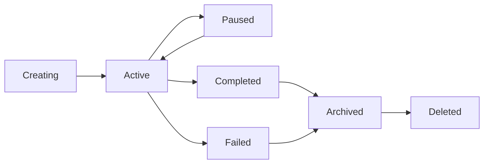

# Sessions API

The Sessions API manages AI coordination sessions that group related tasks and agents together for collaborative work.

## Overview

Sessions serve as the primary organizational unit in Claude-Flow, providing:
- **Task Coordination**: Group related tasks under a common context
- **Agent Assignment**: Coordinate multiple agents for complex workflows
- **State Management**: Maintain session state and configuration
- **Resource Isolation**: Separate different projects or workflows

## Endpoints

### List Sessions

Retrieve a paginated list of sessions.

```http
GET /api/v1/sessions
```

#### Query Parameters

| Parameter | Type | Description | Default |
|-----------|------|-------------|---------|
| `page` | integer | Page number (1-based) | 1 |
| `size` | integer | Items per page (1-100) | 20 |
| `status` | string | Filter by status (`active`, `paused`, `completed`, `archived`) | - |
| `name` | string | Filter by session name (partial match) | - |
| `created_after` | string | Filter sessions created after date (ISO 8601) | - |
| `created_before` | string | Filter sessions created before date (ISO 8601) | - |
| `sort` | string | Sort field and direction (`name:asc`, `created_at:desc`) | `created_at:desc` |
| `include` | string | Include related data (`tasks`, `agents`, `stats`) | - |

#### Response

```json
{
  "items": [
    {
      "id": "sess_123456789",
      "name": "Customer Analysis Project",
      "description": "Analyzing customer behavior patterns",
      "status": "active",
      "config": {
        "max_agents": 5,
        "timeout": 3600,
        "auto_assign": true
      },
      "metadata": {
        "project_id": "proj_abc123",
        "team": "data-science"
      },
      "stats": {
        "total_tasks": 15,
        "completed_tasks": 8,
        "active_agents": 3
      },
      "created_at": "2024-01-15T10:30:00Z",
      "updated_at": "2024-01-15T11:45:00Z",
      "last_activity": "2024-01-15T11:45:00Z"
    }
  ],
  "pagination": {
    "page": 1,
    "size": 20,
    "total": 45,
    "pages": 3,
    "has_next": true,
    "has_prev": false
  }
}
```

### Create Session

Create a new AI coordination session.

```http
POST /api/v1/sessions
```

#### Request Body

```json
{
  "name": "Data Analysis Project",
  "description": "Comprehensive analysis of customer data",
  "config": {
    "max_agents": 10,
    "timeout": 7200,
    "auto_assign": true,
    "priority": "high"
  },
  "metadata": {
    "project_id": "proj_123",
    "department": "analytics",
    "tags": ["data-science", "customer-analysis"]
  }
}
```

#### Fields

| Field | Type | Required | Description |
|-------|------|----------|-------------|
| `name` | string | Yes | Session name (1-255 chars) |
| `description` | string | No | Session description |
| `config` | object | No | Session configuration |
| `config.max_agents` | integer | No | Maximum concurrent agents (1-20) |
| `config.timeout` | integer | No | Session timeout in seconds |
| `config.auto_assign` | boolean | No | Enable automatic task assignment |
| `config.priority` | string | No | Session priority (`low`, `normal`, `high`, `critical`) |
| `metadata` | object | No | Custom metadata |

#### Response

```json
{
  "id": "sess_987654321",
  "name": "Data Analysis Project",
  "description": "Comprehensive analysis of customer data",
  "status": "active",
  "config": {
    "max_agents": 10,
    "timeout": 7200,
    "auto_assign": true,
    "priority": "high"
  },
  "metadata": {
    "project_id": "proj_123",
    "department": "analytics",
    "tags": ["data-science", "customer-analysis"]
  },
  "stats": {
    "total_tasks": 0,
    "completed_tasks": 0,
    "active_agents": 0
  },
  "created_at": "2024-01-15T12:00:00Z",
  "updated_at": "2024-01-15T12:00:00Z",
  "last_activity": null
}
```

### Get Session

Retrieve a specific session by ID.

```http
GET /api/v1/sessions/{session_id}
```

#### Path Parameters

| Parameter | Type | Description |
|-----------|------|-------------|
| `session_id` | string | Session ID |

#### Query Parameters

| Parameter | Type | Description |
|-----------|------|-------------|
| `include` | string | Include related data (`tasks`, `agents`, `events`, `stats`) |

#### Response

```json
{
  "id": "sess_123456789",
  "name": "Customer Analysis Project",
  "description": "Analyzing customer behavior patterns",
  "status": "active",
  "config": {
    "max_agents": 5,
    "timeout": 3600,
    "auto_assign": true,
    "priority": "normal"
  },
  "metadata": {
    "project_id": "proj_abc123",
    "team": "data-science"
  },
  "stats": {
    "total_tasks": 15,
    "completed_tasks": 8,
    "active_tasks": 4,
    "failed_tasks": 3,
    "active_agents": 3,
    "total_execution_time": 14400
  },
  "agents": [
    {
      "id": "agent_abc123",
      "type": "analyzer",
      "status": "active",
      "assigned_tasks": 2
    }
  ],
  "recent_tasks": [
    {
      "id": "task_xyz789",
      "title": "Segment customers",
      "status": "running",
      "created_at": "2024-01-15T11:30:00Z"
    }
  ],
  "created_at": "2024-01-15T10:30:00Z",
  "updated_at": "2024-01-15T11:45:00Z",
  "last_activity": "2024-01-15T11:45:00Z"
}
```

### Update Session

Update an existing session.

```http
PUT /api/v1/sessions/{session_id}
```

#### Request Body

```json
{
  "name": "Updated Project Name",
  "description": "Updated description",
  "config": {
    "max_agents": 8,
    "timeout": 5400,
    "priority": "high"
  },
  "metadata": {
    "updated_by": "user_123",
    "version": "2.0"
  }
}
```

#### Response

Returns the updated session object (same format as GET).

### Delete Session

Delete a session and all associated data.

```http
DELETE /api/v1/sessions/{session_id}
```

#### Query Parameters

| Parameter | Type | Description | Default |
|-----------|------|-------------|---------|
| `force` | boolean | Force delete even if tasks are running | false |
| `archive` | boolean | Archive instead of hard delete | true |

#### Response

```json
{
  "message": "Session deleted successfully",
  "id": "sess_123456789",
  "archived": true
}
```

### Session Actions

#### Pause Session

Pause all activity in a session.

```http
POST /api/v1/sessions/{session_id}/pause
```

#### Resume Session

Resume a paused session.

```http
POST /api/v1/sessions/{session_id}/resume
```

#### Archive Session

Archive a completed session.

```http
POST /api/v1/sessions/{session_id}/archive
```

#### Clone Session

Create a copy of an existing session.

```http
POST /api/v1/sessions/{session_id}/clone
```

#### Request Body

```json
{
  "name": "Cloned Session Name",
  "include_tasks": false,
  "include_agents": true
}
```

## Session Status Lifecycle



### Status Descriptions

- **`creating`**: Session is being initialized
- **`active`**: Session is running and accepting tasks
- **`paused`**: Session is temporarily paused
- **`completed`**: All tasks completed successfully
- **`failed`**: Session failed due to errors
- **`archived`**: Session archived for historical reference
- **`deleted`**: Session permanently deleted

## WebSocket Events

Subscribe to real-time session updates:

```javascript
const ws = new WebSocket('ws://localhost:8000/ws/sessions/sess_123456789');

ws.onmessage = function(event) {
  const update = JSON.parse(event.data);
  switch(update.type) {
    case 'status_changed':
      console.log('Session status:', update.status);
      break;
    case 'task_added':
      console.log('New task:', update.task);
      break;
    case 'agent_joined':
      console.log('Agent joined:', update.agent);
      break;
    case 'stats_updated':
      console.log('Stats:', update.stats);
      break;
  }
};
```

## Examples

### Python

```python
import asyncio
from claude_flow import ClaudeFlowClient

async def main():
    client = ClaudeFlowClient(api_key="your_key")
    
    # Create session
    session = await client.sessions.create(
        name="ML Pipeline",
        description="Training and evaluation pipeline",
        config={
            "max_agents": 5,
            "auto_assign": True
        }
    )
    
    # Get session with stats
    session_detail = await client.sessions.get(
        session.id,
        include="tasks,agents,stats"
    )
    
    print(f"Session {session.name} has {session_detail.stats.total_tasks} tasks")
    
    # List active sessions
    active_sessions = await client.sessions.list(
        status="active",
        sort="last_activity:desc"
    )
    
    for sess in active_sessions.items:
        print(f"Active session: {sess.name}")

asyncio.run(main())
```

### JavaScript

```javascript
import { ClaudeFlowClient } from '@claude-flow/js-sdk';

const client = new ClaudeFlowClient({ apiKey: 'your_key' });

// Create session
const session = await client.sessions.create({
  name: 'Data Processing Pipeline',
  description: 'Process daily data imports',
  config: {
    maxAgents: 3,
    autoAssign: true,
    priority: 'high'
  }
});

// Monitor session progress
const ws = client.sessions.watch(session.id);
ws.on('progress', (update) => {
  console.log(`Progress: ${update.completedTasks}/${update.totalTasks}`);
});

// Pause session after 1 hour
setTimeout(async () => {
  await client.sessions.pause(session.id);
  console.log('Session paused');
}, 3600000);
```

### cURL

```bash
# Create session
curl -X POST http://localhost:8000/api/v1/sessions \
  -H "Content-Type: application/json" \
  -H "Authorization: Bearer YOUR_TOKEN" \
  -d '{
    "name": "Customer Segmentation",
    "description": "Segment customers based on behavior",
    "config": {
      "max_agents": 4,
      "timeout": 3600,
      "auto_assign": true
    },
    "metadata": {
      "project": "marketing-2024"
    }
  }'

# List sessions with filtering
curl "http://localhost:8000/api/v1/sessions?status=active&sort=name:asc&include=stats" \
  -H "Authorization: Bearer YOUR_TOKEN"

# Get session details
curl "http://localhost:8000/api/v1/sessions/sess_123456789?include=tasks,agents" \
  -H "Authorization: Bearer YOUR_TOKEN"

# Update session
curl -X PUT http://localhost:8000/api/v1/sessions/sess_123456789 \
  -H "Content-Type: application/json" \
  -H "Authorization: Bearer YOUR_TOKEN" \
  -d '{
    "config": {
      "priority": "high",
      "max_agents": 6
    }
  }'
```

## Error Handling

### Common Errors

| Status | Code | Description |
|--------|------|-------------|
| 400 | `INVALID_SESSION_NAME` | Session name is invalid or too long |
| 400 | `INVALID_CONFIG` | Session configuration is invalid |
| 403 | `SESSION_ACCESS_DENIED` | Insufficient permissions for session |
| 404 | `SESSION_NOT_FOUND` | Session does not exist |
| 409 | `SESSION_NAME_CONFLICT` | Session name already exists |
| 422 | `VALIDATION_ERROR` | Request validation failed |

### Error Response Example

```json
{
  "error": {
    "code": "INVALID_CONFIG",
    "message": "Session configuration is invalid",
    "details": {
      "field": "config.max_agents",
      "reason": "Value must be between 1 and 20"
    },
    "timestamp": "2024-01-15T12:00:00Z",
    "request_id": "req_abc123"
  }
}
```

## Best Practices

1. **Naming**: Use descriptive session names that clearly indicate purpose
2. **Configuration**: Set appropriate timeouts and agent limits based on workload
3. **Metadata**: Use metadata for project tracking and organization
4. **Cleanup**: Archive or delete completed sessions to maintain performance
5. **Monitoring**: Use WebSocket subscriptions for real-time updates
6. **Error Handling**: Implement proper error handling and retry logic