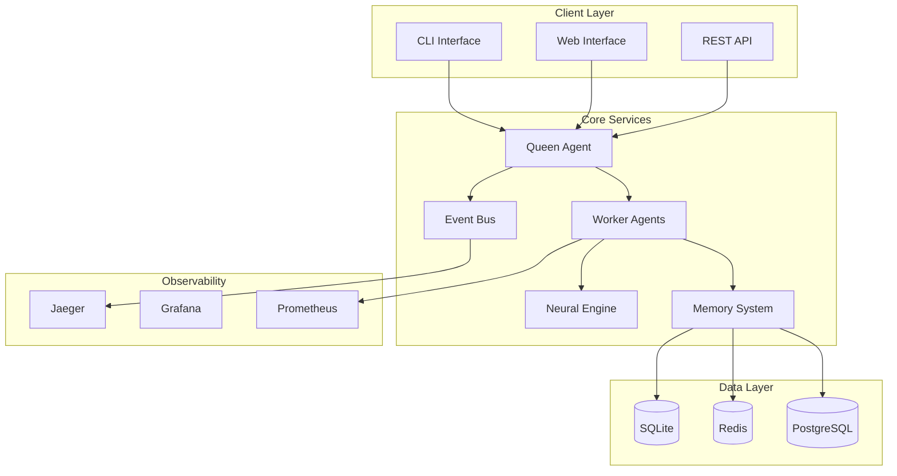
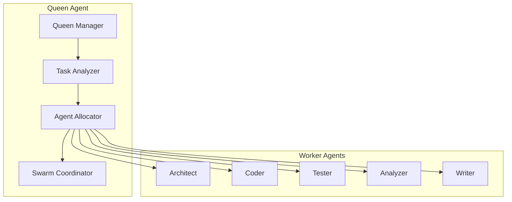
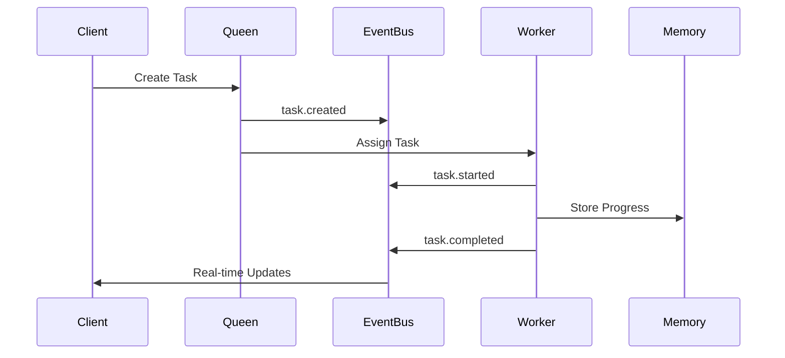
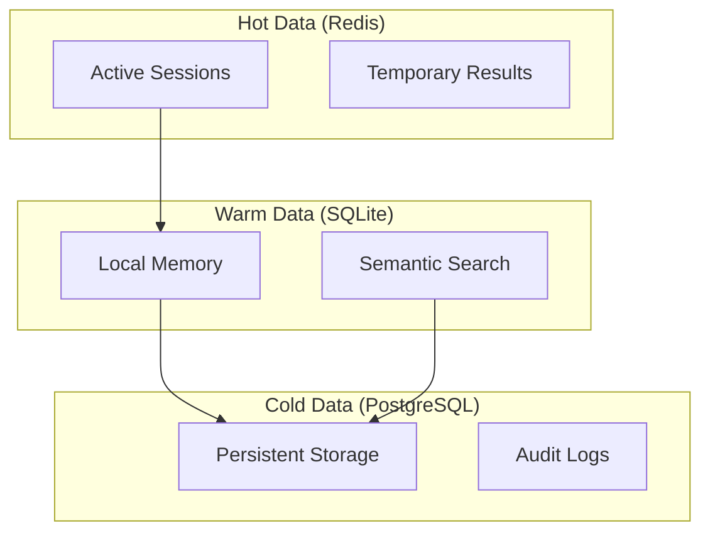
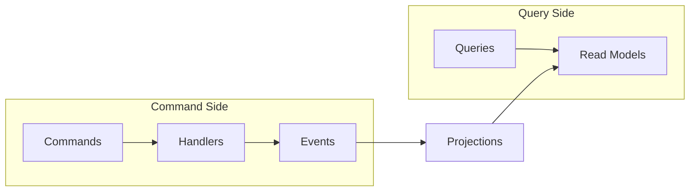
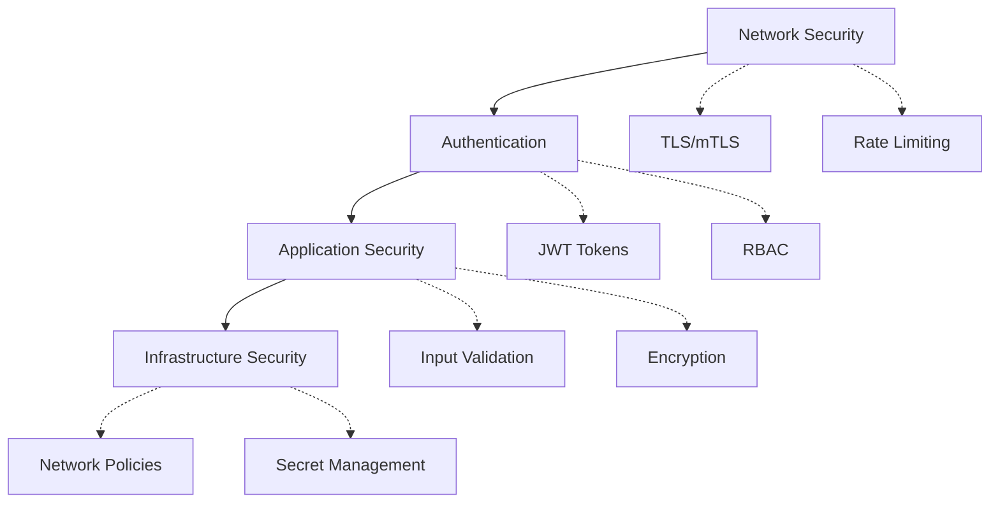
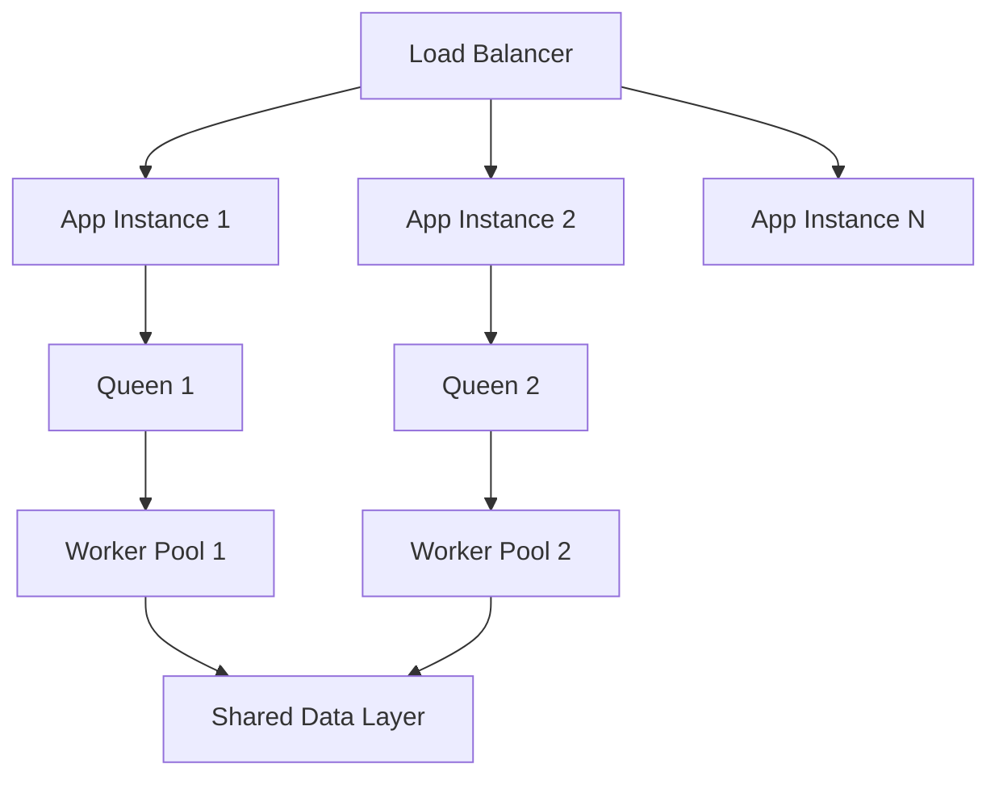
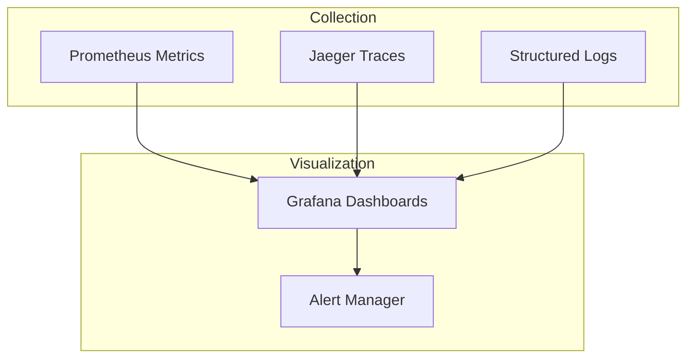
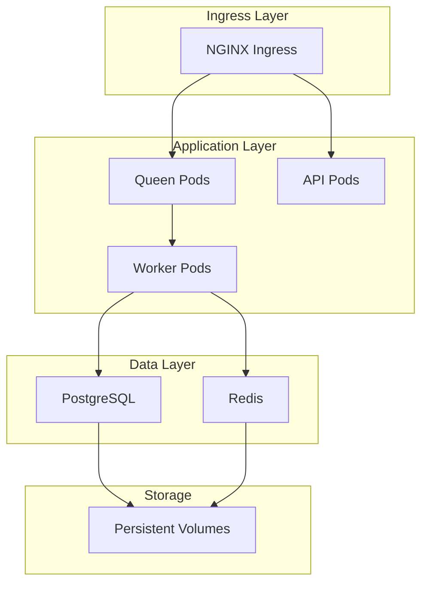
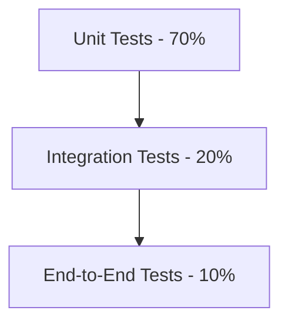

# Claude-Flow Architecture Documentation

This document provides a comprehensive overview of the Claude-Flow system architecture and design principles.

## 🏗️ High-Level Architecture

Claude-Flow is designed as a distributed, event-driven system that orchestrates AI agents for collaborative task execution.

### System Overview

## 🧠 Core Components

### 1. Agent System Architecture

### 2. Event-Driven Architecture

### 3. Memory System Tiers

## 🔄 Key Design Patterns

### 1. CQRS (Command Query Responsibility Segregation)

### 2. Event Sourcing

All state changes are captured as immutable events for audit trails and replay capabilities.

### 3. Saga Pattern

Manages distributed transactions across multiple agents and services with compensation logic.

## 🔐 Security Architecture

### Security Layers

## 📊 Scalability Strategy

### Horizontal Scaling

### Auto-scaling Triggers

- CPU Usage > 70%
- Memory Usage > 80%
- Queue Length > 100
- Response Latency > 1s

## 🔍 Observability

### Monitoring Stack

### Key Metrics

- Agent availability and performance
- Task completion rates and latency
- Memory system performance
- API response times
- System resource utilization

## 🚀 Deployment Architecture

### Kubernetes Deployment

### Environment Strategy

| Environment | Instances | Resources | Features |
|-------------|-----------|-----------|----------|
| Development | Single | 2 CPU, 4GB RAM | SQLite, Local |
| Staging | 2-3 | 4 CPU, 8GB RAM | PostgreSQL, Redis |
| Production | 5+ | 8+ CPU, 16+ GB RAM | HA, Monitoring, Backup |

## 📈 Performance Targets

| Component | Throughput | Latency (P95) |
|-----------|------------|---------------|
| API Gateway | 10,000 RPS | < 10ms |
| Queen Agent | 1,000 tasks/sec | < 50ms |
| Worker Agents | 500 tasks/sec | < 100ms |
| Memory System | 50,000 ops/sec | < 5ms |
| Event Bus | 100,000 events/sec | < 1ms |

## 🔄 Data Flow Patterns

### Task Execution Flow

1. **Task Creation**: Client submits task via API
2. **Classification**: Neural engine analyzes and classifies task
3. **Assignment**: Queen agent selects appropriate worker
4. **Execution**: Worker executes task using MCP tools
5. **Storage**: Results stored in memory system
6. **Notification**: Real-time updates via event bus

### Memory Synchronization

1. **Write Path**: Data written to Redis cache and PostgreSQL
2. **Read Path**: Check Redis first, fallback to PostgreSQL
3. **Consistency**: Eventual consistency with conflict resolution
4. **Eviction**: LRU eviction from Redis based on access patterns

## 🛡️ Disaster Recovery

### Backup Strategy

- **Continuous**: PostgreSQL WAL streaming
- **Snapshots**: Daily full database backups
- **Offsite**: Cross-region backup replication
- **Testing**: Monthly recovery drills

### High Availability

- **Multi-AZ**: Deployment across availability zones
- **Read Replicas**: PostgreSQL read replicas for scaling
- **Circuit Breakers**: Failure isolation and graceful degradation
- **Health Checks**: Kubernetes liveness and readiness probes

## 🔧 Configuration Management

### Hierarchical Configuration

1. **Base Configuration**: Default settings in YAML
2. **Environment Overrides**: Environment-specific settings
3. **Runtime Configuration**: Environment variables
4. **Dynamic Configuration**: Hot-reloadable settings

### Secret Management

- **Kubernetes Secrets**: For sensitive configuration
- **External Secrets**: Integration with vault systems
- **Rotation**: Automated secret rotation
- **Encryption**: Secrets encrypted at rest

## 📋 API Design Principles

### RESTful Design

- **Resource-oriented**: Clear resource hierarchies
- **HTTP Methods**: Proper use of GET, POST, PUT, DELETE
- **Status Codes**: Meaningful HTTP status codes
- **Pagination**: Cursor-based pagination for large datasets

### Real-time Updates

- **WebSocket**: Real-time event streaming
- **Server-Sent Events**: One-way event streams
- **Webhooks**: External system notifications
- **GraphQL Subscriptions**: Subscription-based updates

## 🧪 Testing Strategy

### Test Pyramid

### Test Categories

- **Unit Tests**: Component isolation testing
- **Integration Tests**: Service interaction testing
- **End-to-End Tests**: Complete workflow testing
- **Performance Tests**: Load and stress testing
- **Security Tests**: Vulnerability and penetration testing

## 📚 Further Reading

- [API Documentation](../api/README.md)
- [Deployment Guide](../deployment/README.md)
- [Security Guide](../security/README.md)
- [Operations Manual](../operations/README.md)
- [Development Guide](../development/README.md)